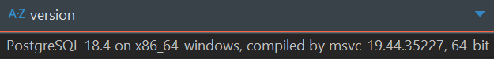
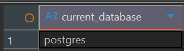
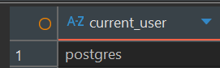
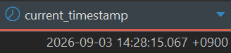
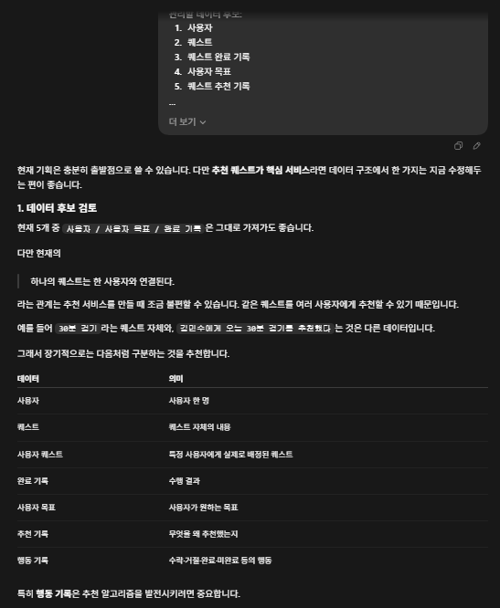

# Chapter 01 확장 실습 답안 템플릿

> **과제:** AI 시대에 데이터베이스를 왜 배워야 하는가  
> **사용 방법:** 이 파일을 내려받아 **본인의 GitHub 저장소**에 `chapter01_answer.md`라는 이름으로 저장한 뒤 답안을 작성합니다.  
> **제출 방법:** LMS에는 파일을 업로드하지 않고, **본인 GitHub 저장소의 `chapter01_answer.md` 파일 URL**을 제출합니다.

---

## 0. 학생 정보

| 항목 | 작성 내용 |
| --- | --- |
| 학번 |  |
| 이름 | 양성용 |
| GitHub 계정 | dydtlsrl@gmail.com |
| 과제 작성일 | 2026-09-03 |
| 사용한 AI 도구 | Chat GPT |

> 실제 비밀번호, API Key, 전체 DB 접속 URL, 개인정보는 이 파일이나 캡처 화면에 기록하지 않습니다.

---

# 1. PostgreSQL 실행 환경 확인

## 1-1. 실행한 SQL

```sql
SELECT version();
SELECT current_database();
SELECT current_user;
SELECT CURRENT_TIMESTAMP;
```

## 1-2. 실행 결과 기록

```text
PostgreSQL 버전: 18.4
현재 데이터베이스: postgres
현재 사용자: postgres
현재 시각: 2026-09-03 14:28:15.067 +0900
```

## 1-3. 내가 확인한 내용

1. SQL을 작성하는 프로그램과 PostgreSQL은 같은 프로그램인가요?

```text
나의 답: 아니요. DBeaver는 SQL을 작성하는 프로그램이고
        PostgreSQL은 실제로 데이터를 저장하고 SQL을 처리하는 관리시스템이다.
```

2. `current_database()` 결과는 무엇을 의미하나요?

```text
나의 답: 현재 내가 연결해서 사용 중인 데이터 베이스 = Postgres 라는 의미이다.
```

3. SQL이 실행되었다는 사실만으로 데이터 내용도 올바르다고 할 수 있나요?

```text
나의 답: 데이터를 직접 확인하고 검증해 보기 전까지는 올바르다고 할 수 없다.
```

## 1-4. 증거 화면

아래 경로에 캡처 이미지를 저장하는 것을 권장합니다.

```text
assignments/chapter01/images/step01_environment.png
```

이미지를 저장했다면 아래 링크의 파일명을 실제 파일명에 맞게 수정합니다.

```markdown

```

**이미지 삽입 위치:**

<!-- 아래 줄의 주석을 지우고 실제 이미지 Markdown을 넣어도 됩니다. -->

`여기에 STEP 1 증거 화면을 삽입하세요.`




---

# 2. Chapter 01 핵심 내용 복습

교재 문장을 그대로 복사하지 말고 자신의 말로 작성합니다.

| 본문의 핵심 | 나의 설명 |
| --- | --- |
| AI가 SQL을 만들어도 DB를 배워야 한다 | AI가 작성한 것을 그대로 사용 하는 것이 아닌, 리뷰하고 검증하고 수정 할 수 있으려면 배워야 한다. |
| 데이터 구조가 중요하다 | 데이터 구조가 잘못되어 있으면 중복이나 누락이 생기고, SQL이나 QI가 올바른 결과를 만들기 어려워지기 떄문에 중요하다. |
| SQL 결과를 검증해야 한다 | SQL이 실행 되었다고 결과가 항상 정확한 것은 아니기 때문에 검증을 해야한다. |
| 데이터 품질이 AI 답변 품질에 영향을 준다 | 데이터 품질이 좋지 않으면 AI가 잘못되거나 부족한 정보를 바탕으로 판단하게 되어 분석 품질도 떨어질 수 있다. |
| 저장 방식은 데이터 양만 보고 선택하지 않는다 | 데이터의 양뿐만 아니라 성격,관계, 동시 수정 가능여부, 반복 조회하거나 관리해야 하는지 등을 보고 저장 방식을 정해야 한다. |

## 가장 중요하다고 생각한 한 문장

```text
AI가 작성한 결과를 그대로 사용하는 것이 아니라, 데이터 품질을 검증하고 데이터를 정확하게
분류, 저장한 뒤 결과를 확인하는 흐름이 중요하다.
```

---

# 3. 실행 성공과 결과 정확성의 차이

## 3-1. SQL 실행 전 예상

학생 A는 질문 2개, 학생 B는 질문 1개, 학생 C는 질문이 없습니다.

```text
전체 학생 수: ___3___ 명
전체 질문 수: ___3___ 개
질문이 있는 학생 수: ____2___ 명
질문이 없는 학생 수: ___1___ 명
```

## 3-2. 임시 테이블 생성 및 데이터 입력 완료 확인

- [x] `ch01_students` 생성
- [x] `ch01_questions` 생성
- [x] 학생 3명 입력
- [x] 질문 3건 입력
- [x] 두 테이블의 데이터를 직접 조회

## 3-3. 잘못된 학생 수 SQL 실행 결과

실행한 SQL: 

```sql
SELECT COUNT(*) AS student_count
FROM ch01_students AS s
INNER JOIN ch01_questions AS q
    ON q.student_id = s.student_id;
```

실행 결과:

```text
3
```

## 3-4. JOIN 상세 결과 관찰

```text
학생 A가 나타난 행 수: 2
학생 B가 나타난 행 수: 1
학생 C가 나타난 행 수: 0
```

다음 질문에 답합니다.

### Q1. 학생 C가 왜 결과에서 사라졌나요?

```text
학생 c는 질문 테이블에 연결되는 데이터가 없기 때문에 INNER JOIN 결과에서 제외 되었다.
```

### Q2. 학생 A가 왜 여러 행으로 나타났나요?

```text
학생 A와 연결되는 질문 데이터가 2개가 있기 때문에 INNER JOIN 결과에서도 2개의 행으로 남았다.
```

### Q3. 위 `COUNT(*)`가 실제로 세고 있었던 것은 무엇인가요?

```text
INNER JOIN 결과로 출력된 행수를 세고 있다.
```

### Q4. 결과 숫자가 우연히 실제 학생 수와 같아도 바로 믿으면 안 되는 이유는 무엇인가요?

```text
학생마다 질문 수가 다를 수 있고, 질문이 없는 학생은 INNER JOIN에서 빠지는 학생이 생길 수 있기 때문에
결과 행 수가 학생수와 일치 한다고 올바르다고 볼 수 없기 때문이다.
```

## 3-5. 질문 한 건을 추가한 뒤 다시 실행

추가한 데이터:

```text
김민수 학생이 "지각 제출도 인정되나요?"라는 질문을 추가했다.
```

다시 실행한 결과: 4

```text
AI SQL 결과: 4
실제 학생 수: 3
```

### 결과 해석

```text
데이터가 바뀐 뒤 무엇이 달라졌는지:
질문이 1건 추가되어 JOIN 결과 행 수가 3에서 4로 늘어났다.

실제 학생 수는 왜 그대로인지:
새로운 학생이 추가된 것이 아니라 기존 학생이 질문을 하나 더 한 것이기 때문에 학생 수는 3명이다.

이 실험을 통해 알게 된 점:
SQL 결과가 유효해 보여도 실제 의미와 일치하는지 검증해야 하며, 어떤 데이터를 세고 있는지 확인하는 과정이 중요하다.
```

## 3-6. 학생 테이블을 직접 센 결과

```sql
SELECT COUNT(*) AS student_count
FROM ch01_students;
```

결과: 3

```text

```

### 두 SQL의 차이를 내 말로 설명

```text
첫 번째 SQL은 __________첫 번째 SQL은 JOIN된 행의 수________을 세고 있었다.

두 번째 SQL은 ___________두 번째 SQL은 학생 테이블의 행 수___________을 세고 있었다.

따라서 SQL을 검토할 때는 문법보다 먼저
____________________어떤 데이터를 세는 SQL인지____________를 확인해야 한다.
```

## 3-7. 증거 화면

권장 경로:

```text
assignments/chapter01/images/step03_join_result.png
```

`여기에 STEP 3 핵심 증거 화면을 삽입하세요.`

---

# 4. 잘못된 데이터가 결과를 바꾸는 과정

## 4-1. 주문 데이터 확인

다음 데이터를 입력한 뒤 실제 결과를 확인합니다.

```text
ORD-001, 10000
ORD-002, 20000
ORD-002, 20000
```

## 4-2. 실행 전 예상

업무적으로 주문이 `ORD-001`, `ORD-002` 두 건이고 `order_code`가 주문을 고유하게 구분한다고 **가정할 경우** 예상 합계: 

```text
___30000__ 원
```

> 위 가정 자체가 실제 업무 규칙인지 확인해야 한다는 점도 기억합니다.

## 4-3. SQL 합계

```sql
SELECT SUM(amount) AS total_amount
FROM ch01_orders;
```

실제 결과:

```text
___50000___ 원
```

## 4-4. 결과 해석

### `SUM` 문법 자체가 잘못된 것인가요?

```text
문법의 문제는 아니고, 중복된 데이터 때문에 결과가 다른 것이다.
```

### 결과 차이의 원인은 무엇인가요?

```text
같은 데이터가 중복으로 들어가 있어서 중복 합산 되었기 때문에 예상과 실제 결과의 차이가 발생했다.
```

### SQL이 정확하게 실행되어도 업무 숫자가 잘못될 수 있는 이유를 설명하세요.

```text
SQL이 정상 실행되어도 데이터가 잘못되어 있으면 결과 숫자도 잘못될 수 있다.
```

## 4-5. AI에게 같은 데이터를 분석시킨 결과

AI가 계산한 합계:

```text
10000 + 20000 + 20000 = 50000
```

AI가 중복 가능성을 언급했나요?

```text
`GPT` 현재 데이터 기준 합계는 50000원입니다.

다만 ORD-002가 두 번 존재하므로,
이 두 행이 실제로 서로 다른 주문인지 중복 데이터인지 확인이 필요합니다.
중복이라면 실제 업무 합계는 30000원이 될 수 있습니다. 
```

AI가 `ORD-002` 두 행이 실제 두 주문인지 중복 입력인지 스스로 확정할 수 있나요? 이유도 적으세요.

```text
주문번호의 의미나 중복 여부를 판단할 업무 규칙을 주어주지 않는다면 스스로 확정할 수 없다.
```

추가로 확인해야 할 업무 규칙:

```text
1.주문번호가 중복되었을 때 잘못 입력된 값으로 판단하는 기준
2.한 주문이 여러 줄로 저장될 수 있는 구조인지 확인
3.
```

내가 최종적으로 내린 판단:

```text

```

## 4-6. 증거 화면

권장 경로:

```text

```

`여기에 STEP 4 핵심 증거 화면을 삽입하세요.`


---

# 5. 파일·스프레드시트·DBMS 선택 연습

각 사례에 대해 **AI에게 묻기 전에 먼저 본인의 판단을 작성**합니다.

## 사례 A. 개인 독서 기록

```text
나의 선택: 스프레드시트
선택 이유: 개인 독서 기록이기 때문에
어떤 조건이 추가되면 다른 방식으로 바꿀 것인지: 
```
GPT 선택: 스프레드시트

```text
선택 이유:
한 사람이 사용하고 데이터 양이 많지 않으며,
책 제목, 날짜, 메모처럼 단순한 정보만 기록하면 되기 때문이다.

어떤 조건이 추가되면 다른 방식으로 바꿀 것인지:
사용자가 여러 명으로 늘어나거나,
검색·통계·관계 관리가 복잡해지면 DBMS로 바꿀 수 있다.
```

## 사례 B. 동아리 행사 신청 명단

```text
나의 선택: DBMS
선택 이유: 운영진이 인원을 관리(참석여부, 참석률 계산)을 해야 하기 때문
어떤 조건이 추가되면 다른 방식으로 바꿀 것인지: 당일 참석여부만 확인하면 되는 경우
```
```text
GPT 선택: 스프레드시트

선택 이유:
운영진 여러 명이 함께 수정해야 하고,
참석 여부를 관리하거나 참석률을 계산하기에 스프레드시트로 충분하기 때문이다.

어떤 조건이 추가되면 다른 방식으로 바꿀 것인지:
행사를 반복적으로 운영하거나,
참가자 정보와 신청 이력을 계속 누적해서 관리해야 한다면 DBMS를 사용할 것 같다.
```

## 사례 C. 온라인 강의 서비스

```text
나의 선택: DBMS
선택 이유: 학생과 강사의 관계와 강의 신청, 변경 등의 데이터를 유동적으로 관리해야 되기 때문에
어떤 조건이 추가되면 다른 방식으로 바꿀 것인지: 
```

```text
GPT 선택: DBMS

선택 이유:
학생, 강사, 강의, 수강신청처럼 서로 관계가 있는 데이터를 관리해야 하고,
신청 상태 변경, 금액 보존, 월별 조회처럼 반복적으로 처리해야 할 작업이 있기 때문이다.

어떤 조건이 추가되면 다른 방식으로 바꿀 것인지:
초기 테스트용으로 소수 인원만 잠깐 사용하고,
강의 신청이나 변경 없이 단순 명단만 관리하는 수준이라면 스프레드시트로도 가능할 것 같다.
```

## 판단 기준 체크

- [ ] 데이터 증가
- [ ] 여러 사용자의 동시 수정
- [ ] 데이터 사이의 관계
- [ ] 반복 조회와 집계
- [ ] 정확성·일관성
- [ ] 변경 이력
- [ ] 권한 구분
- [ ] 백업·복구
- [ ] 웹·앱에서 지속 사용

### 데이터가 적으면 무조건 스프레드시트를 사용해야 하나요?

```text
나의 답: 데이터의 양보다 데이터 관계 구조의 복잡도에 따라 적합한 저장 방식을 선택하는 것이 좋다.
```

---

# 6. 나만의 서비스 데이터 구조 초안

> 이 내용은 이후 Chapter에서 계속 확장할 수 있으므로 신중하게 작성합니다.

## 6-1. 서비스 정의

```text
서비스 이름: EgoQuest

이 서비스는
___사용자가 직접 할 일을 등록할 수 있고,
개인별 행동 패턴과 목표를 바탕으로 해야 할 일을 퀘스트처럼 추천해__
주기 위한 서비스이다.
```

## 6-2. 관리할 데이터 후보

```text
1. 사용자
2. 퀘스트
3. 퀘스트 완료 기록
4. 사용자 목표
5. 퀘스트 추천 기록
```

## 6-3. 한 행의 의미

| 데이터 후보 | 한 행의 의미 |
| --- | --- |
| 사용자 | 사용자 한 명 |
| 퀘스트 | 사용자가 직접 등록 또는 추천 받은 퀘스트 한 건 |
| 퀘스트 완료 기록 | 사용자가 퀘스트를 수행한 기록 한 건 |
| 사용자의 목표 | 사용자가 설정한 목표 한 건 |
| 퀘스트 추천 기록 | 시스템이 사용자에게 추천한 기록 한 건 |

## 6-4. 관계를 자연어로 설명

```text
1. 한 사용자는 여러 개의 퀘스트를 등록하거나 추천받을 수 있다.
2. 한 사용자는 여러 개의 목표를 설정할 수 있다. 
3. 하나의 퀘스트는 한 사용자와 연결된다.
4. 한 퀘스트는 여러 번 수행되거나 완료 기록이 남을 수 있다.
5. 퀘스트 추천 기록은 사용자의 선호 활동과 관련된 퀘스트를 연결한다.
```

## 6-5. 아직 결정하지 않은 정책

```text
Q1. 퀘스트를 완료하지 못한 기록도 계속 보관할 것인가?
Q2. 사용자의 선호 활동과 행동 기록을 어느 범위까지 저장할 것인가?
Q3. 추천 퀘스트를 거절하거나 숨긴 기록도 저장할 것인가?
```

> 확정되지 않은 정책을 AI가 임의로 결정한 경우 그대로 받아들이지 않습니다.

---

# 7. AI를 검토자로 활용하기

## 7-1. 내가 AI에게 전달한 핵심 프롬프트

개인정보나 비밀번호 등 민감한 내용은 제거한 뒤 기록합니다.

```text

```

## 7-2. AI의 주요 제안과 나의 판단

최소 5개를 작성합니다.

| AI의 제안 | 수용 / 수정 / 거절 | 나의 판단 근거 |
| --- | --- | --- |
|  |  |  |
|  |  |  |
|  |  |  |
|  |  |  |
|  |  |  |

## 7-3. AI에게 자기 답변을 다시 비판하도록 요청한 결과

첫 번째 답변과 달라진 점:

```text
나는 개발자 과정을 처음 배우는 학생입니다.

아직 ERD나 정규화를 배우기 전입니다.

내가 생각한 서비스는 다음과 같습니다.

서비스: EgoQuest

목적: *사용자가 직접 할 일을 등록할 수 있고,
개인별 행동 패턴과 목표를 바탕으로 해야 할 일을 퀘스트처럼 추천해*\_
주기 위한 서비스이다.

관리할 데이터 후보:

1. 사용자
2. 퀘스트
3. 퀘스트 완료 기록
4. 사용자 목표
5. 퀘스트 추천 기록

내가 생각한 관계:

1. 한 사용자는 여러 개의 퀘스트를 등록하거나 추천받을 수 있다.
2. 한 사용자는 여러 개의 목표를 설정할 수 있다.
3. 하나의 퀘스트는 한 사용자와 연결된다.
4. 한 퀘스트는 여러 번 수행되거나 완료 기록이 남을 수 있다.
5. 퀘스트 추천 기록은 사용자의 선호 활동과 관련된 퀘스트를 연결한다.

아직 결정하지 못한 정책:

Q1. 퀘스트를 완료하지 못한 기록도 계속 보관할 것인가?

Q2. 사용자의 선호 활동과 행동 기록을 어느 범위까지 저장할 것인가?

Q3. 추천 퀘스트를 거절하거나 숨긴 기록도 저장할 것인가?


지금 단계에서는 완성된 코드나 파일을 만들지 말고,

1\. 초기 기획에 있어서 데이터 후보를 더 추가 하거나 고정하고 바뀌지 말아야 할 것이 있는지,

2\. 퀘스트의 경우 사용자가 등록하는 것 보다 추천하는 퀘스트를 핵심으로 하고 싶은데, 
     어떤 알고리즘을 통해서 구현을 해야 하는지,

3\. 사용자가 목표를 정하지 않는다면, 목표를 설정 할 수 있는 장치적 요소는 어떤 것들이 있는지,

4\. 현재 기획 수준에서 필요한 기술 스택은 최소 몇가지가 있는지

초보자가 이해할 수 있게 검토해 주세요.

확정되지 않은 정책은 임의로 정답처럼 결정하지 마세요.
```

AI가 처음에 임의로 가정했던 내용:

```text
같은 퀘스트를 여러 사용자에게 추천할 수 있다고 가정한 점,
사용자의 행동 기록을 추천에 활용하는 구조를 제안한 점.
```

추가로 업무 담당자에게 확인해야 한다고 판단한 내용:

```text
   퀘스트 중복 허용 여부,
   사용자 행동 기록의 저장 범위,
   목표 없이 추천할 때 사용할 기준.
```

## 7-4. AI 활용에 대한 나의 평가

```text
가장 유용했던 부분: 추천 퀘스트를 위해 사용자 행동 기록이 필요하다는 점.

수정하거나 거절한 부분: 아직 정하지 않은 정책을 확정된 구조처럼 보지 않도록 했다.

그렇게 판단한 근거: 서비스의 핵심 기능과 데이터 구조는 실제 운영 방식이 정해진 뒤 결정해야 하기 때문이다.

AI가 없었다면 놓쳤을 가능성이 있는 질문:  사용자가 추천 퀘스트를 거절하거나 완료하지 않은 기록도 저장할 것인지.
```

## 7-5. AI 활용 증거 화면

권장 경로:

```text
assignments/chapter01/images/step07_ai_review.png
```

AI 대화 전체를 캡처할 필요는 없습니다. 핵심 요청과 검토 과정이 보이는 화면 1장 정도면 충분합니다.



---

# 8. 기준 데이터·파생 데이터·AI 생성 결과 구분

내 서비스에 맞게 작성합니다.

| 구분 | 내 서비스의 예 | 판단 이유 |
| --- | --- | --- |
| 기준 데이터 | 사용자의 퀘스트 완료 기록, 거절 기록, 목표 정보 | 사용자가 실제로 행동하거나 직접 입력한 원본 데이터이기 때문 |
| 파생 데이터 | 주간 퀘스트 완료율, 카테고리별 선호도, 최근 활동 점수 | 기준 데이터를 계산하거나 집계해서 만든 값이기 때문 |
| AI 생성 결과 | 사용자에게 추천한 다음 퀘스트와 추천 이유 | 저장된 데이터와 조건을 바탕으로 AI가 생성한 결과이기 때문 |

### 기준 데이터가 변경되면 파생 데이터는 어떻게 해야 하나요?

```text
기준 데이터가 변경되면 그 데이터를 바탕으로 계산한 파생 데이터도 다시 계산하거나 갱신해야 한다.
```

### AI 결과만 있고 원본 데이터가 없다면 결과를 충분히 검증할 수 있나요?

```text
어떤 데이터를 바탕으로 결과가 만들어졌는지 확인할 수 없기 때문에 충분히 검증하기 어렵다.
```

---

# 9. 최종 성찰

아래 세 문장은 반드시 **본인의 말**로 작성합니다.

```text
1. SQL이 실행되어도 결과를 바로 믿으면 안 되는 이유는
   _데이터가 중복되거나 누락되어 있으면 SQL이 정상 실행되어도 잘못된 결과가 나올 수 있기 때문_ 이다.

2. AI를 데이터베이스 학습에 활용할 때 가장 중요한 것은
   _AI의 답을 그대로 사용하는 것이 아니라 실제 데이터와 요구사항을 기준으로 검증하는 것_ 이다.

3. 이번 실습 이후 내가 더 확인하고 싶은 것은
   _실제 서비스에서는 데이터를 어떤 기준으로 나누고 서로 연결해서 관리하는지_ 이다.
```

## 이번 Chapter에서 새롭게 알게 된 점 3가지

```text
1. SQL이 정상적으로 실행되는 것과 결과가 정확한 것은 다르다는 점.
2. JOIN 방식에 따라 데이터가 빠지거나 같은 데이터가 여러 번 나타날 수 있다는 점.
3. 데이터의 양보다 데이터 구조와 관계를 보고 저장 방식을 선택해야 한다는 점.
```

## 아직 이해가 명확하지 않은 부분

```text
1. INNER JOIN, LEFT JOIN 같은 JOIN 방식의 차이와 실제 사용 기준.
2. 실제 서비스 데이터를 여러 테이블로 나누고 관계를 설계하는 방법.
```

---

# 10. 제출 전 자기 점검

- [x] PostgreSQL 실행 화면을 확인했다.
- [x] SQL 실행 전에 예상 결과를 먼저 작성했다.
- [x] `INNER JOIN` 예제에서 누락과 반복을 설명할 수 있다.
- [x] 숫자가 우연히 같아도 의미가 다를 수 있음을 설명했다.
- [x] 중복 데이터가 집계 결과에 미치는 영향을 확인했다.
- [x] 저장 방식을 데이터 양만으로 판단하지 않았다.
- [x] 개인 서비스 주제를 하나 정했다.
- [x] 데이터 후보와 한 행의 의미를 작성했다.
- [x] 미확정 정책을 최소 3개 작성했다.
- [x] AI 제안을 수용·수정·거절로 구분했다.
- [x] AI 제안에 대한 판단 근거를 작성했다.
- [x] 기준 데이터·파생 데이터·AI 결과를 구분했다.
- [x] 핵심 증거 이미지가 Markdown에서 정상적으로 보인다.
- [x] 비밀번호·API Key·개인정보가 노출되지 않았다.

---

# 11. LMS 제출 정보

## 내 GitHub 답안 파일 URL

아래에는 **교수자 템플릿 URL이 아니라 본인이 작성한 답안 파일의 GitHub URL**을 기록합니다.

```text
https://github.com/<본인-GitHub-ID>/<본인-저장소>/blob/main/assignments/chapter01/chapter01_answer.md
```

내 실제 제출 URL:

```text

```

> LMS에는 위 **본인 저장소의 `chapter01_answer.md` 파일 URL 하나**를 제출합니다.

---

## 권장 학생 저장소 구조

```text
<본인-저장소>/
└── assignments/
    └── chapter01/
        ├── chapter01_answer.md
        └── images/
            ├── step01_environment.png
            ├── step03_join_result.png
            ├── step04_duplicate_result.png
            └── step07_ai_review.png
```

이 구조를 사용하면 이후 Chapter 02, Chapter 03도 같은 방식으로 계속 추가할 수 있습니다.
