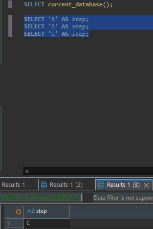

# Chapter 03 확장 실습 답안 템플릿

> **과제:** PostgreSQL과 DBeaver로 실습 환경 검증하기  
> **사용 방법:** 이 파일을 내려받아 본인의 GitHub 저장소에 `chapter03_answer.md`라는 이름으로 저장한 뒤 실습하면서 바로 작성합니다.  
> **제출 방법:** LMS에는 파일을 직접 업로드하지 않고, **본인 GitHub 저장소의 `chapter03_answer.md` 파일 URL**을 제출합니다.

---

## 제출 전 보안 주의

이 과제 파일과 캡처 화면에는 다음 정보를 올리지 않습니다.

```text
실제 PostgreSQL 비밀번호
전체 DB 접속 URL
API Key / Token
개인정보
공개할 필요가 없는 사내 서버 주소
```

LMS에서 제출자를 확인할 수 있으므로 공개 저장소의 답안 파일에 학번이나 실명을 반드시 적을 필요는 없습니다.

```text
GitHub 계정 또는 별칭: dydtlsrl
과제 작성일: 2026.09.07
사용한 AI 도구: chat GPT
```

---

# 1. PostgreSQL과 DBeaver 환경 확인

## 1-1. 내 환경

| 항목 | 작성 내용 |
| --- | --- |
| 운영체제 | Windows 10 Pro |
| PostgreSQL 버전 | PostgreSQL 18.4 |
| DBeaver 버전 | DBeaver 26.1.5 |
| Host | localhost |
| Port | 5432 |
| Database | postgres |
| Username | postgres |

> 비밀번호는 기록하지 않습니다.

## 1-2. PostgreSQL과 DBeaver 역할 설명

```text
PostgreSQL은:
데이터를 저장하고 관리하며, SQL 요청을 처리하는 DBMS이다.
- PostgreSQL은 책을 실제로 보관하고 관리하는 도서관 서고

DBeaver는: 
PostgreSQL 같은 DBMS에 접속해서 SQL을 작성하고 실행하며, 실행 결과를 확인할 수 있게 해주는 클라이언트 도구이다.
- DBeaver는 그 서고에 있는 책을 검색하고 빌릴 수 있도록 도와주는 도서관 검색대

두 프로그램의 차이는: 
PostgreSQL은 실제 데이터를 저장하고 SQL을 처리하는 서버 역할을 하고,
DBeaver는 그 PostgreSQL에 접속해서 사람이 보기 쉽게 작업할 수 있도록 도와주는 화면 도구이다.
```

---

# 2. 연결 테스트와 첫 SQL

## 2-1. DBeaver 연결 결과

- [ x ] PostgreSQL 연결 유형 선택
- [ x ] Host 확인
- [ x ] Port 확인
- [ x ] Database 확인
- [ x ] Username 확인
- [ x ] Test Connection 성공

### 연결 성공 화면

권장 이미지 경로:

```md

```

`여기에 연결 성공 화면을 삽입하세요.`

## 2-2. 첫 SQL 실행

```sql
SELECT 1 + 1 AS result;
```

실행 전 예상:

```text
2
```

실제 결과:

```text
2
```

이 결과가 의미하는 것:

```text
DBeaver에서 작성한 SQL이 PostgreSQL 서버로 정상 전달되었고,
PostgreSQL이 SQL을 실행한 뒤 결과를 다시 DBeaver 화면에 반환했다는 의미이다.
따라서 현재 DBeaver와 PostgreSQL이 정상적으로 연결되어 있으며,
기본적인 SQL 실행도 가능한 상태라고 판단할 수 있다.
```

---

# 3. 현재 연결 위치를 SQL로 검증

다음 SQL을 실행합니다.

```sql
SELECT version();
SELECT current_database();
SELECT current_user;
SELECT current_schema();
SHOW search_path;
SHOW transaction_read_only;
SHOW TimeZone;
```

## 3-1. 결과 기록

| 확인 항목 | 실제 결과 | 내가 이해한 의미 |
| --- | --- | --- |
| `version()` | PostgreSQL 18.4 on x86_64-windows, compiled by msvc-19.44.35227, 64-bit | postgreSQL의 버전을 알려주는 것이다. |
| `current_database()` | postgres | 연결되어 있는 데이터베이스를 알려준다. |
| `current_user` | postgres | Postgres 계정으로 접속한 상태다. |
| `current_schema()` | public | 기본으로 사용되는 스키마가 `public`이라는 뜻 |
| `search_path` | "$user", public |  |
| `transaction_read_only` | off | 현재 트랜잭션이 읽기 전용이 아니라 쓰기 작업도 가능한 상태라는 뜻  |
| `TimeZone` | Asis /Seoul | 한국시간 기준으로 되어있다.  |

## 3-2. 반드시 설명할 것

### DBeaver 연결 이름과 `current_database()`는 왜 같은 개념이 아닌가요?

```text
DBeaver 연결 이름은 사용자가 DBeaver에서 구분하기 위해 붙인 화면상의 이름이다.

반면 current_database()는 현재 SQL이 실제로 실행되고 있는 PostgreSQL 데이터베이스 이름을 알려준다.
```

### `current_schema()`와 `search_path`는 어떤 관계가 있나요?

```text
current_schema()는 현재 기본으로 사용되는 스키마를 알려준다.
search_path는 테이블 이름만 입력했을 때 PostgreSQL이 어떤 스키마 순서로 찾을지 정해둔 경로이다.
```

### `transaction_read_only = off`라는 결과만으로 모든 테이블을 만들 권한이 있다고 단정할 수 있나요?

```text
단정할 수 없다.
transaction_read_only = off는 현재 트랜잭션이 읽기 전용 모드가 아니라는 뜻이다.

하지만 이것은 쓰기 작업이 가능한 모드라는 의미일 뿐,
모든 데이터베이스나 모든 스키마에 테이블을 만들 권한이 있다는 뜻은 아니다.
실제로 테이블을 만들 수 있는지는 데이터베이스 권한, 스키마 권한, 사용자 권한을 따로 확인해야 한다.
```

## 3-3. 증거 화면

권장 경로:

```md

```

`여기에 현재 DB/사용자/스키마/search_path 결과 화면을 삽입하세요.`

---

# 4. `ai_database_book` 데이터베이스 확인

## 4-1. 현재 데이터베이스

```sql
SELECT current_database();
```

실제 결과:

```text
postgres
```

- [x] 결과가 `ai_database_book`이다.
- [x] 다른 DB라면 올바른 연결로 전환했다.

## 4-2. 연결을 바꾼 뒤 다시 검증

```text
전환 전 데이터베이스: postgres
전환 후 데이터베이스: ai_database_book
전환 여부를 판단한 근거: SELECT current_database(); SQL로 실행해서 확인함.
```

### 화면에서 보이는 연결 이름만 믿지 않고 SQL을 다시 실행해야 하는 이유

```text
DBeaver의 연결 이름은 사용자가 보기 쉽게 붙인 이름이거나 연결 설정을 나타내는 화면상의 정보일 수 있다.
하지만 실제로 SQL이 실행되는 데이터베이스는 현재 열린 SQL Editor가 어떤 연결을 사용하느냐에 따라 달라질 수 있다.

따라서 화면에 보이는 연결 이름만 보고 판단하지 않고,
SELECT current_database();를 실행해서 현재 SQL이 어느 데이터베이스에서 실행되는지 직접 확인해야 한다.
```

---

# 5. SQL 실행 범위 실험

SQL Editor에 다음 세 문장을 입력합니다.

```sql
SELECT 'A' AS step;
SELECT 'B' AS step;
SELECT 'C' AS step;
```

## 5-1. 한 문장 실행

```text
내가 실행한 문장: SELECT 'A' AS step;
실제 결과: A
```

## 5-2. 선택 영역 실행

```text
선택한 문장: SELECT 'B' AS step;
실제 결과: B
```

## 5-3. 전체 스크립트 실행

```text
실제 결과: SELECT 'C' AS step;
결과 탭 또는 실행 순서에서 관찰한 점: C
```

## 5-4. 결과 해석

```text
- 한 문장 실행과 전체 스크립트 실행의 차이: 
한 문장 실행
서가 놓인 SQL 한 문장만 실행하거나 선택한 한 문장만 실행하는 방식

- 전체 스크립트 실행
전체 실행했을 때 각 문장이 순서대로 실행되었고, 결과 탭이 여러 개 생성되었다.
현재 화면에서는 마지막으로 실행된 SELECT 'C' AS step;의 결과가 선택되어 C가 표시되었다.

변경 SQL에서 실행 범위를 잘못 선택하면 위험한 이유: 
- 전체 스크립트를 실수로 실행하면 데이터가 삭제되거나 변경될 수 있으므로,
실행하기 전에 내가 선택한 범위가 맞는지 꼭 확인해야 한다.
```

### 증거 화면

권장 경로:

```md

```

`여기에 실행 범위 비교 화면을 삽입하세요.`

---

# 6. 제공된 환경 확인 SQL 실행

Public 저장소의 Chapter 03 파일을 사용합니다.

```text
code/chapter03/setup_check.sql
code/chapter03/setup_validate_local.sql
```

## 6-1. `setup_check.sql`

실행 결과에서 확인한 항목:

```text
PostgreSQL 버전:
현재 DB: ai_database_book
현재 사용자: postgres
현재 스키마: public
search_path: "$user", public
읽기 전용 여부: off
TimeZone: Asia/soeul
1 + 1 결과: 2
public 스키마 존재 여부: True
public USAGE 권한: True
public CREATE 권한: True
```

### 이 파일을 여러 번 실행해도 비교적 안전한 이유

```text
setup_check.sql은 데이터를 변경하기 위한 SQL이 아니라 현재 환경을 확인하기 위한 SQL이다.
대부분 SELECT와 SHOW 문으로 되어 있어서 데이터베이스, 사용자, 스키마, 권한 같은 정보를 조회한다.

INSERT, UPDATE, DELETE, DROP처럼 데이터를 추가하거나 수정, 삭제하는 명령이 아니기 때문에
여러 번 실행해도 기존 데이터나 테이블이 바뀔 가능성이 낮아 비교적 안전하다고 판단했다.
```

## 6-2. `setup_validate_local.sql`

```text
실행 결과:
PASS / FAIL: PASS
```

실패했다면 실패 항목:

```text

```

그 실패가 실제 문제인지 환경 차이인지 판단한 근거:

```text

```

---

# 7. 안전한 오류 진단 실습

실제 오류가 있었다면 그 오류를 사용합니다. 오류가 없었다면 **데이터를 삭제하거나 서버를 강제로 중지하지 말고**, 안전한 SQL 문법 오류를 하나 만들어 관찰합니다.

예:

```sql
SELEC
    current_setting('server_version_num')::integer AS server_version_num,
    current_database() AS database_name,
    current_user AS user_name,
    -이하생략-
```

> 오류를 확인한 뒤 올바른 `SELECT 1;`로 복구합니다.

## 7-1. 오류 기록

```text
오류 메시지 핵심 문장: 
SQL Error [42601]: 오류: 구문 오류, "SELEC" 부근
위치: 251

내가 먼저 생각한 원인 1:
PostgreSQL 서버나 DBeaver 연결 문제가 아니라 SQL 문장 자체에 문법 오류가 있을 수 있다고 생각했다.

내가 먼저 생각한 원인 2:
SELECT 명령어를 잘못 입력했거나 일부 글자가 빠졌을 수 있다고 생각했다.

실제로 확인한 방법:
실행한 SQL 문장을 다시 확인했고, SELECT가 아니라 SELEC으로 입력되어 있는 것을 확인했다.

실제 원인:
SELECT 키워드에서 마지막 T가 빠진 SQL 문법 오류였다.

수정한 내용: SELEC >>>SELECT로 수정했다.
```

## 7-2. 수정 후 재검증

```sql
SELECT
    current_setting('server_version_num')::integer AS server_version_num,
    current_database() AS database_name,
    current_user AS user_name,
    -이하생략-
```

```text
재검증 결과: 
Chapter 03 recommended local environment validation passed
```

## 7-3. 오류를 유형으로 분류

- [ ] 서버 실행 문제
- [ ] Host 문제
- [ ] Port 문제
- [ ] Database 문제
- [ ] Username/인증 문제
- [x] SQL 문법 문제
- [ ] 권한 문제
- [ ] 기타

선택 이유:

```text
PostgreSQL 서버 연결이나 데이터베이스 선택 문제는 아니었고,
실행한 SQL에서 SELECT 키워드를 SELEC으로 잘못 입력했기 때문에 발생한 오류였다.
오류 메시지도 "SELEC" 부근의 구문 오류라고 알려주었으므로 SQL 문법 문제로 분류했다.

```

---

# 8. AI를 오류 분석 보조 도구로 사용

## 8-1. AI에게 전달한 프롬프트

비밀번호·개인정보·전체 접속 URL은 제거하고 기록합니다.

```text
DBeaver에서 PostgreSQL SQL을 실행하는 중 아래 오류가 발생했습니다.

오류 메시지:
SQL Error [42601]: 오류: 구문 오류, "SELEC" 부근
위치: 251

실행한 SQL은 SELECT를 입력해야 하는 부분을 실수로 SELEC으로 작성한 상태였습니다.

이 오류의 원인이 무엇인지,
어떤 항목을 먼저 확인해야 하는지,
안전하게 수정하고 재검증하는 방법을 알려주세요.

단, 데이터 삭제나 서버 중지 같은 위험한 방법은 제외하고 설명해주세요.
```

## 8-2. AI 답변 검토

| AI가 제안한 확인 방법 | 실제로 확인했는가? | 결과 | 수용 / 수정 / 거절 |
| --- | --- | --- | --- |
| 오류 메시지에서 구문 오류가 발생한 위치와 단어를 확인한다. | 예 | 오류 메시지에 `"SELEC" 부근`이라고 표시되어 있었다. | 수용 |
| 실행한 SQL 문장에서 SELECT 키워드가 올바르게 작성되었는지 확인한다. | 예 | `SELECT`가 아니라 `SELEC`으로 작성되어 있었다. | 수용 |
| `SELEC`을 `SELECT`로 수정한 뒤 다시 실행한다. | 예 | 수정 후 SQL이 정상 실행되었고, 환경 검증 결과도 passed로 확인되었다. | 수용 |
### AI가 오류 원인을 너무 빨리 단정한 부분이 있었나요?

```text
이번 오류는 오류 메시지에 "SELEC" 부근의 구문 오류라고 명확하게 표시되어 있어서,
AI가 SQL 문법 오류로 판단한 것은 적절하다고 생각했다.
```

### 오류 메시지와 실제 환경 중 무엇을 확인해서 최종 판단했나요?

```text
오류 메시지에서 "SELEC" 부근의 구문 오류가 발생했다는 내용을 확인했다.
그리고 실제 SQL 문장에서 SELECT가 SELEC으로 잘못 입력된 것을 확인했다.
```

### AI 활용에서 가장 유용했던 점

```text
오류 메시지에서 어떤 부분을 먼저 봐야 하는지 정리해 준 점이 유용했다.
특히 서버 문제, 연결 문제, 권한 문제보다 먼저 SQL 문법 자체를 확인해야 한다는 흐름을 잡는 데 도움이 되었다.
```

### AI 답변을 그대로 실행하지 않고 확인해야 하는 이유

```text
지금처럼 간단한 오류가 아닌 경우에는

AI는 오류 메시지를 바탕으로 가능성이 높은 원인을 제안할 수 있지만,
실제 내 DBeaver 연결 상태나 SQL Editor에 작성된 전체 내용을 직접 확인하지는 못한다.

따라서 AI 답변을 그대로 실행하기 전에 오류 메시지, 실행한 SQL, 현재 연결된 데이터베이스를 사람이 직접 확인해야 한다.
특히 데이터 수정이나 삭제와 관련된 제안은 그대로 실행하면 위험할 수 있으므로 반드시 검토해야 한다.
```

---

# 9. Chapter 01~02 개인 서비스와 연결

앞에서 선택한 개인 서비스가 PostgreSQL을 사용한다고 가정합니다.

```text
서비스 이름: EgoQuest

사용할 데이터베이스 이름 후보: egoquest_db

사용할 스키마 이름 후보: public

앞으로 만들고 싶은 테이블 후보 3개:
1.users
2.quests
3.quest_completion_records
```

### 아직 SQL을 만들지 않고 이름과 역할만 정하는 이유

```text
직 서비스의 세부 정책과 데이터 구조가 완전히 정해지지 않았기 때문에 바로 SQL부터 작성하면 나중에 수정할 부분이 많아질 수 있다.

먼저 어떤 데이터를 저장해야 하는지,
각 테이블이 어떤 역할을 해야 하는지,
데이터끼리 어떤 관계가 있는지 정리하는 것이 필요하다고 생각했다.

이름과 역할을 먼저 정하면 이후에 컬럼, 데이터 타입, PK/FK 관계를 설계할 때 기준을 잡기 쉽다.
```

### Chapter 02에서 정리했던 한 행의 의미 중 수정할 부분이 있나요?

```text
처음에는 한 행을 단순히 하나의 데이터 기록으로만 생각했다.
하지만 이번 실습을 하면서 한 행은 테이블 안에서 하나의 구체적인 대상이나 사건을 나타내는 기록이라고 이해하게 되었다.

예를 들어 users 테이블의 한 행은 사용자 한 명을 의미하고,
quests 테이블의 한 행은 사용자가 등록하거나 추천받은 퀘스트 한 건을 의미한다.

또 quest_completion_records 테이블의 한 행은 단순한 퀘스트 정보가 아니라,
특정 사용자가 특정 퀘스트를 수행하거나 완료한 기록 한 건을 의미한다.

따라서 한 행의 의미는 테이블마다 다르게 정리해야 한다고 판단했다.
```

---

# 10. 초보자용 연결 가이드 작성

친구가 자신의 PC에서 같은 실습을 시작한다고 가정합니다. 아래 순서를 자신의 말로 작성합니다.

```text
1. PostgreSQL 서버가 실행되는지 확인하는 방법:

SQL Editor에서 SELECT version();을 실행해 본다.
PostgreSQL 버전 정보가 정상적으로 출력되면 PostgreSQL 서버가 실행 중이고,
DBeaver에서도 정상적으로 응답을 받고 있는 상태라고 볼 수 있다.


2. DBeaver에서 PostgreSQL 연결을 만드는 방법:

DBeaver에서 새 데이터베이스 연결을 선택하고 PostgreSQL을 고른다.
그다음 Host, Port, Database, Username, Password를 입력한다.
입력 후 Test Connection을 눌러 연결이 되는지 확인하고,
성공하면 Finish를 눌러 연결을 만든다.


3. Host / Port / Database / Username의 의미:

Host는 접속할 PostgreSQL 서버의 위치를 뜻한다.
localhost는 내 컴퓨터 안에서 실행 중인 PostgreSQL 서버에 접속한다는 의미이다.

Port는 PostgreSQL 서버로 들어가는 통로 번호라고 볼 수 있다.
PostgreSQL은 기본적으로 5432 포트를 사용한다.

Database는 실제로 SQL을 실행할 데이터베이스 이름이다.
화면에 보이는 연결 이름이 아니라 current_database()로 확인되는 값이 중요하다.

Username은 PostgreSQL에 접속할 사용자 계정이다.


4. ai_database_book에 연결되었는지 확인하는 방법:

DBeaver에서 ai_database_book 연결로 SQL Editor를 연 뒤 SELECT current_database();를 실행한다.
결과가 ai_database_book으로 나오면 현재 SQL이 ai_database_book 데이터베이스에서 실행되고 있는 것이다.

결과가 postgres처럼 다른 이름으로 나오면,
아직 원하는 데이터베이스에 연결된 것이 아니기 때문에 연결을 바꾸거나 새 연결을 만들어야 한다.


5. 현재 위치를 확인하는 SQL:

SELECT current_database();
SELECT current_user;
SELECT current_schema();
SHOW search_path;

이런 명령어들을 실행하면 현재 내가 어느 데이터베이스에 연결되어 있는지,
어떤 사용자로 접속했는지,
어떤 스키마를 기본으로 사용하는지 확인할 수 있다.


6. 한 문장과 전체 스크립트 실행을 구분해야 하는 이유:

한 문장 실행은 내가 선택한 SQL 또는 커서가 있는 SQL 한 문장만 실행하는 것이고,
전체 스크립트 실행은 SQL Editor에 있는 여러 SQL 문장을 위에서부터 순서대로 모두 실행하는 것이다.

실행 범위를 잘못 선택하면 불필요한 결과가 여러 개 출력될 수 있고,
수정이나 삭제 SQL이 포함되어 있다면 원하지 않는 데이터 변경이 발생할 수도 있다.

그래서 SQL을 실행하기 전에는 내가 실행하려는 범위가 맞는지 확인해야 한다.


7. 비밀번호를 GitHub나 AI 프롬프트에 넣으면 안 되는 이유:

비밀번호, API Key, Token 같은 정보는 다른 사람이 내 데이터베이스나 서비스에 접근할 수 있게 만드는 민감한 정보이다.

GitHub에 올리면 공개 저장소를 통해 다른 사람에게 노출될 수 있고,
AI 프롬프트에 넣으면 내가 통제하기 어려운 곳에 정보가 남을 수도 있다.

그래서 과제나 질문을 작성할 때는 비밀번호, 전체 접속 URL, API Key 같은 정보는 반드시 제거해야 한다.
```

---

# 11. 최종 성찰

아래 문장은 반드시 본인의 말로 작성합니다.

```text
1. DBeaver와 PostgreSQL의 가장 중요한 차이는
    `DBeaver는 SQL을 작성하고 실행 결과를 보는 도구이고, PostgreSQL은 실제 데이터를 저장하고 처리하는 DBMS라는 점`이다.

2. 내가 지금 어느 데이터베이스에 연결되어 있는지 확인할 때
   `화면 이름만 보지 않고 화면 이름만 보지 않고 SELECT current_database();를 실행해서 직접 확인` 해야 한다.

3. PostgreSQL 오류가 발생했을 때 가장 먼저 해야 할 일은
  `오류 메시지를 보고 어느 부분에서 문제가 났는지 확인하는 것` 이다.

4. AI를 오류 해결에 사용할 때 가장 중요한 것은
  `AI 답변을 바로 믿지 말고 실제 오류 메시지와 내 환경에서 직접 검증하는 것` 이다.
```

---

# 12. 제출 체크리스트

- [x] `chapter03_answer.md`의 빈 필수 항목을 작성했다.
- [x] PostgreSQL과 DBeaver의 역할 차이를 설명했다.
- [x] `current_database/current_user/current_schema/search_path`를 실제로 확인했다.
- [x] `ai_database_book` 연결 여부를 SQL로 검증했다.
- [x] SQL 실행 범위 세 가지를 비교했다.
- [x] `setup_check.sql`을 실행했다.
- [x] `setup_validate_local.sql` 결과를 확인했다.
- [x] 오류 원인을 먼저 스스로 추정한 뒤 AI를 사용했다.
- [x] AI 제안을 실제 환경에서 검증했다.
- [x] 핵심 캡처 3~4장만 골라 넣었다.
- [x] 캡처에 비밀번호·개인정보·전체 접속 URL이 없다.
- [x] Markdown 이미지가 GitHub 웹 화면에서 실제로 보인다.
- [x] 최종 답안 파일을 commit/push했다.

---

# 13. LMS 제출 URL

아래 형식의 **본인 GitHub 파일 URL**을 LMS에 제출합니다.

```text
https://github.com/<본인-GitHub-ID>/<본인-저장소>/blob/main/assignments/chapter03/chapter03_answer.md
```

내 제출 URL:

```text

```

> 저장소 메인 URL, 교수자 템플릿 URL, Raw URL이 아니라 **작성 완료된 본인 `chapter03_answer.md` 파일 화면 URL**을 제출합니다.