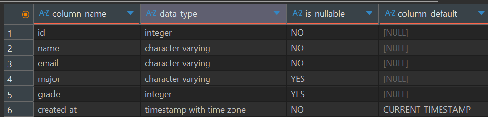
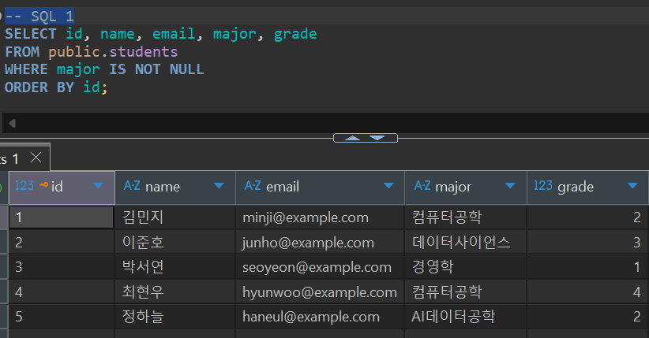
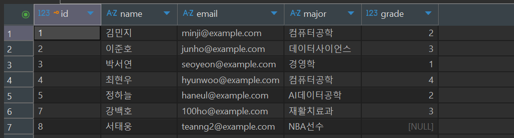
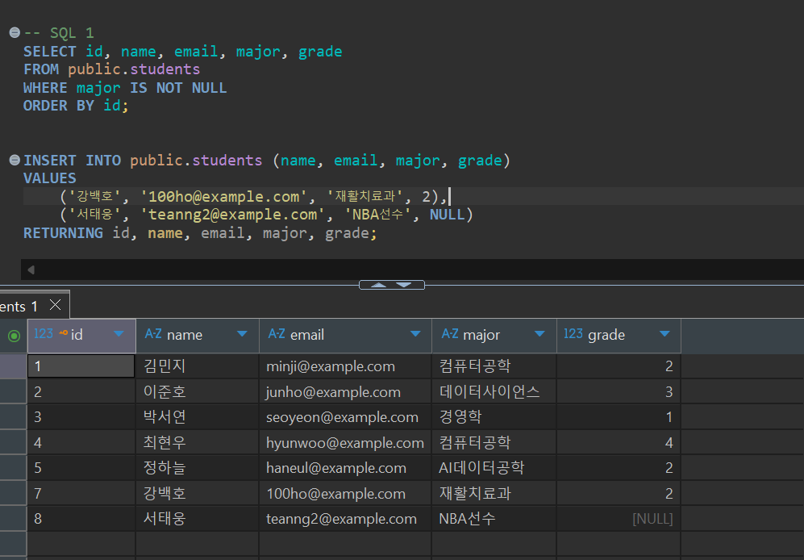

# Chapter 04 확장 실습 답안 템플릿

> **과제:** 관계형 데이터베이스와 SQL 시작하기  
> **사용 방법:** 이 파일을 내려받아 본인의 GitHub 저장소에 `chapter04_answer.md`라는 이름으로 저장한 뒤 실습하면서 바로 작성합니다.  
> **제출 방법:** LMS에는 파일을 직접 업로드하지 않고, **본인 GitHub 저장소의 `chapter04_answer.md` 파일 URL**을 제출합니다.

---

## 제출 전 주의

이 파일과 캡처 화면에는 실제 비밀번호, 전체 DB 접속 URL, API Key, 개인정보를 기록하지 않습니다.

```text
GitHub 계정 또는 별칭: dydtlsrl@gmail.com
과제 작성일: 2026.09.08
사용한 AI 도구: chat GPT
```

---

# 1. 실습 환경과 시작 상태 확인

다음을 실행합니다.

```sql
SELECT current_database();
SELECT current_user;
SELECT current_schema();
SHOW search_path;
SHOW transaction_read_only;
```

| 확인 항목 | 실제 결과 | 의미 |
| --- | --- | --- |
| current_database() | ai_database_book | 해당 데이터 베이스와 연결되어 있다 |
| current_user | postgres | 현재 접속되어 있는 DB 사용자 |
| current_schema() | public | 현재 기본 스키마 |
| search_path | "$user", public | 기본적으로 참조할 스키마 탐색 순서 |
| transaction_read_only | off | 읽기 전용 모드가 꺼져 있는 상태 |

- [x] 현재 DB가 `ai_database_book`이다.
- [x] 변경 가능한 연결인지 확인했다.
- [x] 실행할 SQL 범위를 확인했다.
- [x] Auto-commit 상태를 확인했다.

### 변경 SQL을 실행하기 전에 현재 DB와 실행 범위를 확인해야 하는 이유

```text
의도하지 않은 위치에서 테이블 생성, 데이터 입력, 조회, 수정, 삭제 등의 작업이 이루어지는 것을 방지 하기 위해서
```

---

# 2. `public.students` 구조 생성

## 2-1. 실행 전 예상

```text
테이블 이름: students
한 행의 의미: 학생 1명의 기본 정보
예상 행 수: 0
기본키: id
필수 열: name, email, created_at
중복을 막는 열: email
자동 생성 열: id, created_at
```

## 2-2. 실행 파일

```text
code/chapter04/01_create_students.sql
```

## 2-3. 실행 후 확인

```text
테이블 생성 성공 여부:
실제 행 수:
DBeaver에서 확인한 위치:
```

### 각 열의 역할

| 열 | 타입 | NULL 가능? | 역할 |
| --- | --- | --- | --- |
| id | integer | NO | 학생 데이터 구분 기본키 |
| name | characher varying | NO | 학생 이름 |
| email | characher varying | NO | 학생 이메일 |
| major | characher varying | YES | 전공 |
| grade | integer | YES | 학년 |
| created_at | timestamp with time zone | NO | 데이터 생성 시각 |

### `id`를 학번이나 학생 수로 해석하면 안 되는 이유

```text
데이터를 구분하기 위한 기본(고유 식별자)이기 때문에 학번이나 학생 수를 의미하지 않기 때문
```

### 증거 화면

권장 경로:

```text
assignments/chapter04/images/step02_table.png
```

`여기에 테이블 구조 확인 화면을 삽입하세요.`

---

# 3. 샘플 데이터 6명 입력

## 3-1. 실행 전 예상

```text
현재 행 수: 0
실행 후 예상 행 수: 6
예상되는 NULL 포함 학생: 1
```

## 3-2. 실행 파일

```text
code/chapter04/02_insert_students.sql
```

## 3-3. 실제 결과

```text
실제 행 수: 6
이준호 grade: 3
박서연 존재 여부: 1
윤서진 major: NULL
윤서진 grade: NULL
```

### 예상과 실제 비교

```text
예상과 실제가 일치했는가: 일치했다.
다르다면 이유: 일치했다.
```

### `created_at` 값이 여러 행에서 같을 수 있는 이유

```text
데이터가 입력된 시각을 자동으로 저장하는 열이기 때문에,
한 번에 여러 행을 입력하면 같은 시점으로 처리되어 `created_at` 값이 같을 수 있다.
```

---

# 4. SELECT 복습과 결과 검증

각 문제는 **SQL 실행 전에 예상 행 수를 먼저 작성**합니다.

| 번호 | 조회 문제 | 예상 행 수 | 실제 행 수 | 일치? | 다르면 이유 |
| ---: | --- | ---: | ---: | --- | --- |
| 1 | 전체 학생 | 6 | 6 | 일치 |  |
| 2 | 이름·이메일만 조회 | 6 | 6 | 일치 |  |
| 3 | 특정 전공 | 2 | 2 | 일치 |  |
| 4 | 특정 학년 이상 | 3 | 3 | 일치 |  |
| 5 | 두 전공 중 하나 | 3 | 3 | 일치 |  |
| 6 | `grade IS NULL` | 1 | 1 | 일치 |  |
| 7 | 전공 `DISTINCT` | 5 | 5 | 일치 | NULL 포함 시 5개 |
| 8 | 정렬 후 상위 3명 | 3 | 3 | 일치 |  |

## 4-1. 내가 직접 작성한 SQL 2개

```sql
SELECT id, name, email, major, grade
FROM public.students
WHERE major IS NOT NULL
ORDER BY id;
```

```text
이 SQL의 한 행 의미: 전공이 NULL이 아닌 학생을 조회한다.
예상 행 수: 5
실제 행 수: 5
```

```sql
-- SQL 2
SELECT id, name, email, major, grade
FROM public.students
WHERE grade IN (2, 3)
ORDER BY grade, id;
```

```text
이 SQL의 한 행 의미: grade 값이 2 또는 3인 학생 1명을 의미한다.
예상 행 수: 3
실제 행 수: 3
```

## 4-2. `= NULL` 대신 `IS NULL`을 사용하는 이유

```text
NULL은 값이 없거나 알 수 없다는 의미이기 때문에 비교 연산자인 = 로는 비교할 수 없다.

NULL 여부를 확인할 때는 = NULL이 아니라 IS NULL을 사용해야 한다.
반대로 NULL이 아닌 값을 찾을 때는 IS NOT NULL을 사용한다.
```

## 4-3. `ORDER BY` 없이 결과 순서를 믿으면 안 되는 이유

```text
SQL 조회 결과는 ORDER BY를 사용하지 않으면 행의 출력 순서가 보장되지 않기 때문이다.
```

## 4-4. `DISTINCT`가 원본 데이터를 삭제하는 기능인가요?

```text
아니다. 원본 테이블의 데이터는 삭제되지 않는다.
DISTINCT는 조회 결과에서 중복된 값을 한 번만 보여주는 기능으로 SELECT 결과에만 영향을 주고 실제 저장된 데이터는 변경하지 않는다.
```

### 증거 화면

권장 경로:

```text
assignments/chapter04/images/step04_select.png
```

`여기에 SELECT 핵심 결과 화면을 삽입하세요.`

---

# 5. 내 가상 학생 2명 추가

실명·실제 이메일 대신 가상 데이터를 사용합니다.

## 5-1. 실행 전 계획

```text
학생 A
이름: 강백호
이메일: 100ho@example.com
전공: 재활치료과
학년: 2

학생 B
이름: 서태웅 
이메일: teanng2@example.com
전공: NBA선수
학년 또는 NULL: NULL

현재 행 수: 6
추가 후 예상 행 수:8
```

## 5-2. 내가 실행한 INSERT

```sql
INSERT INTO public.students (name, email, major, grade)
VALUES
    ('강백호', '100ho@example.com', '재활치료과', 2),
    ('서태웅', 'teanng2@example.com', 'NBA선수', NULL)
RETURNING id, name, email, major, grade;
```

## 5-3. 실제 결과

```text
RETURNING 또는 확인 SELECT 결과: 강백호, 서태웅 학생 데이터 추가
실제 전체 행 수: 8
예상과 일치 여부: 일치했다.
```

### 내가 일부 값을 NULL로 둔 이유 또는 NULL을 사용하지 않은 이유

```text
`grade`는 아직 확정되지 않은 정보라고 생각해서 `NULL`로 입력했다.
`NULL`은 값이 없거나 아직 알 수 없다는 뜻이다.
반면 `name`과 `email`은 학생을 구분하기 위한 필수 정보라서 `NULL`로 두지 않았다.
```

---

# 6. 안전한 UPDATE

내가 추가한 가상 학생 한 명만 수정합니다.

## 6-1. 먼저 대상 확인 SELECT

```sql
SELECT *
FROM public.students
WHERE email = '100ho@example.com';
```

```text
예상 대상 행 수: 1
실제 대상 행 수: 1
```

## 6-2. UPDATE

```sql
UPDATE public.students
SET grade = 3
WHERE email = '100ho@example.com'
RETURNING id, name, email, grade;
```

```text
예상 영향 행 수: 1
실제 영향 행 수: 1
RETURNING 결과: grade가 '2' >>> '3'으로 변경 됐다.
```

## 6-3. UPDATE 후 재조회

```sql
SELECT *
FROM public.students
WHERE email = '100ho@example.com';
```

### `WHERE` 없는 UPDATE를 실행하면 위험한 이유

```text
WHERE 없이 UPDATE를 실행하면 특정 학생 한 명만 수정되는 것이 아니라,
students 테이블의 모든 행이 한 번에 수정될 수 있다.

예를 들어 WHERE 조건 없이 grade = 3으로 수정하면 모든 학생의 grade가 3으로 바뀔 수 있으므로,
UPDATE를 실행할 때는 수정 대상 조건을 반드시 확인해야 한다.
```

### 증거 화면

권장 경로:

```text
assignments/chapter04/images/step06_update.png
```

`여기에 UPDATE 전/후 결과 화면을 삽입하세요.`



---

# 7. 안전한 DELETE

내가 추가한 가상 학생 한 명을 삭제합니다.

## 7-1. 삭제 전 확인

```sql
SELECT *
FROM public.students
WHERE email = 'teanng2@example.com';
```

```text
예상 대상 행 수:1
실제 대상 행 수:1
```

## 7-2. DELETE

```sql
DELETE FROM public.students
WHERE email = 'teanng2@example.com'
RETURNING id, name, email;
```

```text
예상 영향 행 수: 1
실제 영향 행 수: 1
RETURNING 결과: id 8번, 서태웅, teanng2@example.com 행이 삭제되었다.
```

## 7-3. 삭제 후 재조회

```sql
SELECT *
FROM public.students
WHERE email = 'student_b@example.com';
```

```text
삭제 후 같은 조건의 SELECT 결과 행 수: 0
```

### `DELETE` 성공 메시지만 보고 끝내지 않고 다시 SELECT해야 하는 이유

```text
DELETE가 성공했다고 메시지가 나오더라도, 내가 의도한 데이터가 정확히 삭제됐는지는 한번더 확인하기 위함이다.
```

---

# 8. 본문 기준 UPDATE·DELETE 상태 검증

`04_update_delete_students.sql`을 본문 시작 상태에서 실행했다면 다음을 확인합니다.

```text
최종 학생 수:
이준호 grade:
박서연 존재 여부:
```

본문 기준 기대 상태와 비교합니다.

```text
학생 수 = 5
이준호 grade = 4
박서연 = 0행
```

### 내 실제 결과가 기준과 다르다면 원인

```text

```

---

# 9. 의도한 실패 2개 관찰

> 실패 테스트는 데이터베이스 규칙이 실제로 데이터를 보호하는지 확인하는 실험입니다.

## 9-1. 중복 이메일 `UNIQUE` 오류

내가 사용한 SQL:

```sql

```

```text
오류 메시지 핵심 단서:
왜 실패해야 맞는가:
어떤 규칙이 작동했는가:
실패 후 기존 데이터가 어떻게 유지되었는가:
```

## 9-2. 이름 `NULL` 입력 `NOT NULL` 오류

내가 사용한 SQL:

```sql

```

```text
오류 메시지 핵심 단서:
왜 실패해야 맞는가:
어떤 규칙이 작동했는가:
```

### 실패한 INSERT 뒤 자동 생성 `id` 번호에 빈 구간이 생길 수 있어도 문제라고 단정할 수 없는 이유

```text

```

### 증거 화면

권장 경로:

```text
assignments/chapter04/images/step09_constraint_error.png
```

`여기에 제약조건 오류 화면을 삽입하세요.`

---

# 10. `verify_students.sql`로 최종 상태 확인

실행 파일:

```text
code/chapter04/verify_students.sql
```

```text
현재 전체 학생 수:
NULL 개수:
이준호 grade:
박서연 존재 여부:
현재 데이터 상태에서 예상과 다른 부분:
```

### 검증 SQL을 따로 두면 좋은 이유

```text

```

---

# 11. AI를 SQL 작성자가 아니라 검토자로 활용

먼저 본인이 SQL을 작성한 뒤 AI에게 검토를 요청합니다.

## 11-1. 내가 작성한 SQL

```sql

```

## 11-2. AI에게 전달한 핵심 요청

```text

```

## 11-3. AI 검토 결과

| AI 제안 | 수용 / 수정 / 거절 | 실제 검증 결과 | 나의 이유 |
| --- | --- | --- | --- |
|  |  |  |  |
|  |  |  |  |
|  |  |  |  |

### AI가 예상한 영향 행 수와 실제 결과가 같았나요?

```text

```

### AI 답변을 실행 전에 검토해야 하는 이유

```text

```

---

# 12. 내 서비스 테이블 하나 확장 설계

Chapter 01~03에서 정한 개인 서비스에서 **테이블 하나**를 선택합니다.

```text
서비스 이름:
테이블 이름:
한 행의 의미:
```

| 열 이름 | 저장할 값 | 타입 후보 | NULL 가능? | UNIQUE 후보? | 이유 |
| --- | --- | --- | --- | --- | --- |
|  |  |  |  |  |  |
|  |  |  |  |  |  |
|  |  |  |  |  |  |
|  |  |  |  |  |  |
|  |  |  |  |  |  |

```text
PK 후보:
업무 식별자 후보:
아직 미확정인 규칙:
```

## 선택: CREATE TABLE 초안

> 아직 확정되지 않은 업무 규칙은 억지로 제약조건으로 만들지 않습니다.

```sql

```

### AI에게 검토받은 뒤 수정한 부분

```text

```

---

# 13. 최종 성찰

아래 문장은 본인의 말로 작성합니다.

```text
1. SQL 실행 성공과 올바른 대상 선택이 다른 이유는
   ____________________________________________________________ 이다.

2. UPDATE와 DELETE 전에 SELECT를 먼저 해야 하는 이유는
   ____________________________________________________________ 이다.

3. 영향받은 행 수를 확인해야 하는 이유는
   ____________________________________________________________ 이다.

4. UNIQUE 또는 NOT NULL 오류를 '보호 장치가 정상 동작한 결과'라고 볼 수 있는 이유는
   ____________________________________________________________ 이다.

5. AI가 SQL을 만들어 주더라도 내가 반드시 확인해야 하는 것은
   ____________________________________________________________ 이다.
```

---

# 14. 제출 체크리스트

- [ ] `chapter04_answer.md`를 본인 저장소에 만들었다.
- [ ] 현재 DB와 실행 환경을 확인했다.
- [ ] `public.students`를 생성했다.
- [ ] 샘플 6명 입력 결과를 검증했다.
- [ ] SELECT 문제에서 실행 전 예상 행 수를 작성했다.
- [ ] 가상 학생 2명을 추가했다.
- [ ] UPDATE 전후를 SELECT로 확인했다.
- [ ] DELETE 전후를 SELECT로 확인했다.
- [ ] UNIQUE 오류를 관찰했다.
- [ ] NOT NULL 오류를 관찰했다.
- [ ] `verify_students.sql`로 상태를 확인했다.
- [ ] AI 제안을 실제 SQL 결과와 비교했다.
- [ ] 개인 서비스 테이블 하나를 확장 설계했다.
- [ ] 핵심 캡처는 3~4장 정도로 제한했다.
- [ ] 비밀번호·개인정보가 캡처에 없다.
- [ ] Markdown 이미지가 GitHub 웹 화면에서 정상 표시된다.
- [ ] commit/push를 완료했다.

---

# 15. LMS 제출 URL

아래 형식의 **본인 GitHub 파일 URL**을 LMS에 제출합니다.

```text
https://github.com/<본인-GitHub-ID>/<본인-저장소>/blob/main/assignments/chapter04/chapter04_answer.md
```

내 제출 URL:

```text

```

> 교수자 템플릿 URL이나 저장소 메인 URL이 아니라 **작성 완료된 본인 `chapter04_answer.md` 파일 화면 URL**을 제출합니다.
