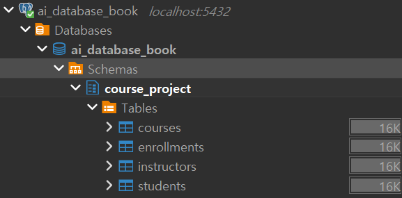
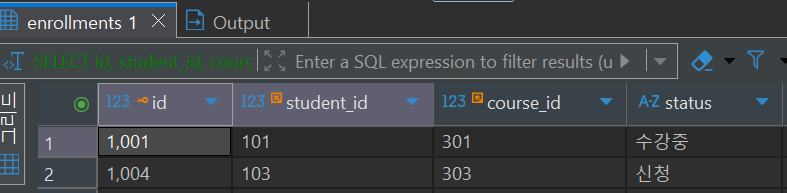
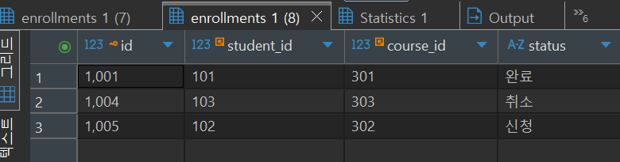
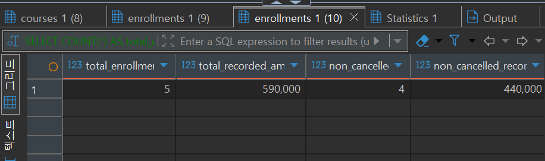
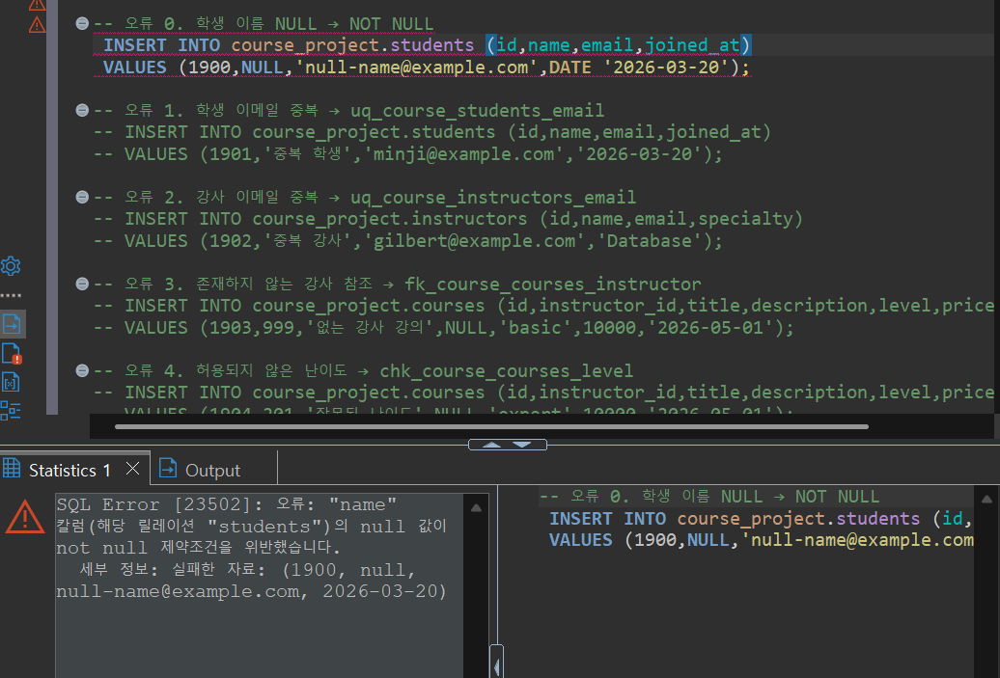
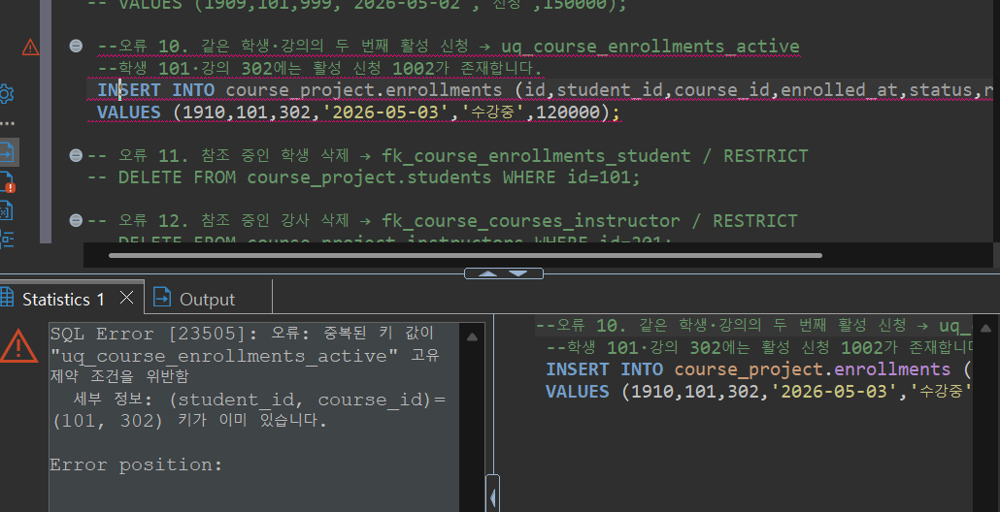
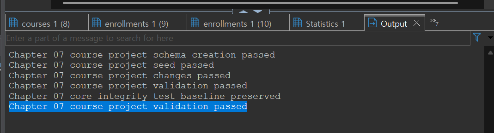
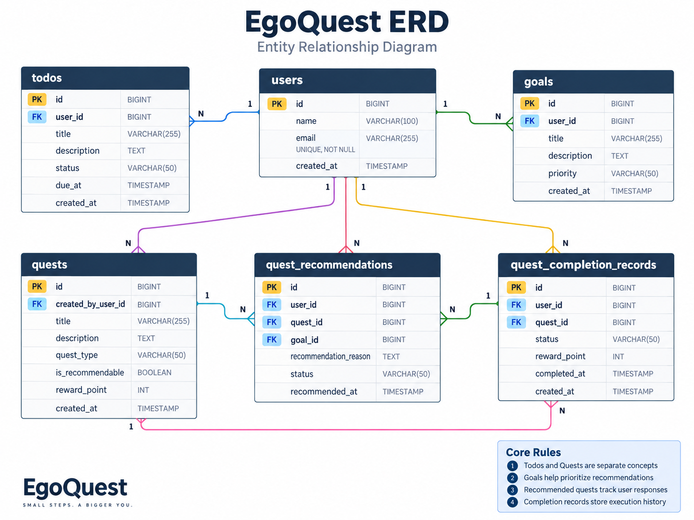

# Chapter 07 확장 실습 답안 템플릿

> **과제:** 실전 프로젝트 1 — 온라인 강의 수강신청 DB 완성하기  
> **사용 방법:** 이 파일을 내려받아 본인의 GitHub 저장소에 `chapter07_answer.md`라는 이름으로 저장한 뒤 실습하면서 바로 작성합니다.  
> **제출 방법:** LMS에는 파일을 직접 업로드하지 않고, **본인 GitHub 저장소의 `chapter07_answer.md` 파일 URL**을 제출합니다.

---

## 제출 전 주의

이 파일과 캡처 화면에는 실제 비밀번호, 전체 DB 접속 URL, API Key, 개인정보를 기록하지 않습니다.

```text
GitHub 계정 또는 별칭: dydtlsrl@gmail.com
과제 작성일: 2026-09-15
사용한 AI 도구: chat GPT
```

---

# 1. 시작 환경 확인

다음을 실행합니다.

```sql
SELECT current_database();
SELECT current_user;
SELECT current_schema();
SHOW search_path;
SHOW transaction_read_only;
```

| 확인 항목 | 실제 결과 | 의미 |
| --- | --- | --- |
| `current_database()` | ai_database_book | 현재 DBeaver가 연결해서 SQL을 실행하고 있는 데이터베이스 이름이다. |
| `current_user` | postgres |  현재 데이터베이스에 접속한 사용자 계정이다. |
| `current_schema()` | public | 현재 기본으로 사용 중인 스키마이다.  |
| `search_path` | "$user", public | SQL에서 스키마 이름을 생략했을 때 PostgreSQL이 테이블을 찾는 순서이다.  |
| `transaction_read_only` | off | 현재 연결이 읽기 전용인지 확인하는 설정이다. |

- [x] 현재 DB가 `ai_database_book`이다.
- [x] 쓰기 가능한 연결인지 확인했다.
- [x] 실행할 SQL 범위를 확인했다.
- [x] Auto-commit 상태를 확인했다.

### 프로젝트 SQL을 실행하기 전에 시작 상태를 확인해야 하는 이유

```text
프로젝트 SQL을 실행하기 전에 시작 상태를 확인해야 하는 이유는 
내가 지금 어떤 데이터베이스에 연결되어 있는지, 쓰기 가능한 상태인지, 
그리고 어떤 스키마 범위에서 SQL을 실행하게 되는지를 먼저 확인하기 위해서이다.
```

---

# 2. 프로젝트 범위와 요구사항 읽기

## 2-1. 포함 범위

본문을 그대로 복사하지 말고 자신의 말로 정리합니다.

```text
1.학생 정보를 관리한다. 학생은 온라인 강의를 신청하는 대상이다.
2.강사 정보를 관리한다. 강사는 하나 이상의 강의를 담당할 수 있다.
3.강의 정보를 관리한다. 강의에는 담당 강사, 난이도, 현재 기준 가격 같은 정보가 포함된다.
4.수강신청 정보를 관리한다. 수강신청은 학생과 강의를 연결하는 단순 연결이 아니라, 신청 시점, 신청 상태, 신청 당시 기록 금액을 함께 저장하는 사건 데이터이다
```

## 2-2. 제외 범위

```text
1.실제 결제 승인, 결제 실패, 환불 처리는 이번 프로젝트 범위에서 제외한다.
2.강의 정원 관리와 대기열 처리는 이번 프로젝트 범위에서 제외한다.
3.수강 상태가 바뀐 전체 이력 관리는 이번 프로젝트 범위에서 제외한다.
4.강의 진도, 수료 여부, 콘텐츠 관리, 쿠폰과 할인 이력 관리는 이번 프로젝트 범위에서 제외한다.
```

### 범위를 명확하게 정해야 하는 이유

```text
프로젝트 범위를 명확하게 정해야 하는 이유는 지금 만들고 검증할 기능과 아직 다루지 않을 기능을 구분하기 위해서이다.
```

## 2-3. 요구사항 / 프로젝트 결정 / 미확정 질문 구분

아래 항목 중 대표 항목을 정리합니다.

| ID | 종류 | 내용 요약 | DB 구조/규칙에 미치는 영향 |
| --- | --- | --- | --- |
| P07-R01 | 요구사항 | 학생 정보를 저장하고 관리한다. | `students` 테이블이 필요하며, 학생을 구분할 기본키와 이름, 이메일 같은 주요 속성이 필요하다. |
| P07-R05 | 요구사항 | 수강신청은 학생과 강의를 연결하고 신청 정보를 저장한다. | `enrollments` 테이블이 필요하며, `student_id`, `course_id`는 각각 학생과 강의를 참조하는 FK가 된다. |
| P07-R07 | 요구사항 | 수강신청에는 신청 당시 기록 금액을 저장한다. | `enrollments.recorded_amount` 컬럼이 필요하며, 음수 금액이 들어가지 않도록 CHECK 제약조건 후보가 된다. |
| P07-D02 | 프로젝트 결정 | 현재 프로젝트에서는 신청 당시 강의 가격을 수강신청 금액으로 기록한다. | `courses.price`와 `enrollments.recorded_amount`를 구분해서 저장해야 한다. |
| P07-D03 | 프로젝트 결정 | 진행 중인 중복 신청은 허용하지 않는다. | 같은 학생이 같은 강의에 대해 활성 상태 신청을 중복으로 만들지 못하도록 부분 UNIQUE 인덱스가 필요하다. |
| P07-Q01 | 미확정 질문 | 학생과 강사 사이에서도 이메일을 전역 고유하게 제한할 것인가? | 아직 확정된 정책이 아니므로 학생 테이블과 강사 테이블 전체를 묶는 전역 UNIQUE 제약조건으로 바로 만들면 안 된다. |

### 미확정 질문을 바로 제약조건으로 만들면 안 되는 이유

```text
미확정 질문은 아직 결정되지 않은 내용이기 때문이다
```

---

# 3. 네 테이블의 한 행 의미와 관계

## 3-1. 한 행 의미

```text
course_project.students 한 행 = 온라인 강의를 신청할 수 있는 학생 한 명을 의미한다.

course_project.instructors 한 행 = 강의를 담당하는 강사 한 명을 의미한다.

course_project.courses 한 행 = 개설된 온라인 강의 한 개를 의미한다.

course_project.enrollments 한 행 = 특정 학생이 특정 강의를 수강신청한 사건 한 건을 의미한다.
```

## 3-2. 키와 중요 규칙


```md
## 3-2. 키와 중요 규칙

| 테이블 | PK | FK | 중요 규칙 |
| --- | --- | --- | --- |
| students | id | 없음 | 학생은 고유한 id로 구분하고, 이메일은 중복되지 않아야 한다. |
| instructors | id | 없음 | 강사는 고유한 id로 구분하고, 이메일은 중복되지 않아야 한다. |
| courses | id | instructor_id | 강의는 반드시 담당 강사를 참조해야 하며, 가격은 음수가 될 수 없다. |
| enrollments | id | student_id, course_id | 수강신청은 반드시 학생과 강의를 참조해야 하며, 상태와 신청 당시 금액을 가진다. |

## 3-3. 관계를 양방향 문장으로 작성

```text
instructors ↔ courses: 
한 강사는 여러 강의를 담당할 수 있다.
한 강의는 반드시 한 명의 강사를 참조한다.

students ↔ enrollments:
한 학생은 여러 번 수강신청을 할 수 있다.
한 수강신청은 반드시 한 명의 학생을 참조한다.

courses ↔ enrollments:
한 강의는 여러 학생의 수강신청을 받을 수 있다.
한 수강신청은 반드시 하나의 강의를 참조한다.
```

### 학생과 강의의 N:M 관계가 `enrollments`를 통해 어떻게 바뀌는지 설명

```text
학생과 강의는 원래 N:M 관계로 볼 수 있다.

한 학생은 여러 강의를 신청할 수 있고,
한 강의도 여러 학생에게 신청될 수 있기 때문이다.

하지만 데이터베이스에서는 학생 테이블과 강의 테이블을 직접 N:M으로 연결하지 않고,
중간에 enrollments 테이블을 둔다.

그래서 관계는 다음처럼 바뀐다.

students 1 : N enrollments
courses 1 : N enrollments

즉, students와 courses가 직접 연결되는 것이 아니라,
수강신청 사건을 저장하는 enrollments를 통해 연결된다.

```

### `enrollments`가 단순 연결 테이블이 아니라 사건 테이블이라고 볼 수 있는 이유

```text
enrollments는 학생 id와 강의 id만 저장하는 단순 연결 테이블이 아니다.

수강신청이 언제 만들어졌는지,
현재 상태가 신청, 수강중, 완료, 취소 중 무엇인지,
신청 당시 기록된 금액이 얼마인지도 함께 저장한다.

즉, 단순히 “학생과 강의를 연결했다”가 아니라
“어떤 학생이 어떤 강의를 어떤 상태와 금액으로 신청했다”라는 사건을 기록한다.

그래서 enrollments는 연결 테이블이면서 동시에 수강신청 사건 테이블이라고 볼 수 있다.
```

---

# 4. `recorded_amount`의 의미 이해

```text
courses.price =  현재 강의의 기준 가격이다.

enrollments.recorded_amount = 학생이 수강신청을 했을 때, 그 신청 건에 기록된 금액이다.
```

### 두 값이 처음에는 같아도 같은 의미가 아닌 이유

```text
처음 수강신청을 만들 때는 courses.price 값을 enrollments.recorded_amount에 복사하므로 두 값이 같을 수 있다.

하지만 courses.price는 강의의 현재 기준 가격이고,
recorded_amount는 수강신청이 만들어진 당시의 기록 금액이다.

나중에 강의 가격이 바뀌어도 이미 만들어진 수강신청의 recorded_amount는 그 당시 기록으로 남아야 한다.
그래서 처음 값이 같아도 의미는 다르다.
```

### `recorded_amount`를 실제 결제 성공액이나 회계 매출로 해석하면 안 되는 이유

```text
실제 결제 성공, 결제 실패, 환불, 할인, 쿠폰 기능이 포함되어 있지 않다.

따라서 recorded_amount를 실제로 결제가 완료된 금액이나 회계상 매출로 해석하면 안 된다.
지금은 단순히 수강신청 사건에 저장된 기준 금액으로 이해해야 한다.
```

---

# 5. STEP 01 — 스키마와 테이블 생성

실행 파일:

```text
code/chapter07/01_course_project_schema.sql
```

## 5-1. 실행 전 예상

```text
course_project 스키마 존재 여부: 생성될 것으로 예상한다
예상 테이블 수: 4개
예상 데이터 행 수: 각 테이블 모두 0행
예상되는 명명 제약조건 수: 15개
예상되는 NOT NULL 열 수: 20개
부분 고유 인덱스 존재 여부: 존재할 것으로 예상한다.
```

## 5-2. 실행 결과

```text
실제 테이블 수: 4개
실제 명명 제약조건 수:15개
실제 NOT NULL 열 수: 20개
부분 고유 인덱스: uq_course_enrollments_active 존재
네 테이블의 실제 행 수: students 0행, instructors 0행, courses 0행, enrollments 0행
통과 메시지: Chapter 07 course project schema creation passed
```

### 예상과 실제 비교

```text
01_course_project_schema.sql 파일을 실행하기 전에는 course_project 스키마와 4개의 테이블이 생성될 것으로 예상했다.

또한 이 단계는 구조만 만드는 단계이므로 students, instructors, courses, enrollments 테이블에는 아직 데이터가 없고, 각 테이블의 행 수는 0행일 것으로 예상했다.

실행 후 실제 결과도 예상과 같다면, 스키마와 테이블 구조가 정상적으로 만들어졌다고 볼 수 있다.

이 단계에서는 데이터를 넣는 것이 목적이 아니라, 이후 Seed 데이터와 변경 시나리오를 실행할 수 있는 기본 구조를 준비하는 것이 목적이다.
```

### 증거 화면

권장 경로:

```text
assignments/chapter07/images/step05_schema.png
```

`여기에 스키마/테이블 생성 검증 화면을 삽입하세요.`


---

# 6. STEP 02 — Seed 데이터 입력

실행 파일:

```text
code/chapter07/02_course_project_seed.sql
```

## 6-1. 실행 전 예상

```text
students: 3명 
instructors: 2행 
courses: 3행 
enrollments: 4행
recorded_amount 합계: 470000
학생 101 신청 건수: 2건
강의 301 신청 건수: 2건
강사 201 담당 강의 수: 2개
활성 중복 신청: 0건
```

## 6-2. 실제 결과

```text
students: 3
instructors: 2
courses: 3
enrollments: 4
recorded_amount 합계: 470000
학생 101 신청 건수: 2
강의 301 신청 건수: 2
강사 201 담당 강의 수: 2
활성 중복 신청: 없음
1001 상태: 수강중
1004 상태: 신청
1005 존재 여부: 없음
통과 메시지:
Chapter 07 course project seed passed
```

### Seed 데이터를 단순 예제가 아니라 검증 데이터라고 볼 수 있는 이유

```text
Seed 데이터는 화면에 예시 데이터를 채우기 위한 데이터만은 아니다.

학생 3명, 강사 2명, 강의 3개, 수강신청 4건을 넣어서
테이블 사이의 관계가 실제로 잘 연결되는지 확인할 수 있다.

예를 들어 한 학생이 여러 강의를 신청할 수 있는지,
한 강의에 여러 학생이 신청할 수 있는지,
한 강사가 여러 강의를 담당할 수 있는지 확인할 수 있다.

또한 수강신청 상태와 recorded_amount 합계를 확인하면서
데이터가 예상한 기준 상태로 들어갔는지도 검증할 수 있다.

그래서 Seed 데이터는 단순 예제가 아니라,
이후 변경 SQL과 최종 validation SQL이 제대로 동작하는지 확인하기 위한 기준 데이터라고 볼 수 있다.
```

---

# 7. STEP 03 — 변경 시나리오 실행

실행 파일:

```text
code/chapter07/03_course_project_changes.sql
```

## 7-1. 실행 전에 상태 변화를 예상

| 신청 ID | 변경 전 예상 상태 | 변경 후 예상 상태 | 예상 recorded_amount |
| ---: | --- | --- | ---: |
| 1001 | 수강중 | 완료 | 100000 |
| 1004 | 신청 | 취소 | 150000 |
| 1005 | 없음 | 신청 | 120000 |

```text
변경 후 예상 enrollments 행 수: 5행
변경 후 예상 전체 recorded_amount 합계: 590000
변경 후 예상 취소 제외 건수: 4건
변경 후 예상 취소 제외 recorded_amount 합계: 440000
```

## 7-2. 실제 결과

```text
1001 상태 / recorded_amount: 100,000
1004 상태 / recorded_amount: 150,000
1005 상태 / recorded_amount: 120,000
최종 enrollments 행 수: 5행
전체 recorded_amount 합계: 590,000
취소 제외 건수: 4
취소 제외 recorded_amount 합계: 440,000
활성 중복 신청: 0
통과 메시지: Chapter 07 course project changes passed
```

### 조건부 UPDATE에서 예상 이전 상태를 확인해야 하는 이유

```text
예상한 이전 상태를 확인해야 잘못된 데이터를 실수로 바꾸지 않을 수 있다.

예를 들어 `수강중` 상태일 때만 `완료`로 바꿔야 하는데,
이미 다른 상태로 바뀐 데이터를 그대로 UPDATE하면 기존 데이터를 덮어쓸 수 있다.

그래서 UPDATE 전에 현재 상태가 예상과 맞는지 확인해야 한다.
```

### 증거 화면

권장 경로:

```text
assignments/chapter07/images/step07_changes.png
```

`여기에 주요 변경 전/후 결과를 삽입하세요.`




---

# 8. STEP 04 — 최종 완료 게이트 실행

실행 파일:

```text
code/chapter07/04_course_project_validation.sql
```

## 8-1. 최종 검증 결과

```text
최종 행 수 students/instructors/courses/enrollments: 3, 2, 3, 5
서비스 JOIN 결과 행 수: 5행
학생 101 신청 수: 2건
강의 301 신청 수: 2건 
강사 201 강의 수: 2개
고아 관계 수: 0건
활성 중복 신청 수 : 0건
전체 recorded_amount: 590000
취소 제외 recorded_amount: 440000
통과 메시지:
Chapter 07 course project validation passed
```

### SQL 파일 4개가 모두 실행되었다는 사실과 프로젝트 검증 PASS가 다른 이유

```text
1. SQL 파일 4개 실행
01, 02, 03, 04번 파일을 순서대로 실행했다는 뜻이다.
즉, 작업을 수행했다는 사실을 의미한다.

2. 프로젝트 검증 PASS
실행 결과가 과제에서 요구한 최종 상태와 일치한다는 뜻이다.
즉, 작업 결과가 올바른지 확인했다는 의미이다.

3. 차이점
파일을 실행했다고 해서 데이터가 항상 올바른 것은 아니다.
중간에 일부 데이터가 잘못 들어가거나, 관계 오류가 생기거나, 금액 합계가 달라질 수도 있다.

4. 최종 validation의 역할
최종 validation SQL은 테이블 행 수, 관계 오류, 중복 신청, 상태값, 금액 합계를 다시 검사한다.
그래서 단순 실행 여부가 아니라 프로젝트가 정상 완료되었는지를 확인해 준다.
```

### 증거 화면

권장 경로:

```text
assignments/chapter07/images/step08_validation.png
```

`여기에 최종 validation PASS 화면을 삽입하세요.`



```
---

# 9. 무결성 테스트

실행 파일:

```text
code/chapter07/05_course_project_integrity_tests.sql
```

> 오류 테스트는 파일 전체를 무작정 실행하지 않고 **한 테스트 구간씩** 실행합니다.

## 9-1. 허용되어야 하는 경계값 1개

```text
테스트 내용:
무료 강의 price=0, description=NULL, 무료 신청 recorded_amount=0을 입력한 뒤 임시 데이터를 삭제했다.
기대 결과: 성공해야 한다.
실제 결과: 성공했다. 임시로 추가한 course 1801과 enrollment 1802를 삭제했다.
왜 허용되어야 하는가:
0원은 음수 금액이 아니고, description은 필수 입력값이 아니기 때문이다.
```

## 9-2. 실패해야 하는 테스트 1 — 잘못된 참조 또는 값

```text
테스트 내용: 학생 이름(name)에 NULL 값을 넣어 학생 데이터를 입력했다.
기대 결과: 실패해야 한다.
실제 오류 핵심: students 테이블의 name 컬럼에서 null 값이 not-null 제약조건을 위반했다.
동작한 제약조건/규칙: students.name 컬럼의 NOT NULL 제약조건
왜 실패해야 하는가: 학생 이름은 필수 정보이므로 NULL로 저장되면 안 되기 때문이다.
```

## 9-3. 실패해야 하는 테스트 2 — 활성 중복 신청

```text
테스트 내용: 학생 101이 강의 302에 대해 이미 활성 신청이 있는 상태에서,
같은 학생과 같은 강의로 '수강중' 상태 신청을 다시 입력했다.
기대 결과: 실패해야 한다.
실제 오류 핵심: 중복된 키 값이 "uq_course_enrollments_active" 고유 제약 조건을 위반했다.
(student_id, course_id) = (101, 302) 키가 이미 있다고 나왔다.
동작한 인덱스/규칙: uq_course_enrollments_active
왜 실패해야 하는가: 이번 프로젝트에서는 같은 학생이 같은 강의에 대해
'신청' 또는 '수강중' 상태의 활성 신청을 중복으로 가질 수 없기 때문이다.
```

## 9-4. 실패 후 기준 상태 재검증

```text
04 validation 재실행 결과: Chapter 07 course project validation passed
기준 데이터가 유지되었는가: 
유지되었다. 실패 테스트는 오류로 막혔고,
핵심 테스트 후 기준 상태도 그대로 유지되었다.
```

### 실패 테스트가 프로젝트 품질 검증에 필요한 이유

```text
실패 테스트는 데이터베이스가 잘못된 데이터를 제대로 막는지 확인하기 위해 필요하다.

정상 데이터만 넣어 보면 테이블에 데이터가 들어가는 것은 확인할 수 있지만,
제약조건이 실제로 작동하는지는 알기 어렵다.

그래서 NULL 입력, 잘못된 참조, 중복 신청 같은 실패해야 하는 데이터를 일부러 실행해 본다.

이때 오류가 발생하면 DB가 규칙에 맞지 않는 데이터를 막고 있다는 뜻이다.
또한 실패 후 기준 상태가 유지되면, 테스트 때문에 기존 데이터가 망가지지 않았다는 것도 확인할 수 있다.
```

### 증거 화면

권장 경로:

```text
assignments/chapter07/images/step09_integrity.png
```

`여기에 대표 실패 테스트와 기준 상태 유지 결과를 삽입하세요.`




---

# 10. 재현성 실험

> 이 단계는 본인의 실습 환경이며 보존할 데이터가 없을 때만 수행합니다.

실행 순서:

```text
reset_course_project.sql
→ 01_course_project_schema.sql
→ 02_course_project_seed.sql
→ 03_course_project_changes.sql
→ 04_course_project_validation.sql
```

```text
처음 실행의 최종 결과: Chapter 07 course project validation passed
재실행의 최종 결과: Chapter 07 course project validation passed
두 결과가 일치했는가: 일치했다. reset 후 같은 순서로 다시 실행했을 때도 최종 validation이 통과했다.
중간에 수동 수정이 필요했는가: 필요하지 않았다.
```

### 다른 사람이 같은 순서로 실행해 같은 결과를 얻는 것이 중요한 이유

```text
데이터베이스 프로젝트는 내 컴퓨터에서 한 번 성공하는 것만으로는 충분하지 않다.

다른 사람도 같은 SQL 파일을 같은 순서로 실행했을 때
같은 테이블 구조, 같은 기준 데이터, 같은 검증 결과를 얻을 수 있어야 한다.

그래야 프로젝트가 우연히 성공한 것이 아니라,
정해진 절차에 따라 다시 만들 수 있는 상태라고 볼 수 있다.

또한 재현성이 있으면 문제가 생겼을 때
어느 단계에서 오류가 났는지도 더 쉽게 확인할 수 있다.
```

---

# 11. Chapter 01~06 개인 프로젝트를 중간 프로젝트 초안으로 확장

온라인 강의 예제를 이름만 바꾸지 않고 본인의 아이디어를 사용합니다.

## 11-1. 프로젝트 기본 정보

```text
프로젝트 이름: EgoQuest

해결하려는 문제:
사용자가 직접 할 일을 등록할 수 있고, 개인별 목표와 행동 패턴을 바탕으로 해야 할 일을 퀘스트처럼 추천받고 수행할 수 있도록 돕는 서비스이다.

주요 사용자:
퀘스트를 등록하고 수행하는 일반 사용자,
사용자의 목표와 행동 패턴을 바탕으로 퀘스트를 추천하는 AI 추천 시스템,
전체 서비스 상태와 데이터 품질을 확인하는 관리자
```

## 11-2. 포함 범위 / 제외 범위

```text
[포함]
1. 사용자가 직접 등록한 할 일과 퀘스트 정보를 구분해서 저장한다.
2. 사용자가 설정한 목표 정보를 저장한다.
3. 목표와 행동 패턴을 바탕으로 관련 퀘스트를 우선 추천한다.
4. 추천 퀘스트의 수락, 거절, 진행, 완료 상태와 수행 기록을 저장한다.

[제외]
1. 결제, 구독, 환불 기능은 제외한다.
2. AI 모델 학습 또는 파인튜닝 기능은 제외한다.
3. 실시간 알림, 채팅, 랭킹 기능은 제외한다.
```

## 11-3. 요구사항

최소 8개를 작성합니다.

## 11-3. 요구사항

최소 8개를 작성합니다.

| ID | 요구사항 | 관련 테이블/관계 | 검증 방법 후보 |
| --- | --- | --- | --- |
| P07-MR01 | 사용자는 이름과 이메일을 가진다. | users | 사용자 데이터 조회, 이름과 이메일의 NOT NULL 확인 |
| P07-MR02 | 사용자의 이메일은 중복될 수 없다. | users | 같은 이메일로 INSERT 시 실패하는지 확인 |
| P07-MR03 | 사용자는 직접 할 일을 등록할 수 있다. | users 1:N todos | 특정 사용자의 할 일 개수 조회 |
| P07-MR04 | 사용자는 직접 퀘스트를 등록할 수 있다. | users 1:N quests | 특정 사용자의 퀘스트 개수 조회 |
| P07-MR05 | 할 일과 퀘스트는 구분해서 저장한다. | todos, quests | 할 일 테이블과 퀘스트 테이블이 따로 존재하는지 확인 |
| P07-MR06 | 사용자는 여러 개의 목표를 설정할 수 있다. | users 1:N goals | 특정 사용자의 목표 개수 조회 |
| P07-MR07 | 사용자가 설정한 목표와 관련된 퀘스트를 우선 추천할 수 있다. | goals, quests, quest_recommendations | 목표 ID와 연결된 추천 퀘스트가 존재하는지 확인 |
| P07-MR08 | 추천받은 퀘스트는 수락, 거절, 진행, 완료 상태를 가진다. | quest_recommendations 또는 user_quests | 허용되지 않은 상태값 입력 실패 확인 |

## 11-4. 프로젝트 결정

최소 3개를 작성합니다.

| ID | 이번 프로젝트에서 내린 결정 | 이유 | 구현 후보 |
| --- | --- | --- | --- |
| P07-MD01 | 할 일과 퀘스트는 구분해서 관리한다. | 사용자가 본인이 수행하려고 등록한 것은 일반 할 일이고, 퀘스트는 다른 사용자에게도 추천될 수 있는 활동이어야 하기 때문이다. | `todos` 테이블과 `quests` 테이블 분리 |
| P07-MD02 | 사용자가 등록한 퀘스트는 추천 가능한 활동 후보로 관리한다. | EgoQuest는 개인 할 일 관리뿐 아니라, 유효한 활동을 다른 사용자에게 추천하는 것이 핵심이기 때문이다. | `quests.is_recommendable`, `quests.created_by_user_id` |
| P07-MD03 | 퀘스트 추천과 수행 반응은 별도 기록으로 남긴다. | 어떤 퀘스트가 추천되었고, 사용자가 수락·거절·진행·완료했는지 알아야 추천 품질을 판단할 수 있기 때문이다. | `quest_recommendations`, `quest_completion_records` |

## 11-5. 미확정 질문

최소 3개를 작성합니다.

```text
P07-MQ01. 사용자가 등록한 퀘스트를 어떤 기준으로 “다른 사람에게 추천 가능한 유효한 활동”이라고 판단할 것인가?

P07-MQ02. 다른 사람이 만든 퀘스트를 수행한 뒤 추천을 많이 받은 퀘스트일수록 신뢰도가 높다고 볼 수 있는가?

P07-MQ03. 퀘스트를 완료했을 때 리워드나 보상을 지급한다면, 보상 기준은 완료 여부, 추천 수, 난이도, 반복 수행 중 무엇을 기준으로 할 것인가?
```

---

# 12. 개인 프로젝트 ERD와 한 행 의미

## 12-1. 테이블 후보

최소 4개를 권장합니다.

| 테이블 | 한 행의 의미 | PK 후보 | FK 후보 | 주요 규칙 |
| --- | --- | --- | --- | --- |
| users | 서비스를 사용하는 사용자 한 명 | id | 없음 | 이메일은 중복될 수 없고, 이름과 이메일은 필수값이다. |
| todos | 사용자가 본인이 수행하려고 등록한 일반 할 일 한 건 | id | user_id | 하나의 할 일은 반드시 한 명의 사용자와 연결된다. |
| goals | 사용자가 설정한 목표 한 건 | id | user_id | 하나의 목표는 반드시 한 명의 사용자와 연결된다. |
| quests | 다른 사용자에게 추천될 수 있는 퀘스트 후보 한 건 | id | created_by_user_id | 퀘스트는 제목, 설명, 유형, 추천 가능 여부를 가진다. |
| quest_recommendations | AI/알고리즘이 사용자에게 퀘스트를 추천한 기록 한 건 | id | user_id, quest_id, goal_id | 추천 상태는 수락, 거절, 숨김, 진행 중 등 정해진 값 중 하나여야 한다. |
| quest_completion_records | 사용자가 퀘스트를 수행하거나 완료한 기록 한 건 | id | user_id, quest_id | 완료, 진행 중, 실패 같은 수행 상태와 보상 포인트를 기록한다. |

## 12-2. 관계 문장

```text
1. 한 사용자는 여러 개의 할 일과 여러 개의 목표를 가질 수 있다.

2. 한 사용자는 여러 개의 퀘스트를 등록할 수 있고, 등록된 퀘스트는 다른 사용자에게 추천될 수 있다.

3. AI 추천 시스템은 사용자의 목표와 행동 패턴을 참고하여 퀘스트를 추천하고, 그 추천 결과는 quest_recommendations에 기록된다.

4. 한 사용자는 추천받은 퀘스트를 수락, 거절, 숨김, 진행, 완료할 수 있으며, 실제 수행 결과는 quest_completion_records에 기록된다.

5. 할 일은 사용자가 본인을 위해 등록한 일반 작업이고, 퀘스트는 다른 사용자에게도 추천될 수 있는 활동 후보이므로 서로 구분해서 관리한다
```

## 12-3. ERD

권장 이미지 경로:

```text
assignments/chapter07/images/personal_project_erd.png
```

`여기에 본인의 ERD 이미지를 삽입하세요.`



### Chapter 05~06 ERD에서 이번에 바꾼 점

```text
chapter05~06 건너띄었습니다..ㅜㅜ
```

---

# 13. 개인 프로젝트 완료 기준 만들기

“잘 동작한다”처럼 모호하게 쓰지 말고 검증 가능한 기준을 최소 6개 작성합니다.

| 번호 | 완료 기준 | 자동 SQL 검증 가능? | 검증 방법 |
| -: | --- | --- | --- |
| 1 | `users`, `todos`, `goals`, `quests`, `quest_recommendations`, `quest_completion_records` 테이블이 존재한다. | 가능 | `information_schema.tables`에서 테이블 존재 여부를 조회한다. |
| 2 | 사용자 이메일은 중복될 수 없다. | 가능 | 같은 이메일을 가진 사용자를 INSERT 했을 때 실패하는지 확인한다. |
| 3 | 할 일과 퀘스트는 서로 다른 테이블에 구분되어 저장된다. | 가능 | `todos`와 `quests` 테이블의 행 수를 각각 조회한다. |
| 4 | 한 사용자는 여러 개의 목표를 가질 수 있다. | 가능 | 특정 `user_id`에 연결된 `goals` 행 수를 조회한다. |
| 5 | 퀘스트 추천 기록은 반드시 사용자와 퀘스트를 참조해야 한다. | 가능 | 존재하지 않는 `user_id` 또는 `quest_id`로 추천 기록 INSERT 시 실패하는지 확인한다. |
| 6 | 추천 상태는 정해진 값만 사용할 수 있다. | 가능 | `수락`, `거절`, `숨김`, `진행`, `완료` 외의 상태값 INSERT 시 실패하는지 확인한다. |
| 7 | 퀘스트 완료 기록은 사용자와 퀘스트를 연결한 수행 기록으로 저장된다. | 가능 | 특정 사용자와 퀘스트에 대한 `quest_completion_records` 행을 조회한다. |
| 8 | 보상 포인트는 음수가 될 수 없다. | 가능 | `reward_point < 0` 값을 INSERT 했을 때 실패하는지 확인한다. |

예시 형식:

```text
Seed 실행 후 A/B/C/D 테이블의 행 수가 각각 5/3/8/12다.
존재하지 않는 부모를 참조하는 행은 0건이다.
허용되지 않은 상태 입력은 DB가 거부한다.
검증 SQL이 예상 결과를 반환한다.
```

존재하지 않는 사용자나 퀘스트를 참조하는 추천 기록은 0건이다.

할 일과 퀘스트는 서로 다른 테이블에 저장되어 구분된다.

허용되지 않은 추천 상태값 입력은 DB가 거부한다.

사용자 이메일 중복 입력은 DB가 거부한다.

보상 포인트가 음수인 퀘스트 완료 기록은 DB가 거부한다.

최종 검증 SQL이 예상 결과를 반환한다.

---

# 14. AI를 프로젝트 리뷰어로 사용

AI에게 프로젝트를 대신 완성시키지 않고 누락과 위험을 찾게 합니다.

## 14-1. AI에게 전달한 핵심 자료

```text
요구사항:
EgoQuest는 사용자가 할 일과 퀘스트를 구분해서 관리하고, 목표와 행동 패턴을 바탕으로 퀘스트를 추천받는 서비스이다.

테이블/ERD 설명:
users, todos, goals, quests, quest_recommendations, quest_completion_records 테이블을 사용한다.
사용자는 여러 할 일, 목표, 퀘스트, 추천 기록, 수행 기록을 가질 수 있다.

프로젝트 결정:
할 일과 퀘스트는 구분해서 관리한다.
목표와 관련된 퀘스트를 우선 추천한다.
추천 퀘스트의 수락, 거절, 진행, 완료 상태를 기록한다.

미확정 질문:
추천 가능한 퀘스트의 기준, 추천 수를 신뢰도로 볼 수 있는지, 보상 지급 기준은 아직 확정하지 않았다.

완료 기준:
테이블 존재, 이메일 중복 방지, FK 관계 유지, 허용되지 않은 상태값 거부, 음수 보상 포인트 거부, 최종 검증 SQL 통과를 기준으로 한다.
```

## 14-2. 내가 사용한 프롬프트

```text
내 프로젝트는 EgoQuest입니다.
이 서비스는 사용자가 할 일과 퀘스트를 구분해서 관리하고,
사용자 목표와 행동 패턴을 바탕으로 AI 추천 시스템이 퀘스트를 추천해 주는 서비스입니다.

현재 생각한 테이블은 users, todos, goals, quests, quest_recommendations, quest_completion_records입니다.

내가 작성한 요구사항, 테이블 후보, 프로젝트 결정, 미확정 질문, 완료 기준을 대신 완성하지 말고 리뷰어 관점에서 검토해 주세요.

특히 다음을 확인해 주세요.

1. 요구사항과 테이블이 연결되지 않는 부분
2. 할 일과 퀘스트의 의미가 섞인 부분
3. 빠진 PK/FK 후보
4. 아직 확정하지 않은 정책을 제약조건으로 만들 위험
5. 자동 SQL 검증이 어려운 완료 기준
6. 지금 단계에서 너무 복잡한 기능

정답 SQL을 먼저 작성하지 말고,
문제점과 확인 질문을 초보자가 이해할 수 있게 알려 주세요.
```

## 14-3. AI 제안 검토

| AI 제안 | 수용 / 수정 / 보류 / 거절 | 실제 근거 | 반영 내용 |
| --- | --- | --- | --- |
| 할 일과 퀘스트를 같은 개념으로 보지 말고 분리하라는 제안 | 수용 | 내가 생각한 서비스에서 할 일은 개인 작업이고, 퀘스트는 다른 사람에게 추천될 수 있는 활동이기 때문이다. | `todos`와 `quests`를 별도 테이블 후보로 작성했다. |
| 퀘스트 추천 기록을 별도 테이블로 관리하라는 제안 | 수용 | 어떤 퀘스트가 누구에게 추천되었고, 사용자가 어떻게 반응했는지 기록해야 하기 때문이다. | `quest_recommendations` 테이블을 추가했다. |
| 퀘스트 수행 기록을 추천 기록과 분리하라는 제안 | 수정 | 추천받은 기록과 실제 수행한 기록은 다르지만, 아직 최종 구조는 확정하지 않았다. | `quest_completion_records`를 테이블 후보로 두고, 추후 조정 가능하게 남겼다. |
| 추천 수가 많은 퀘스트를 더 신뢰할 수 있다고 보는 제안 | 보류 | 좋은 아이디어지만 추천 수만으로 신뢰도를 판단해도 되는지는 아직 정책이 부족하다. | 미확정 질문에 추천 수와 신뢰도 기준을 추가했다. |

### AI가 미확정 정책을 임의로 확정하려 한 부분이 있었나요?

```text
AI가 처음에는 퀘스트 추천 기준이나 보상 기준을 어느 정도 정해진 구조처럼 제안했다.
하지만 추천 가능한 퀘스트의 기준, 추천 수를 신뢰도로 볼 수 있는지, 보상을 어떤 기준으로 줄지는 아직 확정하지 않았다.

그래서 이 부분은 바로 제약조건이나 확정 규칙으로 만들지 않고 미확정 질문으로 남겼다.
```

### AI가 제안한 규칙 중 아직 배우지 않은 기능이라 보류한 것이 있나요?

```text
있었다.

AI 추천 알고리즘, 파인튜닝, 자동 추천 점수 계산, 리워드 시스템 같은 내용은 아직 현재 Chapter에서 바로 구현하기에는 복잡하다고 판단했다.

이번 단계에서는 AI 모델 구현보다 어떤 데이터를 저장해야 하는지, 어떤 관계가 필요한지, 어떤 기준을 검증할 수 있는지에 집중하기로 했다.
```

### AI 활용 후 실제로 좋아진 부분

```text
처음에는 할 일, 퀘스트, 추천, 수행 기록의 구분이 조금 섞여 있었다.

AI와 검토하면서 할 일은 개인 작업,
퀘스트는 다른 사람에게 추천될 수 있는 활동,
추천 기록은 AI가 사용자에게 제안한 사건,
수행 기록은 사용자가 실제로 행동한 기록으로 나누어 생각할 수 있게 되었다.

또한 아직 확정하지 않은 추천 기준과 보상 정책을 바로 DB 규칙으로 만들지 않고,
미확정 질문으로 남겨야 한다는 점도 더 명확해졌다.
```

---

# 15. 최종 성찰

아래 문장은 반드시 본인의 말로 작성합니다.

```text
1. 데이터베이스 프로젝트가 완료되었다고 판단하려면
   SQL 파일의 존재보다 요구사항대로 실행되고 검증까지 통과했는지가 중요하다.

2. Seed 데이터의 목적은 단순히 화면을 채우는 것이 아니라
   관계와 기준 상태가 제대로 만들어졌는지 확인하기 위한 것이다.

3. 실패 테스트가 필요한 이유는
   잘못된 데이터를 DB가 제대로 막는지 확인하기 위해서이다.

4. 요구사항과 프로젝트 결정을 구분해야 하는 이유는
   반드시 지켜야 할 규칙과 이번 버전에서 선택한 판단을 구분하기 위해서이다.

5. 내가 만든 개인 프로젝트에서 가장 먼저 추가 확인해야 할 정책은
   어떤 퀘스트를 다른 사용자에게 추천 가능한 활동으로 볼 것인지이다.
```

---

# 16. 제출 체크리스트

- [x] `chapter07_answer.md`를 본인 저장소에 만들었다.
- [x] 시작 환경과 현재 DB를 확인했다.
- [x] 프로젝트 포함/제외 범위를 설명했다.
- [x] 요구사항/결정/미확정 질문을 구분했다.
- [x] 네 테이블의 한 행 의미와 관계를 설명했다.
- [x] `01_course_project_schema.sql`을 실행하고 결과를 확인했다.
- [x] `02_course_project_seed.sql`의 기준 상태를 확인했다.
- [x] `03_course_project_changes.sql` 전후 상태를 비교했다.
- [x] `04_course_project_validation.sql` PASS를 확인했다.
- [x] 허용 경계값 1개 이상을 확인했다.
- [x] 실패 테스트 2개 이상을 한 구간씩 실행했다.
- [x] 실패 후 validation을 다시 실행했다.
- [x] 개인 프로젝트 요구사항 8개 이상을 작성했다.
- [x] 프로젝트 결정 3개 이상과 미확정 질문 3개 이상을 작성했다.
- [x] 개인 프로젝트 ERD를 작성했다.
- [x] 검증 가능한 완료 기준 6개 이상을 작성했다.
- [x] AI 제안을 수용/수정/보류/거절로 구분했다.
- [x] 핵심 캡처는 3~4장 정도로 정리했다.
- [x] 캡처에 비밀번호나 개인정보가 없다.
- [x] GitHub 웹에서 Markdown과 이미지가 정상적으로 보인다.
- [x] 최종 파일을 commit/push했다.

---

# 17. LMS 제출 URL

아래 형식의 **본인 GitHub 파일 URL**을 LMS에 제출합니다.

```text
https://github.com/<본인-GitHub-ID>/<본인-저장소>/blob/main/assignments/chapter07/chapter07_answer.md
```

내 제출 URL: 

```text

https://github.com/dydtlsrl/ai-data-analysis/blob/main/00_llm-data-analysis-course/assignments/chapter07/chapter07_answer.md

```

> 저장소 메인 URL, 교수자 템플릿 URL, Raw URL이 아니라 **작성 완료된 본인 `chapter07_answer.md` 파일 화면 URL**을 제출합니다.
