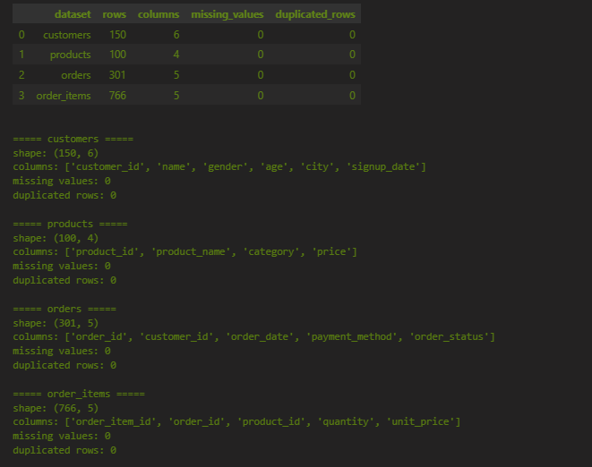
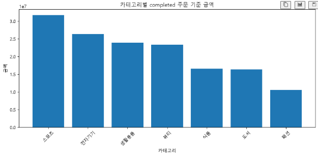
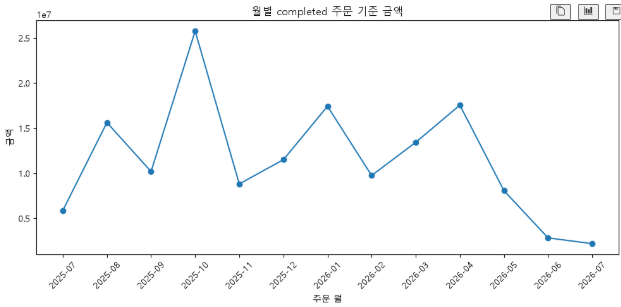
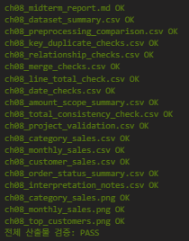

# Chapter 08 답안 양식. 작은 데이터 분석 프로젝트 완성하기

> 이 내용을 `chapter08.ipynb`의 Markdown 셀로 작성합니다.

## 제출 정보
- 이름: 양성용
- GitHub ID: dydtlsrl@gmail.com
- 작성일: 2026.09.17
- 최종 Notebook URL: 

## 1. 프로젝트 질문
### 분석 질문

### 분석 범위

### 사용할 데이터와 지표

### 계산 기준
- `order_status == "completed"` 적용 여부:
- `line_total = quantity × unit_price` 확인 여부:

### 완료 기준

## 2. 입력 데이터와 전처리 검증
- 사용 원본 파일:
- shape:
- 핵심 결측/중복 결과:
- 전처리 전후 변화:

### 나의 해석과 판단

### 한계와 추가 확인 사항

## 3. PK/FK·병합 검증
### PK 결과
- 결측:
- 중복:
- PASS/FAIL:

### FK 결과
- 미매칭:
- PASS/FAIL:

### 병합 결과
- validate 관계:
- 병합 전 행 수:
- 병합 후 행 수:
- 미매칭:
- PASS/FAIL:

### 나의 해석과 판단

## 4. 핵심 EDA 결과
### 결과 1
- 수치/표:
- 결과 관찰:
- 나의 해석과 판단:
- 업무·분석적 의미:
- 한계:

### 결과 2
- 수치/표:
- 결과 관찰:
- 나의 해석과 판단:
- 업무·분석적 의미:
- 한계:

### 결과 3
- 수치/표:
- 결과 관찰:
- 나의 해석과 판단:
- 업무·분석적 의미:
- 한계:

## 5. Total consistency와 날짜 검증
- completed source total:
- category total:
- monthly total:
- customer total:
- 총합 일치 여부:
- completed 주문 날짜 오류 건수:
- 날짜 오류 영향 금액:

### 불일치가 있었다면 원인

## 6. 대표 시각화

### 그래프 선택 이유

### 그래프와 원본 집계값 일치 여부

### 그래프에서 직접 관찰한 사실

### 그래프만으로 말할 수 없는 것

## 7. 개인정보 검증
- 공개 고객 CSV 컬럼:
- 원본 `customer_id` 포함 여부:
- 이름/이메일/전화번호/주소 포함 여부:
- 익명 라벨 방식:
- PASS/FAIL:

### 나의 판단

## 8. 최종 Validation
`reports/ch08_project_validation.csv`의 결과를 요약합니다.

| 검증 항목 | 결과 | 내가 확인한 근거 |
| --- | --- | --- |
| pk_integrity |  |  |
| fk_integrity |  |  |
| merge_checks_pass |  |  |
| line_total_consistency |  |  |
| completed_total_consistency |  |  |
| category_sales_ratio_pct_sum |  |  |
| completed_rows_with_invalid_order_date |  |  |
| public_customer_columns_safe |  |  |

### FAIL이 있었다면 수정 내용

## 9. LLM 활용 기록
- 사용 여부:
- 사용 목적:
- Safe Context:
- Prompt 요약:
- 제안 요약:
- 반영/수정/보류:
- 사람이 검증한 근거:

## 10. 프로젝트 재현 확인
- `python scripts/run_midterm_project.py` 실행 여부:
- 재실행 결과:
- Notebook과 핵심 수치 일치 여부:
- 생성된 핵심 Evidence 파일 확인 여부:

### 나의 해석과 판단
재실행 가능한 프로젝트가 왜 중요한지 작성하세요.

## 11. 최종 프로젝트 요약
### 핵심 인사이트 3개
1.
2.
3.

### 가장 중요한 업무·분석적 의미

### 현재 분석의 한계

### 다음 분석 제안
1.
2.
3.

## 최종 체크
- [ ] 질문과 지표가 연결됩니다.
- [ ] 원본 데이터에서 다시 시작했습니다.
- [ ] PK/FK·병합 검증 근거가 있습니다.
- [ ] `line_total` 계산 관계를 확인했습니다.
- [ ] 금액성 분석은 completed 범위를 사용했습니다.
- [ ] category/month/customer 총합이 source total과 일치합니다.
- [ ] 날짜 오류를 확인했습니다.
- [ ] 공개 고객 결과에서 원본 ID와 직접 식별정보를 제거했습니다.
- [ ] 대표 그래프와 원본 집계값을 비교했습니다.
- [ ] 원인 과대 해석이 없습니다.
- [ ] 최종 Validation이 모두 PASS입니다.
- [ ] 전체 프로젝트를 재실행했습니다.
- [ ] 한계와 다음 분석을 작성했습니다.
- [ ] 최종 Notebook URL을 제출합니다.
