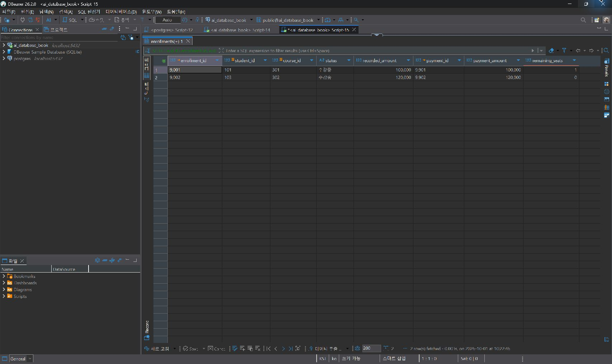
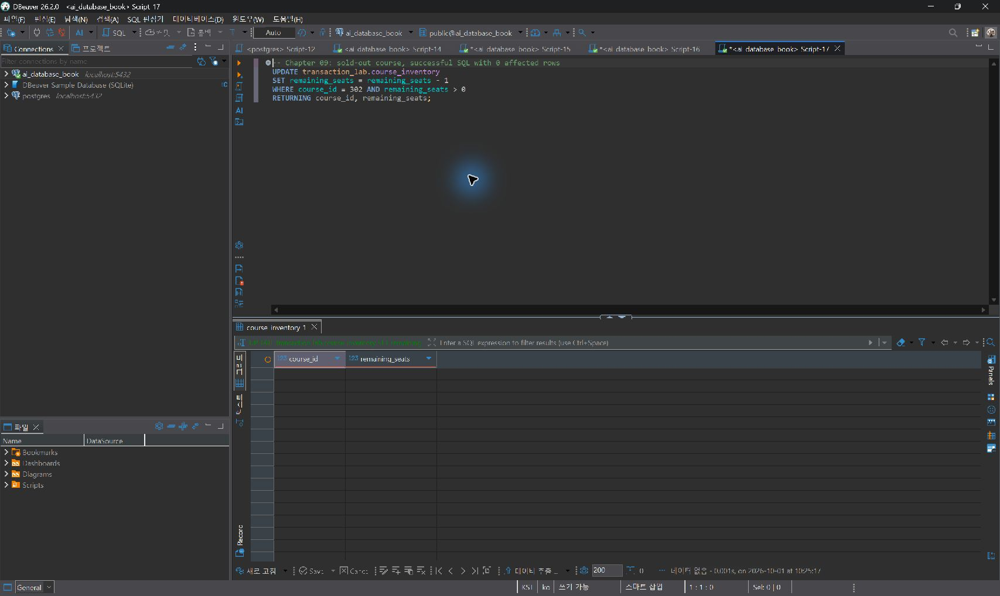
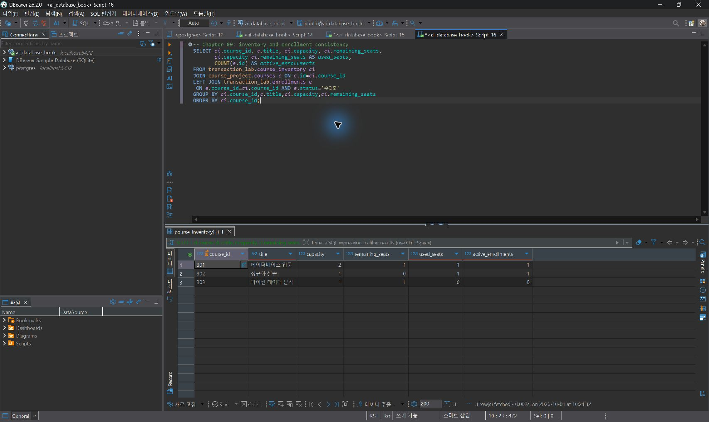

# Chapter 09 실습 답안 템플릿

> **과제:** 트랜잭션으로 데이터 정합성 지키기
> **사용 방법:** `assignments/chapter09_SQL/`의 SQL 파일을 순서대로 DBeaver에서 직접 실행하면서, 이 파일의 `직접 실행 후 작성` 부분을 실제 결과로 채웁니다.
> **제출 방법:** LMS에는 파일을 직접 업로드하지 않고, 본인 GitHub 저장소의 `chapter09_answer.md` 파일 URL을 제출합니다.

---

## 제출 전 주의

이 파일과 캡처 화면에는 실제 비밀번호, 전체 DB 접속 URL, API Key, 개인정보를 기록하지 않습니다.

```text
GitHub 계정 또는 별칭: dydtlsrl
이메일: dydtlsrl@gmail.com
과제 작성일: 2026-10-01
사용한 AI 도구: Codex (SQL 실행·결과 검증·답안 작성)
```

실행 환경: PostgreSQL 18 / ai_database_book / psql 및 DBeaver / READ COMMITTED.
01~06과 선택 실습은 psql에서 실행했다. 이후 DBeaver에서 신청·결제, 좌석 현황을 직접 조회하고 좌석 부족 UPDATE를 다시 실행했다.
아래 3장은 실제 DBeaver 실행 결과 화면이다. 생성·ROLLBACK·Lock·SAVEPOINT의 실행 증거는 원본 로그로 구분해 연결했다.
[기준 상태 실행 로그](logs/00_baseline.txt) · [01~06 원본 실행 로그](logs/01_06_main.txt)

---

# 1. Chapter 07·08 기준 상태 확인

`chapter07/04_course_project_validation.sql`과 `chapter08_SQL/00_check_course_project.sql`을 실행합니다.

```text
검증 메시지: Chapter 07 course project validation passed
             Chapter 08 prerequisite check passed
students / instructors / courses / enrollments: 3 / 2 / 3 / 5
전체 590000 / 활성 340000 / 취소 제외 440000
```

### 기준값이 다르면 그대로 진행하면 안 되는 이유

```text
transaction_lab이 course_project.students/courses를 FK로 참조하므로,
기준 데이터가 다르면 01_transaction_lab_schema.sql의 사전 검사부터
막히거나 이후 좌석·신청 결과를 기대값과 비교할 수 없기 때문이다.
```

---

# 2. transaction_lab 스키마 생성 (01)

실행 전 예상:

```text
사전 검사 통과 메시지: Chapter 09 prerequisite check passed
생성 메시지: Chapter 09 transaction_lab schema created
세 테이블 모두 0행
```

직접 실행 후 작성:

```text
사전 검사 결과: Chapter 09 prerequisite check passed
생성 결과: Chapter 09 transaction_lab schema created
course_inventory / enrollments / payments 각 0행, COMMIT 완료
SQL 기준 성공 조건: ai_database_book의 기준 상태와 권한을 검사하고,
transaction_lab의 3개 테이블 및 활성 신청 부분 고유 인덱스를 생성한다.
사전 검사 실패 시 생성하지 않으며 DDL 중 오류가 나면 ROLLBACK한다.
```

### 증거 화면

[스키마 생성 원본 실행 로그](logs/01_06_main.txt)

---

# 3. 좌석 초기 데이터 입력 (02)

```text
예상 결과: course_inventory 3행
301(데이터베이스 입문) capacity 2 / remaining 2
302(정규화 실습)     capacity 1 / remaining 1
303(파이썬 데이터 분석) capacity 1 / remaining 1
통과 메시지: Chapter 09 transaction_lab seed passed
```

직접 실행 후 작성:

```text
실제 결과: INSERT 0 3, Chapter 09 transaction_lab seed passed, COMMIT 완료
301 capacity 2 / remaining 2, 302 capacity 1 / remaining 1,
303 capacity 1 / remaining 1, 신청·결제 각 0행.
SQL 기준 확인 항목: course_inventory 3행, 신청·결제 각 0행,
301 잔여 2 / 302 잔여 1 / 303 잔여 1이어야 한다.
```

---

# 4. 성공 트랜잭션 — 좌석·신청·결제 함께 확정 (03)

## 4-1. FOR UPDATE로 좌석 행 잠금·관찰

```text
예상 결과: course 301, remaining_seats = 2 (아직 차감 전)
```

## 4-2. 조건부 차감 + 신청·결제 CTE

```sql
WITH seat AS (
    UPDATE transaction_lab.course_inventory AS ci
    SET remaining_seats = ci.remaining_seats - 1
    FROM course_project.courses AS c
    WHERE ci.course_id = c.id
      AND ci.course_id = 301
      AND ci.remaining_seats > 0
    RETURNING ci.course_id, c.price
),
new_enrollment AS (
    INSERT INTO transaction_lab.enrollments (
        id, student_id, course_id,
        enrolled_at, status, recorded_amount
    )
    SELECT 9001, 101, course_id, CURRENT_TIMESTAMP, '수강중', price
    FROM seat
    RETURNING id, recorded_amount
)
INSERT INTO transaction_lab.payments (id, enrollment_id, amount, paid_at)
SELECT 9901, id, recorded_amount, CURRENT_TIMESTAMP
FROM new_enrollment
RETURNING id, enrollment_id, amount;
```

```text
예상 결과: enrollment 9001 = 1행 / payment 9901 = 1행 / 금액 100000 / course 301 remaining_seats = 1
통과 메시지: Chapter 09 commit transaction (course 301) passed
```

직접 실행 후 작성:

```text
실제 결과: 잠금 조회에서 강의 301 잔여 좌석 2 확인.
결제 RETURNING: id 9901 / enrollment_id 9001 / amount 100000 (1행).
Chapter 09 commit transaction (course 301) passed, COMMIT 완료.
확정 후 신청 9001(student 101/course 301/수강중/100000),
결제 9901(9001/100000) 각 1행, 강의 301 잔여 좌석 1.
SQL 기준 확인 항목: 좌석 차감 1행 → 신청 9001 1행 → 결제 9901 1행.
학생 101, 강의 301, 신청 금액과 결제 금액 각 100000,
잔여 좌석 1을 COMMIT 전에 검사한다. 하나라도 다르면 확정하지 않는다.
```

### 왜 seat CTE가 0행이면 신청·결제도 함께 0건이 되는가

```text
new_enrollment는 seat의 결과 행을 SELECT ... FROM seat로 가져와 INSERT하고,
payments의 INSERT도 new_enrollment의 결과를 가져와 실행하기 때문에
seat 단계에서 조건(remaining_seats > 0)을 만족하는 행이 없으면
뒤의 두 INSERT도 실행 대상 자체가 없어 자연히 0건이 된다.
```

### 증거 화면

DBeaver에서 확정된 신청·결제를 직접 조회한 결과: 신청 9001·9002와 결제 9901·9902, 금액 100000·120000을 확인했다.



---

# 5. 실패를 가정한 ROLLBACK (04)

```text
예상 결과(ROLLBACK 전 임시 상태): course 302 remaining_seats = 0, enrollment 9002 존재, payment 9902 존재
예상 결과(ROLLBACK 후): course 302 remaining_seats = 1, enrollment 9002 없음, payment 9902 없음
통과 메시지: Chapter 09 rollback transaction (course 302) passed
```

직접 실행 후 작성:

```text
ROLLBACK 전 임시 상태: 302 잔여 좌석 0, 신청 9002(학생 102) 1행,
결제 9902(120000) 1행
ROLLBACK 후 상태: 302 잔여 좌석 1, 신청 9002 0행, 결제 9902 0행.
Chapter 09 rollback transaction (course 302) passed 확인.
9001/9901은 유지됨
SQL 기준 기대 변화: 강의 302 좌석 1 → 0 → 1,
신청 9002와 결제 9902는 트랜잭션 안에서 생겼다가 ROLLBACK으로 제거된다.
앞서 COMMIT한 신청 9001과 결제 9901은 유지되어야 한다.
```

### 이미 COMMIT된 변경을 같은 트랜잭션의 ROLLBACK으로 되돌릴 수 없는 이유

```text
COMMIT은 트랜잭션의 변경을 영구히 확정하는 시점이며,
그 순간 트랜잭션 자체가 끝난다. ROLLBACK은 아직 확정되지 않은,
현재 열려 있는 트랜잭션의 변경만 취소할 수 있으므로
이미 COMMIT된 변경에는 적용할 대상 트랜잭션이 남아 있지 않다.
```

---

# 6. 두 번째 COMMIT과 좌석 부족(0행) 확인 (05)

## 6-1. 학생 103의 강의 302 신청 — 이번에는 COMMIT

```text
예상 결과: course 302 remaining_seats = 0, enrollment 9002(학생 103) / payment 9902 = 1행씩
통과 메시지: Chapter 09 commit transaction (course 302, student 103) passed
```

## 6-2. 좌석이 없는 강의에 추가 신청 시도

```sql
UPDATE transaction_lab.course_inventory
SET remaining_seats = remaining_seats - 1
WHERE course_id = 302
  AND remaining_seats > 0
RETURNING course_id, remaining_seats;
```

```text
예상 결과: 0 rows affected (SQL 오류 아님, 자동 ROLLBACK 아님)
```

직접 실행 후 작성:

```text
실제 결과(6-1): 신청 9002(student 103/course 302/수강중/120000),
결제 9902(9002/120000) 각각 1행.
Chapter 09 commit transaction (course 302, student 103) passed,
COMMIT 완료, 강의 302 잔여 좌석 0
실제 결과(6-2, 반환 행 수): (0 rows), UPDATE 0. SQL 오류 없음.
이 파일의 0행 UPDATE는 COMMIT 뒤 자동 커밋 문장으로 실행되었다.
별도의 신청·결제 INSERT나 명시적 ROLLBACK은 이 시도에 포함되지 않았다
SQL 기준 성공 조건: 학생 103의 강의 302 신청 9002와 결제 9902를
각 1건 확정하고 금액은 각 120000, 잔여 좌석은 0이 된다.
그 뒤 조건부 UPDATE는 0행이어야 한다. 실제 파일에서는 후속 INSERT 없이
좌석 0행을 확인한다. 별도로 신청 업무를 트랜잭션으로 구성한다면
좌석 0행일 때 후속 INSERT를 막고 ROLLBACK으로 종료해야 한다.
```

### 0행 반환이 SQL 오류나 자동 ROLLBACK과 다른 이유

```text
0행 반환은 WHERE 조건(remaining_seats > 0)을 만족하는 행이 없다는
정상적인 실행 결과이다. 문장 자체는 성공했고 트랜잭션도 오류 상태가 되지 않으며,
애플리케이션 레벨에서는 이를 "정원 마감"이라는 업무 결과로 해석해야 한다.
```

### 증거 화면

DBeaver에서 같은 조건부 UPDATE를 다시 실행했다. 오류 없이 빈 결과 표(데이터 없음)가 반환되었다.



---

# 7. IDENTITY 자동 번호와 ROLLBACK의 관계

```text
명시적 ID(9001, 9002 등)를 ROLLBACK한 뒤 같은 번호를 다시 사용할 수 있었던 이유:
명시적 ID를 넣은 행 자체가 취소되어 테이블에 남지 않기 때문이다.
04의 신청 9002·결제 9902가 취소되면 05에서 같은 값을 다시 직접 입력할 수 있다.
이미 COMMIT된 같은 ID를 재사용하면 기본키 중복 오류가 발생한다.

IDENTITY 자동 번호와 ROLLBACK되지 않는 이유(자동 생성 시나리오라면):
자동 번호를 생성하는 시퀀스의 nextval 사용은 행 변경과 달리 취소되지 않으므로,
트랜잭션을 ROLLBACK해도 소비된 번호에 빈 구간이 생길 수 있다.
따라서 번호가 연속인지로 트랜잭션 성공 여부를 판단하면 안 된다.
명시적 ID 입력도 시퀀스의 다음 값을 자동으로 높여 주지는 않는다.
```

직접 실행 후 작성 (05 마지막의 `ALTER TABLE ... RESTART WITH` 실행 결과):

```text
enrollments 다음 값: 05 실행 후 last_value=9003, is_called=false → 다음 값 9003
payments 다음 값: 05 실행 후 last_value=9903, is_called=false → 다음 값 9903
추가 오류 재현 후: 신청 시퀀스 last_value=9003, is_called=true → 다음 값 9004.
결제 시퀀스는 9903/false로 유지됨.
중복 신청 INSERT가 오류로 취소되어도 자동 번호 9003이 소비된 것을 직접 확인했다
```

---

# 8. 최종 정합성 검증 (06)

```text
예상 결과:
course_project.enrollments = 5 (변경 없음)
transaction_lab.enrollments = 2
transaction_lab.payments = 2
course 301 remaining_seats = 1
course 302 remaining_seats = 0
course 303 remaining_seats = 1
좌석 범위 위반 / 결제 누락 / 금액 불일치 / 고아 결제 / 중복 활성 신청 = 모두 0
활성 신청 수 = 사용 좌석 수

통과 메시지: Chapter 09 main transaction validation passed
```

직접 실행 후 작성:

```text
실제 결과: Chapter 09 main transaction validation passed.
course_project 신청 5행, lab 신청 2행, 결제 2행.
301/302/303 잔여 좌석 = 1/0/1.
좌석 범위·결제 누락·금액 불일치·고아 결제·중복 활성 신청 각 0건.
활성 신청 수 2 = 사용 좌석 수 2.
선택 실습 후 06을 다시 실행해 동일한 최종 검증 통과 확인
SQL 기준 검산: 신청 9001(101/301)과 9002(103/302) 각 1행,
결제 9901(100000)과 9902(120000) 각 1행.
사용 좌석은 (2-1)+(1-0)+(1-1)=2이며 활성 신청 2건과 같아야 한다.
course_project 신청 5건은 유지되어야 하고 모든 위반 검사는 0이어야 한다.
```

### 자동 검증이 통과했어도 사람이 설명해야 하는 것

```text
자동 검증은 기준 데이터에서 결과값이 맞는지만 확인할 뿐,
왜 이 실습이 선행 FOR UPDATE와 WHERE remaining_seats > 0을 함께 사용하는지,
왜 신청·결제를 같은 트랜잭션에 묶어야 하는지 같은
업무적 이유는 사람이 직접 설명해야 확인할 수 있다.
FOR UPDATE는 잠근 상태로 먼저 읽기 위한 것이며 단일 조건부 UPDATE에 항상
필수는 아니다. 조건부 UPDATE 자체도 필요한 행 잠금을 획득한다.
또한 FK는 유효한 신청 참조를, UNIQUE는 신청당 결제 최대 1건을 보장하지만,
수강중 신청에 결제가 최소 1건 존재한다는 조건은 업무 검증으로 확인해야 한다.
```

### 증거 화면

DBeaver에서 좌석과 활성 신청 수를 직접 조회했다. 잔여 좌석 1/0/1, 사용 좌석과 활성 신청 수 1/1/0을 확인했다.



[최종 자동 검증 원본 로그](logs/06_after_optional.txt)

---

# 9. (선택) Lock 대기 관찰 — 07

두 개의 DBeaver 연결을 사용했다면 작성합니다. 실행하지 않았다면 `미실행`이라고 명시합니다.

```text
현재 격리 수준(SHOW transaction_isolation): read committed
세션 B가 대기한 시간(체감): 약 3.008초 (명령 실행부터 종료까지 측정)
세션 A가 COMMIT/ROLLBACK한 뒤 세션 B가 어떻게 진행되었는가:
A가 303행 잠금을 가진 채 pg_sleep(3) 후 ROLLBACK하자,
B의 FOR UPDATE 조회가 303/remaining_seats 1을 반환했다. B도 ROLLBACK했다
lock_timeout에 걸렸는가: 아니오. B의 lock_timeout='5s' 이내에 A가 종료됨
DBeaver 대신 서로 다른 psql 연결 2개로 동일한 잠금 흐름을 실행했다.
```

### Lock 대기와 Deadlock의 차이를 자신의 말로 설명

```text
Lock 대기는 다른 트랜잭션이 가진 잠금의 해제를 기다리는 상태이다.
Deadlock은 A가 B의 잠금을, B가 A의 잠금을 기다리는 등 순환 대기 상태이다.
한쪽이 종료되면 풀릴 수 있는 일반 대기와 달리 Deadlock은 DBMS가 감지하여
한 트랜잭션을 오류로 중단할 수 있다. 여러 행을 같은 순서로 잠그고
트랜잭션을 짧게 유지하면 위험을 줄일 수 있다.
```

---

[두 psql 연결의 Lock 대기 원본 로그](logs/07_concurrency.txt)

# 10. (선택) 취소와 좌석 복구 — 08

08 파일을 실제 실행했고 아래 상태 변화를 관찰했다.
`Chapter 09 cancel and restore (temporary) passed`를 확인했다.
[취소·복구 및 시퀀스 확인 로그](logs/08_cancel_identity.txt)

```text
취소 전: enrollment 9001 = 수강중, course 301 remaining_seats = 1
취소·복구 직후(트랜잭션 안): enrollment 9001 = 취소, course 301 remaining_seats = 2
ROLLBACK 후: enrollment 9001 = 수강중(복구), course 301 remaining_seats = 1
```

### 취소와 좌석 복구를 같은 트랜잭션에 묶어야 하는 이유

```text
취소 상태 변경과 좌석 복구를 별개의 트랜잭션으로 나누면
그 사이에 장애나 재시도가 발생했을 때 취소만 반영되고 좌석은
복구되지 않는(또는 그 반대의) 부분 실패 상태가 남을 수 있기 때문이다.
CTE로 "취소에 실제로 성공한 행"만 좌석 복구에 연결하면
같은 취소를 다시 실행해도 좌석이 중복으로 복구되지 않는다.
```

---

# 11. (선택) SQL 오류와 SAVEPOINT — 09

오류 유발 INSERT의 주석을 해제해 실제로 오류를 재현했다면 작성합니다. 재현하지 않았다면 `미실행`이라고 명시합니다.

```text
발생시킨 오류 메시지: SQLSTATE 23505 (uq_transaction_enrollments_active 중복),
이후 SELECT에서 SQLSTATE 25P02 (현재 트랜잭션 중지 상태)
SAVEPOINT 이전으로 되돌린 뒤 트랜잭션이 계속되었는가: 예.
savepoint recovery ok 조회 성공, 303 잔여 좌석 1로 복구, COMMIT 성공
실행 설명: 09의 주석 처리된 중복 INSERT를 별도 psql 입력에서 활성화했다.
SAVEPOINT 이후 303 좌석을 임시 차감하는 단계도 추가해 복구 범위를 관찰했다.
오류 전에 before_optional_step SAVEPOINT를 만들고,
중복 수강중 신청이 부분 고유 인덱스를 위반하면 오류 상태가 된다.
ROLLBACK TO SAVEPOINT before_optional_step으로 그 이후 좌석 차감까지 취소하고
오류 상태를 해제한다. 저장점을 만들지 않았다면 전체 ROLLBACK이 기본 대응이다.
```

> 오류를 실제로 재현했다면, 오류 화면과 원인·해결 과정을 이 파일이 아니라 `chapter09_error_notes.md`에 따로 기록하고 여기서는 링크만 남깁니다.

---

[실제 오류·SAVEPOINT 복구 기록](chapter09_error_notes.md)

# 12. 최종 성찰

아래 문장은 본인의 말로 작성합니다.

```text
1. 트랜잭션 경계를 정할 때 가장 먼저 판단해야 하는 것은
   어떤 변경이 하나의 업무로 함께 성공하거나 취소되어야 하는지이다.
   좌석 확보·신청 생성·결제 결과 저장·내부 검증을 같은 경계로 묶되,
   외부 API 응답이나 사용자 입력을 기다리면서 잠금을 오래 유지하지 않는다.

2. 좌석 UPDATE 0행을 SQL 오류와 구분해야 하는 이유는
   0행은 조건을 만족하지 않는 정상 실행 결과이고 오류 상태가 아니기 때문이다.
   좌석 확보에는 실패했으므로 정원 마감으로 처리하고 후속 생성은 막아야 한다.
   반면 제약조건 오류가 발생하면 ROLLBACK 또는 SAVEPOINT 복구가 필요하다.

3. FOR UPDATE와 조건부 UPDATE(WHERE ... RETURNING)의 역할이 다른 이유는
   FOR UPDATE는 대상 행을 잠근 상태로 관찰하고 후속 판단을 준비하는 반면,
   조건부 UPDATE는 남은 좌석이 있을 때만 실제 변경하기 때문이다.
   RETURNING의 반환 행 수로 성공 여부를 판단한다. 단일 조건부 UPDATE는
   자체적으로 행 잠금을 얻으므로 선행 FOR UPDATE가 항상 필수는 아니다.

4. ROLLBACK과 IDENTITY 자동 번호를 구분해야 하는 이유는
   행 변경은 취소되어도 이미 사용된 자동 번호는 회수되지 않을 수 있기 때문이다.
   번호 누락이 곧 데이터 누락은 아니며 명시적 ID 입력 후에는 시퀀스의 다음
   값이 기존 ID와 충돌하지 않도록 별도로 확인해야 한다.

5. AI가 만든 트랜잭션 SQL을 검토할 때 정상 경로만큼 중요하게 봐야 하는 것은
   좌석 부족·중복 신청·결제 실패·SQL 오류·동시 실행·재시도 경로이다.
   좌석 0행일 때 후속 INSERT가 차단되는지, COMMIT 전에 관계와 금액을 검증하는지,
   오류 상태를 복구하는지, 취소 성공 행만 좌석 복구에 연결하는지 확인한다.
   기존 course_project를 변경하지 않는지도 확인해야 한다.
```

---

# 13. 제출 체크리스트

- [x] `chapter09_answer.md`를 본인 저장소에 만들었다.
- [x] Chapter 07·08 기준 상태 검사를 통과했다.
- [x] `01_transaction_lab_schema.sql` ~ `06_transaction_validation.sql`을 순서대로 실행했다.
- [x] 성공 COMMIT과 ROLLBACK을 각각 실행하고 상태 차이를 직접 확인했다.
- [x] 좌석 부족이 SQL 오류가 아니라 0행이라는 것을 직접 확인했다.
- [x] IDENTITY 자동 번호와 ROLLBACK의 관계를 직접 확인했다.
- [x] 최종 검증(`06`)이 통과했다.
- [x] (선택) Lock 대기, 취소·복구, SAVEPOINT 실습 중 진행한 것을 표시했다.
- [x] 오류가 발생했다면 `chapter09_error_notes.md`에 기록했다.
- [x] 핵심 캡처는 3~6장 정도만 사용했다.
- [x] 비밀번호·개인정보·비밀정보가 없다.
- [ ] GitHub 웹에서 Markdown과 이미지가 정상적으로 보인다.
- [ ] 최종 답안을 commit/push했다.

---

# 14. LMS 제출 URL

```text
https://github.com/dydtlsrl/ai-data-analysis/blob/main/00_llm-data-analysis-course/assignments/chapter09_SQL/chapter09_answer.md
```
