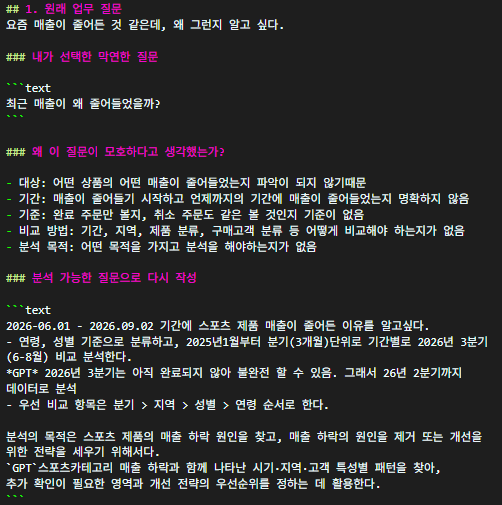
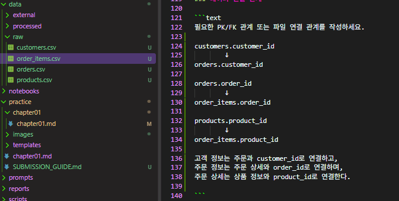
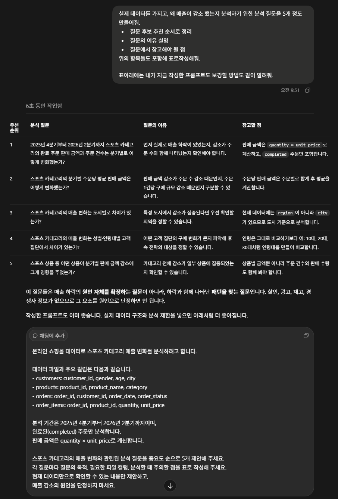
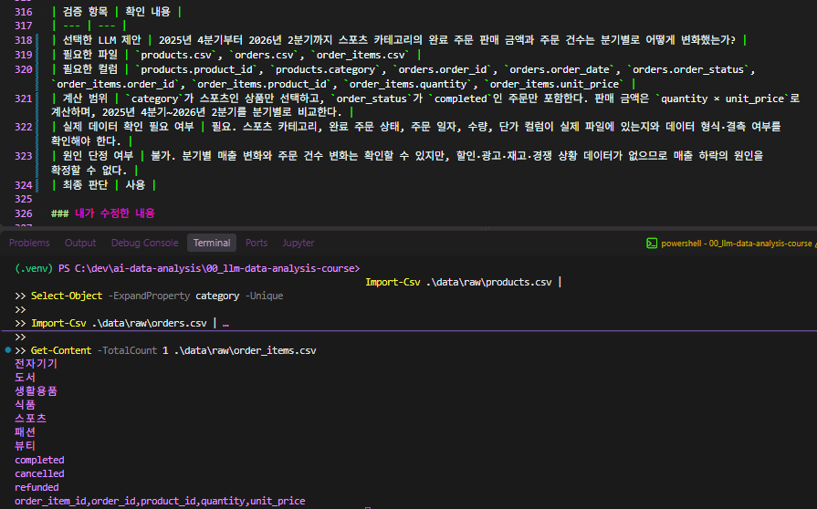
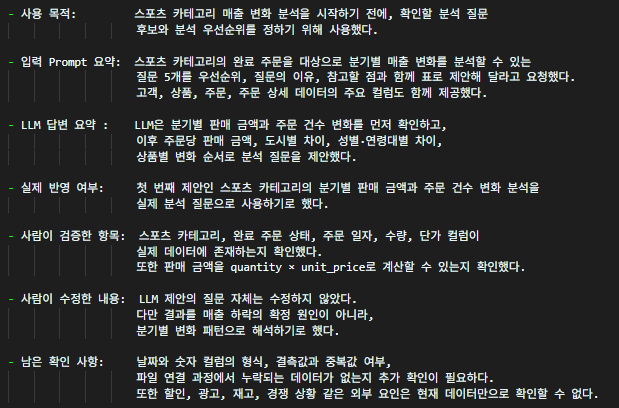
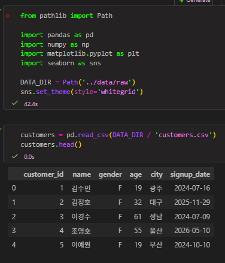

# Chapter 01 제출 답안. AI와 함께하는 데이터 분석의 시작

> 이 파일은 Chapter 01 실습 결과를 정리하여 제출하기 위한 학생용 템플릿입니다.  
> 강사 저장소의 원본 템플릿을 직접 수정하지 말고, 자신의 PC에 복사한 뒤 작성합니다.

---

## 0. 제출 정보

- 이름: 양성용
- GitHub ID: dydtlsrl@gmail.com
- 개인 저장소명: `ai-data-analysis`
- 작성일: 2026-09-02
- 사용한 LLM:chat GPT

### 최종 제출 URL

```text
https://github.com/dydtlsrl/ai-data-analysis/blob/main/00_llm-data-analysis-course/practice/chapter01.md
```

---

## 1. 원래 업무 질문
요즘 매출이 줄어든 것 같은데, 왜 그런지 알고 싶다.

### 내가 선택한 막연한 질문

```text
최근 매출이 왜 줄어들었을까?
```

### 왜 이 질문이 모호하다고 생각했는가?

- 대상: 어떤 상품의 어떤 매출이 줄어들었는지 파악이 되지 않기때문
- 기간: 매출이 줄어들기 시작하고 언제까지의 기간에 매출이 줄어들었는지 명확하지 않음
- 기준: 완료 주문만 볼지, 취소 주문도 같은 볼 것인지 기준이 없음
- 비교 방법: 기간, 지역, 제품 분류, 구매고객 분류 등 어떻게 비교해야 하는지가 없음
- 분석 목적: 어떤 목적을 가지고 분석을 해야하는지가 없음

### 분석 가능한 질문으로 다시 작성

```text
2026-06.01 - 2026.09.02 기간에 스포츠 제품 매출이 줄어든 이유를 알고싶다.
- 연령, 성별 기준으로 분류하고, 2025년분기(3개월)단위로 기간별로 2026년 3분기(6-8월) 비교 분석한다.
*GPT* 2026년 3분기는 아직 완료되지 않아 불완전 할 수 있음. 그래서 2025년 4분기부터 2026년 2분기까지 완료된 주문을 기준
- 우선 비교 항목은 분기 > 지역 > 성별 > 연령 순서로 한다.

분석의 목적은 스포츠 제품의 매출 하락 원인을 찾고, 매출 하락의 원인을 제거 또는 개선을 위한 전략을 세우기 위해서다.
`GPT`스포츠카테고리 매출 하락과 함께 나타난 시기·지역·고객 특성별 패턴을 찾아,
추가 확인이 필요한 영역과 개선 전략의 우선순위를 정하는 데 활용한다.
```

### 결과 관찰

이 단계에서 질문이 어떻게 구체화되었는지 작성하세요.

처음에는 “스포츠 제품 매출이 왜 줄었는가?”처럼 원인과 범위가 불명확한 질문이었다.

질문을 구체화하면서 분석 대상을 스포츠 카테고리의 완료 주문으로 정하고,
매출을 판매 금액과 주문 건수로 확인하도록 기준을 세웠다.
또한 비교 기간을 분기 단위로 정했으며, 매출 변화가 큰 경우 지역·성별·연령대별로
감소 패턴이 다르게 나타나는지 추가 확인하도록 분석 범위를 구체화했다.

### 나의 해석과 판단

왜 이 질문이 실제 분석에 더 적합하다고 판단했는지 자신의 말로 작성하세요.

명확한 분석기준과 분석 목표가 있기 때문

`GPT` 
분기별 판매 금액과 주문 건수라는 측정 기준도 명확하다.
또한 지역·성별·연령대별 차이를 추가로 확인할 방향이 있어,
단순히 매출이 줄었다고 말하는 것보다 실제 데이터를 통해 
변화 패턴을 검토하기에 적합하다고 판단했다.
다만 현재 데이터만으로 매출 하락의 원인을 확정할 수는 없으므로,
분석 결과는 원인이 아니라 추가 확인이 필요한 패턴으로 해석해야 한다.

### 업무·분석적 의미

이 질문에 답하면 어떤 의사결정이나 다음 분석에 도움이 될 수 있는지 작성하세요.

이 질문에 답하면 스포츠 카테고리 매출 하락이 특정 분기에 집중되었는지,
또는 특정 지역이나 고객 집단에서 더 크게 나타났는지 확인할 수 있다.
이를 바탕으로 우선 점검할 상품군과 고객 집단을 정하고,
프로모션, 상품 구성, 지역별 판매 전략 등 후속 개선 방향의 우선순위를 결정하는 데 도움이 된다

### 한계와 추가 확인 사항

현재 질문만으로 알 수 없는 것은 무엇인지 작성하세요.

분석 결과만으로 매출 하락의 원인을 확정할 수는 없으므로,
할인 정책, 재고, 경쟁 상황, 광고 집행 등 데이터에 없는 요인은 추가로 확인해야 한다.

### Evidence



---

## 2. 질문과 필요한 데이터 연결

### 필요한 데이터 파일

- [ v ] `customers.csv`
- [ v ] `products.csv`
- [ v ] `orders.csv`
- [ v ] `order_items.csv`

### 필요한 컬럼 후보

| 파일 | 필요한 컬럼 | 필요한 이유 |
| --- | --- | --- |
| `customers.csv` | `customer_id`, `gender`, `age`, `city` | 고객 특성별 차이를 보기 위해 필요 |
| `products.csv` | `product_id`, `category` | 스포츠 카테고리 상품을 구분하기 위해 필요 |
| `orders.csv` | `order_id`, `customer_id`, `order_date`, `order_status` | 완료 주문만 선택하고, 분기·고객 정보와 연결하기 위해 필요 |
| `order_items.csv` | `order_id`, `product_id`, `quantity`, `unit_price` | 판매 금액(`quantity × unit_price`)을 계산하기 위해 필요 |

### 데이터 연결 관계

```text
필요한 PK/FK 관계 또는 파일 연결 관계를 작성하세요.

customers.customer_id
        ↓
orders.customer_id

orders.order_id
        ↓
order_items.order_id

products.product_id
        ↓
order_items.product_id

고객 정보는 주문과 customer_id로 연결하고,
주문 정보는 주문 상세와 order_id로 연결하며,
주문 상세는 상품 정보와 product_id로 연결한다.

```

### 결과 관찰

질문에 답하기 위해 어떤 데이터가 필요하다는 사실을 확인했는지 작성하세요.

스포츠 카테고리의 매출 변화를 분석하기 위해서는 상품 정보, 주문 정보,
주문 상세 정보, 고객 정보가 모두 필요하다는 사실을 확인했다.

상품 정보에서는 스포츠 카테고리를 구분하고,
주문 정보에서는 주문 일자와 완료 주문 여부를 확인할 수 있다.
주문 상세 정보에서는 수량과 단가를 통해 판매 금액을 계산할 수 있으며,
고객 정보에서는 성별, 연령, 도시별 차이를 확인할 수 있다.

### 나의 해석과 판단

현재 데이터만으로 질문에 답할 수 있는지 판단하세요.

왜 매출이 들었는지 명확한 답을 내릴 수는 없지만,
분류별로 패턴을 파악하고 분석은 가능하며
분석 한 것을 기반으로 유의미한 다른 데이터와
연결하여 줄어든 이유를 추적을 심화 할 수 있을 것 같다.

`gpt`
현재 데이터만으로 스포츠 카테고리의 분기별 판매 금액과 주문 건수 변화,
그리고 도시·성별·연령대별 차이와 같은 패턴은 분석할 수 있다고 판단했다.

하지만 이 데이터에는 할인 정책, 광고 집행, 재고 상태, 경쟁사 상황 등의 정보가 없으므로,
매출이 줄어든 정확한 원인을 확정할 수는 없다.
분석 결과에서 특정 시기나 고객 집단의 감소 패턴이 확인된다면,
해당 패턴과 관련된 추가 데이터를 확인하여 매출 감소 이유를 더 심화해 추적할 수 있을 것 같다.

### 업무·분석적 의미

질문과 데이터 구조를 먼저 연결하는 것이 왜 중요한지 작성하세요.

구체화한 질문과 데이터 구조를 먼저 연결하면,
원하는 분석에 필요한 데이터가 실제로 존재하는지
어떤 기준으로 분석을 해야 하는지 확인 할 수 있다.

### 한계와 추가 확인 사항

실제 컬럼 존재 여부, 타입, 결측 등 아직 확인하지 못한 부분을 작성하세요.

현재는 각 파일의 컬럼 이름과 분석에 필요한 항목의 존재 여부만 확인했다.

order_date가 날짜 형식으로 정상 처리되는지,
quantity와 unit_price가 숫자 형식인지 추가 확인이 필요하다.
또한 gender, age, city 등의 결측값 여부와,
category 값에 스포츠 카테고리가 일관되게 기록되어 있는지 확인해야 한다.

마지막으로 customer_id, order_id, product_id가 누락되거나 중복되지 않아
네 파일을 정상적으로 연결할 수 있는지도 이후 분석 전에 검증해야 한다.

### Evidence

필요한 경우 관계도 또는 데이터 파일 확인 화면을 첨부하세요.



---

## 3. LLM에게 분석 질문 후보 요청

### 사용 목적

```text
스포츠 카테고리 매출 변화 분석을 시작하기 전에,
현재 데이터로 확인할 수 있는 분석 질문과 필요한 
데이터 항목을 정리하기 위해 LLM을 사용했다.

LLM에게 분석 방향과 질문 후보를 제안받되,
제안된 컬럼과 분석 방법이 실제 데이터에 존재하고 
적용 가능한지는 직접 확인한 뒤 사용하기로 했다.
```

### 사용한 Prompt

```text
여기에 실제 사용한 Prompt를 붙여 넣으세요.

실제 데이터를 가지고, 왜 매출이 감소 했는지 분석하기 위한 분석 질문을 5개 정도 만들어줘.
- 질문 후보 추천 순서로 정리
- 질문의 이유 설명
- 질문에서 참고해야 될 점
위의 항목들도 포함해 표로작성해줘.
표아래에는 내가 지금 작성한 프롬프트도 보강할 방법도 같이 알려줘.


`GPT`
온라인 쇼핑몰 데이터로 스포츠 카테고리 매출 변화를 분석하려고 합니다.

데이터 파일과 주요 컬럼은 다음과 같습니다.
- customers: customer_id, gender, age, city
- products: product_id, product_name, category
- orders: order_id, customer_id, order_date, order_status
- order_items: order_id, product_id, quantity, unit_price

분석 기간은 2025년 4분기부터 2026년 2분기까지이며,
완료된(completed) 주문만 분석합니다.
판매 금액은 quantity × unit_price로 계산합니다.

스포츠 카테고리의 매출 변화와 관련된 분석 질문을 중요도 순으로 5개 제안해 주세요.
각 질문마다 질문의 목적, 필요한 파일·컬럼, 분석할 때 주의할 점을 표로 작성해 주세요.
현재 데이터만으로 확인할 수 있는 내용만 제안하고,
매출 감소의 원인을 단정하지 마세요.


단, 개인정보·API Key·Secret은 포함하지 마세요.
```

### LLM 답변 요약

LLM의 전체 답변을 그대로 복사하지 말고 핵심 제안 3~5개를 요약하세요.

1. 2025년 4분기부터 2026년 2분기까지 스포츠 카테고리의 완료 주문 판매 금액과 주문 건수는 분기별로 어떻게 변화했는가?
2. 스포츠 카테고리의 분기별 주문당 평균 판매 금액은 어떻게 변화했는가?
3. 스포츠 카테고리의 매출 변화는 도시별로 차이가 있는가?
4. 스포츠 카테고리의 매출 변화는 성별·연령대별 고객 집단에서 차이가 있는가?
5. 스포츠 상품 중 어떤 상품이 분기별 판매 금액 감소에 크게 영향을 주었는가?

### 결과 관찰

LLM이 어떤 방향의 질문을 주로 제안했는지 사실 위주로 작성하세요.

실제 데이터를 기반으로 분석해야 할 정보를 분류하고 각 분류별로 비교해서 차이를 판단하기 위한
질문을 주로 제안했다.

`GPT`
LLM은 스포츠 카테고리의 매출 변화를 먼저 분기별 판매 금액과 주문 건수로 확인하고,
이후 도시·성별·연령대·상품별로 비교하는 방향의 질문을 주로 제안했다.
또한 판매 금액 감소를 주문 수 감소와 주문당 구매 금액 변화로 나누어 확인하는 질문을 제안했다.

### 나의 해석과 판단

좋았던 제안과 그대로 사용하기 어려운 제안을 구분해서 작성하세요.

현재 받은 제안들은 그대로 사용할 수 있다고 생각한다.

`GPT`
분기별 판매 금액과 주문 건수 변화를 먼저 확인하라는 제안은
매출 감소 여부와 감소 패턴을 확인하는 데 적합하다고 판단했다.

도시·성별·연령대별 비교와 상품별 비교 제안도 현재 데이터의 
컬럼을 활용할 수 있어 수정 후 사용할 수 있다고 판단했다.
다만 연령은 연령대 구간으로 다시 분류해야 하며,
현재 데이터만으로 매출 하락의 정확한 원인을 확정할 수 없다는 
점을 함께 고려해야 한다.

### 업무·분석적 의미

LLM이 분석 시작 단계에서 어떤 도움을 줄 수 있다고 생각하는지 작성하세요.

사람이 분석내용 중 놓칠 수 있는 부분을 한 번 더 생각해보게 할 수 있는 것 같다.

### 한계와 추가 확인 사항

LLM 답변에서 실제 데이터로 검증해야 할 내용을 작성하세요.

`GPT`
LLM이 제안한 파일과 컬럼이 실제 데이터에 존재하는지 확인해야 한다.
또한 order_date가 분석 기간에 충분히 포함되는지,
order_status에서 completed가 실제 완료 주문을 의미하는지,
quantity와 unit_price를 이용해 판매 금액을 올바르게 계산할 수 있는지 검증해야 한다.

LLM이 매출 감소의 원인을 단정하거나,
현재 데이터에 없는 할인·광고·재고·경쟁 상황을 근거 없이 언급하지 않았는지도 확인해야 한다.

### Evidence



---

## 4. LLM 제안 검증

| 검증 항목 | 확인 내용 |
| --- | --- |
| 선택한 LLM 제안 | 2025년 4분기부터 2026년 2분기까지 스포츠 카테고리의 완료 주문 판매 금액과 주문 건수는 분기별로 어떻게 변화했는가? |
| 필요한 파일 | `products.csv`, `orders.csv`, `order_items.csv` |
| 필요한 컬럼 | `products.product_id`, `products.category`, `orders.order_id`, `orders.order_date`, `orders.order_status`, `order_items.order_id`, `order_items.product_id`, `order_items.quantity`, `order_items.unit_price` |
| 계산 범위 | `category`가 스포츠인 상품만 선택하고, `order_status`가 `completed`인 주문만 포함한다. 판매 금액은 `quantity × unit_price`로 계산하며, 2025년 4분기~2026년 2분기를 분기별로 비교한다. |
| 실제 데이터 확인 필요 여부 | 필요. 스포츠 카테고리, 완료 주문 상태, 주문 일자, 수량, 단가 컬럼이 실제 파일에 있는지와 데이터 형식·결측 여부를 확인해야 한다. |
| 원인 단정 여부 | 불가. 분기별 매출 변화와 주문 건수 변화는 확인할 수 있지만, 할인·광고·재고·경쟁 상황 데이터가 없으므로 매출 하락의 원인을 확정할 수 없다. |
| 최종 판단 | 사용 |

### 내가 수정한 내용

```text
선택한 LLM 제안은 현재 데이터의 파일과 컬럼 구조에 맞아
질문 자체는 수정하지 않고 사용하기로 했다.

다만 분석 결과를 매출 하락의 확정 원인으로 해석하지 않고,
분기별 판매 금액과 주문 건수의 변화 패턴으로 해석한다.
```

### 결과 관찰

검증 과정에서 확인된 사실을 작성하세요.

products.csv에 스포츠 카테고리를 구분할 수 있는 category 컬럼이 있고,
orders.csv에는 주문 일자와 완료 주문 여부를 확인할 수 있는
order_date, order_status 컬럼이 있음을 확인했다.

또한 order_items.csv에는 판매 금액 계산에 필요한
quantity와 unit_price 컬럼이 있음을 확인했다.
따라서 스포츠 카테고리의 완료 주문 판매 금액과 주문 건수를
분기별로 비교하는 분석은 현재 데이터로 수행할 수 있다.


### 나의 해석과 판단

왜 `사용 / 수정 후 사용 / 보류` 중 해당 결정을 내렸는지 작성하세요.

`사용` - 제안한 분석에 필요한 스포츠 카테고리, 주문 날짜, 
완료 주문 여부, 수량, 단가 컬럼이 실제 데이터에 있는 것을 확인했기 때문이다.
그래서 완료 주문 기준으로 스포츠 제품의 판매 금액과 주문 건수 변화를
분기별로 분석하는 것은 가능하다고 생각한다.

다만 이 분석만으로 매출 하락의 정확한 원인을 알 수는 없고,
어떤 시기나 고객 분류에서 변화가 나타나는지 확인하는 분석으로 활용해야 할 것 같다.

### 업무·분석적 의미

LLM 제안을 검증하지 않고 바로 사용하는 경우 어떤 문제가 생길 수 있는지 작성하세요.

LLM 제안을 검증하지 않고 바로 사용하면 실제 데이터에 없는 컬럼이나
확인할 수 없는 내용을 기준으로 분석을 시작할 수 있다.

또한 판매 금액 계산 방식이나 완료 주문의 기준을 잘못 이해하면
분석 결과도 정확하지 않을 수 있다.
특히 데이터만으로 확인할 수 없는 할인, 광고, 재고 같은 내용을
매출 하락의 원인으로 단정할 위험도 있다고 생각한다.

### 한계와 추가 확인 사항

아직 실제 데이터로 검증하지 못한 부분을 명확히 작성하세요.

현재는 필요한 파일과 컬럼의 존재 여부만 확인했다.

order_date가 날짜 형식으로 정상 처리되는지,
quantity와 unit_price에 결측값이나 비정상적인 값이 없는지 추가 확인이 필요하다.
또한 완료 주문으로 분류된 데이터가 실제 판매 완료 건을 정확히 의미하는지,
상품·주문·고객 정보를 연결할 때 누락되거나 중복되는 데이터가 없는지도 검증해야 한다.

그리고 분석 결과에서 매출 감소가 확인되더라도,
할인·광고·재고·경쟁 상황 같은 외부 요인은 현재 데이터에 없으므로
원인을 확정할 수 없다는 한계가 있다.


### Evidence



---

## 5. Prompt Log

- 사용 목적:         스포츠 카테고리 매출 변화 분석을 시작하기 전에, 확인할 분석 질문 
                    후보와 분석 우선순위를 정하기 위해 사용했다.

- 입력 Prompt 요약:  스포츠 카테고리의 완료 주문을 대상으로 분기별 매출 변화를 분석할 수 있는
                    질문 5개를 우선순위, 질문의 이유, 참고할 점과 함께 표로 제안해 달라고 요청했다.
                    고객, 상품, 주문, 주문 상세 데이터의 주요 컬럼도 함께 제공했다.

- LLM 답변 요약 :    LLM은 분기별 판매 금액과 주문 건수 변화를 먼저 확인하고,
                    이후 주문당 판매 금액, 도시별 차이, 성별·연령대별 차이,
                    상품별 변화 순서로 분석 질문을 제안했다.

- 실제 반영 여부:     첫 번째 제안인 스포츠 카테고리의 분기별 판매 금액과 주문 건수 변화 분석을
                    실제 분석 질문으로 사용하기로 했다.

- 사람이 검증한 항목:  스포츠 카테고리, 완료 주문 상태, 주문 일자, 수량, 단가 컬럼이
                    실제 데이터에 존재하는지 확인했다.
                    또한 판매 금액을 quantity × unit_price로 계산할 수 있는지 확인했다.

- 사람이 수정한 내용:  LLM 제안의 질문 자체는 수정하지 않았다.
                    다만 결과를 매출 하락의 확정 원인이 아니라,
                    분기별 변화 패턴으로 해석하기로 했다.

- 남은 확인 사항:     날짜와 숫자 컬럼의 형식, 결측값과 중복값 여부,
                    파일 연결 과정에서 누락되는 데이터가 없는지 추가 확인이 필요하다.
                    또한 할인, 광고, 재고, 경쟁 상황 같은 외부 요인은 현재 데이터만으로 확인할 수 없다.

### 결과 관찰

LLM 사용 기록에서 어떤 의사결정 과정을 확인할 수 있는지 작성하세요.

Prompt Log를 통해 분석 질문을 바로 확정한 것이 아니라,
LLM에게 여러 질문 후보를 받은 뒤 실제 데이터 파일과 컬럼을 확인하고
사용 여부를 판단하는 과정을 확인할 수 있었다.

최종적으로는 분기별 판매 금액과 주문 건수 변화를 확인하는 질문을 선택했고,
도시·성별·연령대·상품별 분석은 이후 추가로 확인할 분석 방향으로 정리했다

### 나의 해석과 판단

Prompt Log를 남기는 것이 왜 필요한지 자신의 말로 작성하세요.

어떤 상황에서 어떻게 Prompt를 사용했고
어떤 결과를 받았는지 Log로 남겨 놓으면
추후에는 더 좋은 Prompt를 만들기 위한
분석이 가능하기 때문에 중요하다. 

### Evidence



---

## 6. 개인정보와 Secret 보호 확인

다음 항목을 확인합니다.

- [ v ] 실제 이름·이메일·전화번호 등 고객 개인정보를 Prompt에 사용하지 않았습니다.
- [ v ] API Key를 코드나 Notebook에 직접 작성하지 않았습니다.
- [ v ] `.env` 실제 내용을 캡처하거나 업로드하지 않았습니다.
- [ v ] GitHub Token, 비밀번호, 내부 URL이 캡처에 보이지 않습니다.
- [ v ] 제출 전 이미지까지 다시 확인했습니다.

### 나의 판단

이번 실습에서 어떤 정보는 LLM 또는 Public GitHub에 올리면 안 된다고 판단했는지 작성하세요.

이번 실습에서는 실제 고객의 개인정보나 API Key를 LLM에 입력하지 않았다.

앞으로도 고객의 이름, 이메일, 전화번호, 주소 같은 개인정보와
API Key, GitHub Token, 비밀번호, .env 파일의 실제 내용은
LLM이나 Public GitHub에 올리면 안 된다고 판단했다.
---

## 7. Chapter 01 Notebook 확인

Notebook:

```text
notebooks/ch01_ai_data_analysis_intro.ipynb
```

### 내 환경 상태

- [ v ] 아직 환경설정 전이라 Notebook 위치만 확인했습니다.
- [ v ] 환경설정이 완료되어 Notebook을 직접 실행했습니다.

### 환경설정 완료 학생만 작성

#### 실행한 코드

```python
from pathlib import Path

import pandas as pd
import numpy as np
import matplotlib.pyplot as plt
import seaborn as sns

DATA_DIR = Path('../data/raw')
sns.set_theme(style='whitegrid')

customers = pd.read_csv(DATA_DIR / 'customers.csv')
customers.head()
```

#### 실행 결과

```text
오류 없이 실행 확인 했고, 5개의 컬럼(name, gender, age, city, signup_date)이 표시됐다.
```

#### 결과 관찰

실행 결과에서 확인한 사실을 작성하세요.

customers.csv에는 고객을 구분하는 customer_id와
고객 특성을 확인할 수 있는 gender, age, city 컬럼이 있음을 확인했다.
또한 signup_date 컬럼을 통해 고객 가입일 정보도 확인할 수 있었다.

데이터를 DataFrame 형태로 정상적으로 불러올 수 있음을 확인했다.

#### 나의 해석과 판단

현재 Notebook이 본격 분석이 아니라 starter scaffold라는 의미를 자신의 말로 설명하세요.

데이터를 분석 하기 위한 기본양식

#### 한계와 추가 확인 사항

Chapter 02 또는 Chapter 03에서 추가로 확인해야 할 내용을 작성하세요.

Chapter 03에서는 customers.csv뿐 아니라 products.csv, orders.csv,
order_items.csv도 불러와 각 파일의 컬럼, 자료형, 결측값, 중복값을 확인해야 한다.
또한 customer_id, order_id, product_id를 기준으로 파일을 연결했을 때
누락되거나 잘못 연결되는 데이터가 없는지도 검증해야 한다.

#### Evidence



> 환경설정 전이라면 이 이미지는 생략할 수 있습니다.

---

## 8. Chapter 01 최종 해석

### 이번 장에서 가장 중요하다고 생각한 내용

```text
질문을 구체화 하는 것이 가장 중요하다고 생각함.
```

### LLM을 데이터 분석에 사용할 때 가장 조심해야 할 점

```text
모호한 질문이나 분석을 요청 했을 경우, 잘못된 기준으로 분석하고 결과를 내놓을
가능성이 매우 높다고 생각되므로, 모호하거나 추상적인 질문을 사용하지 않도록
해야 할 것 같다.
```

### 사람과 LLM의 역할 차이

| 항목 | LLM이 도울 수 있는 부분 | 사람이 책임져야 하는 부분 |
| --- | --- | --- |
| 질문 정의 | 분석 질문 후보와 비교 관점을 제안 | 실제 업무 목적에 맞는 구체적 질문 선택 |
| 데이터 확인 | 필요한 파일·컬럼 후보를 정리 | 실제 컬럼, 자료형, 결측값, 데이터 범위 검증 |
| 코드 작성 | 분석 코드 초안과 오류 해결 방향 제안 | 코드 실행, 결과 검증, 안전한 수정 |
| 결과 해석 | 결과를 설명할 수 있는 관점 제안 | 데이터에 근거한 해석과 원인 단정 방지 |
| 최종 판단 | 장단점과 추가 분석 방향 제안 | 분석 결과의 사용 여부와 최종 의사결정 |

### 다음 Chapter에서 확인하고 싶은 것

```text
이번 장에서 남은 의문이나 Chapter 02~03에서 확인하고 싶은 내용을 작성하세요.
```

---

## 9. 최종 제출 체크리스트

- [x] 원래 업무 질문과 구체화한 분석 질문을 작성했습니다.
- [x] 질문에 필요한 데이터 파일과 컬럼 후보를 정리했습니다.
- [x] LLM Prompt와 답변 요약을 작성했습니다.
- [x] LLM 제안을 실제 데이터 관점에서 검증했습니다.
- [x] 각 핵심 STEP의 결과 관찰을 작성했습니다.
- [x] 각 핵심 STEP의 나의 해석과 판단을 작성했습니다.
- [x] 업무·분석적 의미를 작성했습니다.
- [x] 한계와 추가 확인 사항을 작성했습니다.
- [x] 핵심 실행 Evidence 이미지를 첨부했습니다.
- [x] 이미지가 Markdown에서 정상 표시됩니다.
- [x] 개인정보가 없습니다.
- [x] API Key·Secret·Token이 없습니다.
- [x] 개인 GitHub 저장소에 업로드했습니다.
- [x] GitHub에서 Markdown과 이미지가 정상 표시됩니다.
- [x] 아래 최종 파일 URL이 정상적으로 열립니다.

### 최종 파일 URL

```text
https://github.com/dydtlsrl/ai-data-analysis/blob/main/00_llm-data-analysis-course/practice/chapter01/chapter01.md
```

---

## 10. 교수자 확인용 요약

### 수행 상태

- [ ] COMPLETE
- [ ] PARTIAL

### 내가 가장 중요하게 내린 판단 1개

```text
여기에 작성하세요.
```

### 아직 확인이 필요한 내용 1개

```text
여기에 작성하세요.
```
