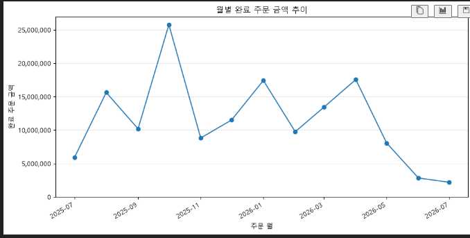
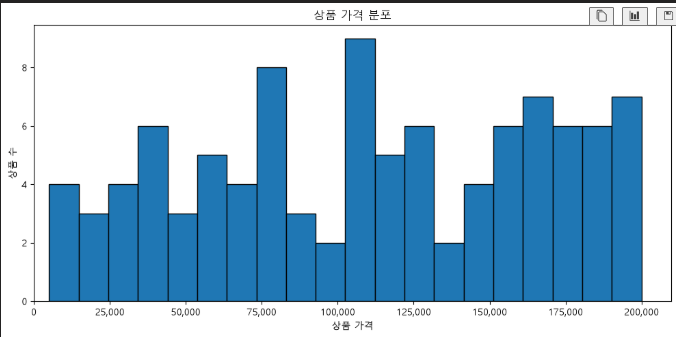
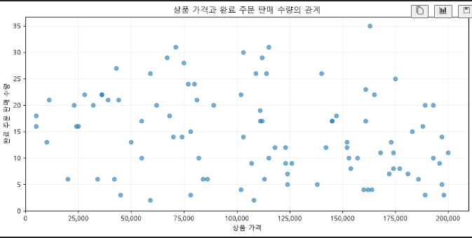

# Chapter 07 답안 양식. 그래프로 데이터의 이야기를 보여주기

> 이 내용을 `chapter07.ipynb`의 Markdown 셀로 작성합니다.

## 제출 정보
- 이름:
- GitHub ID:
- 작성일:
- 최종 Notebook URL:

## 1. 시각화 질문과 그래프 선택
| 질문 | 선택한 그래프 | 선택 이유 |
| --- | --- | --- |
|  |  |  |
|  |  |  |
|  |  |  |

## 2. 대표 그래프 1

### 원본 집계값

### 결과 관찰

### 나의 해석과 판단

### 업무·분석적 의미

### 한계와 추가 확인 사항

## 3. 대표 그래프 2

### 원본 집계값

### 결과 관찰

### 나의 해석과 판단

### 업무·분석적 의미

### 한계와 추가 확인 사항

## 4. 대표 그래프 3

### 원본 집계값

### 결과 관찰

### 나의 해석과 판단

### 업무·분석적 의미

### 한계와 추가 확인 사항

## 5. 그래프 정확성 점검
- [ ] 그래프 값과 집계표 값 일치
- [ ] 축 이름 확인
- [ ] 단위 확인
- [ ] 범례 확인
- [ ] 날짜 정렬 확인
- [ ] 과장될 수 있는 축 범위 확인
- [ ] 제목이 분석 범위를 정확히 표현

### 내가 발견한 시각화 위험 또는 개선점

## 6. Chapter 07 최종 판단
### 가장 중요한 그래프 1개와 이유

### 그래프가 보여 준 사실

### 그래프만으로 말할 수 없는 것

### 다음 분석에서 확인할 질문

## 최종 체크
- [ ] 그래프와 수치를 교차 검증했습니다.
- [ ] 관찰과 해석을 구분했습니다.
- [ ] 업무적 의미와 한계를 작성했습니다.
- [ ] 최종 Notebook URL을 제출합니다.