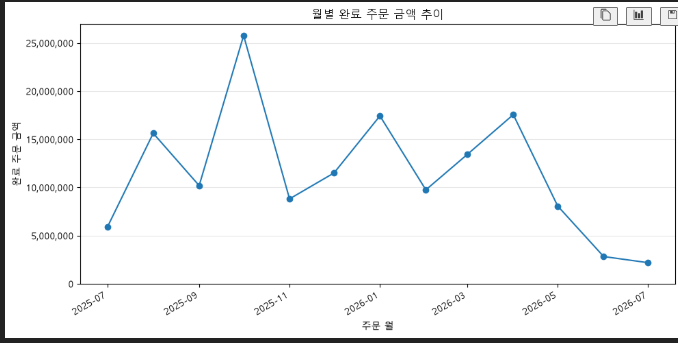
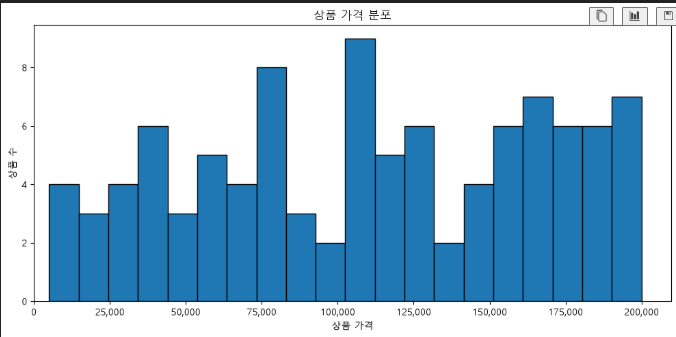
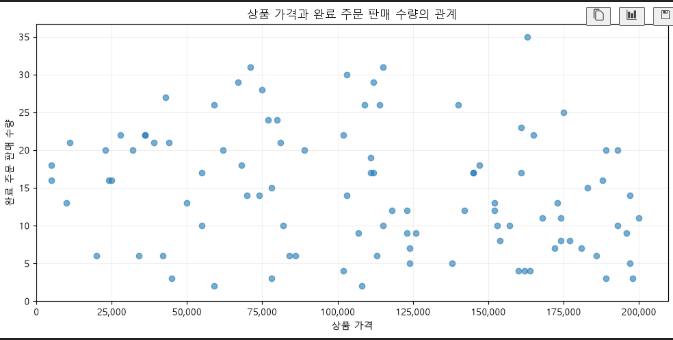

# Chapter 07 답안 양식. 그래프로 데이터의 이야기를 보여주기

> 이 내용을 `chapter07.ipynb`의 Markdown 셀로 작성합니다.

## 제출 정보
- 이름: 양성용
- GitHub ID: dydtlsrl
- 이메일: dydtlsrl@gmail.com
- 작성일: 2026-10-01
- 최종 Notebook URL: https://github.com/dydtlsrl/ai-data-analysis/blob/main/00_llm-data-analysis-course/practice/chapter07/chapter07.ipynb

## 1. 시각화 질문과 그래프 선택
| 질문 | 선택한 그래프 | 선택 이유 |
| --- | --- | --- |
| 월별 completed 주문 금액은 어떻게 변하는가? | 선그래프 | 시간 순서에 따른 금액의 증가·감소를 확인하기 적합하다. |
| 상품 가격은 어떤 구간에 분포하는가? | 히스토그램 | 전체 상품 가격을 구간별로 나누어 상품 수와 분포를 확인할 수 있다. |
| 상품 가격과 completed 판매 수량은 어떤 관계인가? | 산점도 | 상품별 가격과 완료 주문 판매 수량이라는 두 숫자형 변수의 관계를 탐색할 수 있다. |

## 2. 대표 그래프 1

### 원본 집계값

월별 완료 주문 금액 선그래프이다. 노트북의 월별 집계 출력은 다음과 같다. 분석 범위는 `completed` 주문 중 주문일이 유효한 데이터이며, 금액 단위는 원이다.

| 주문 월 | 완료 주문 금액(원) | 완료 주문 수(건) | 평균 완료 주문 금액(원) |
| --- | --- | --- | --- |
| 2025-07 | 5,869,000 | 8 | 733,625 |
| 2025-08 | 15,621,000 | 18 | 867,833 |
| 2025-09 | 10,190,000 | 13 | 783,846 |
| 2025-10 | 25,766,000 | 26 | 991,000 |
| 2025-11 | 8,812,000 | 12 | 734,333 |
| 2025-12 | 11,501,000 | 14 | 821,500 |
| 2026-01 | 17,423,000 | 22 | 791,955 |
| 2026-02 | 9,749,000 | 17 | 573,471 |
| 2026-03 | 13,429,000 | 14 | 959,214 |
| 2026-04 | 17,553,000 | 23 | 763,174 |
| 2026-05 | 8,063,000 | 11 | 733,000 |
| 2026-06 | 2,826,000 | 4 | 706,500 |
| 2026-07 | 2,188,000 | 2 | 1,094,000 |

월별 금액 합계는 148,990,000원으로 같은 범위의 원본 완료 주문 상세 합계와 일치했다. 검증 차이는 0이고 `passed`는 `True`였다. 날짜 결측으로 제외된 완료 주문 상세는 0행이었다.

### 결과 관찰

2025년 10월에 25,766,000원으로 가장 높았고, 2026년 7월에 2,188,000원으로 가장 낮았다. 2026년 4월 이후 금액은 17,553,000원 → 8,063,000원 → 2,826,000원 → 2,188,000원으로 감소했다. 같은 기간 완료 주문 수도 23건 → 11건 → 4건 → 2건으로 줄었다.

### 나의 해석과 판단

마지막 구간의 금액 감소는 완료 주문 수 감소와 함께 나타났다. 다만 2026년 7월의 평균 완료 주문 금액은 1,094,000원으로 높으므로 총금액 감소를 주문당 금액 감소로 설명할 수는 없다. 총금액, 주문 수, 평균 주문 금액을 함께 비교해야 한다고 판단했다.

### 업무·분석적 의미

월별 금액이 달라지는 시점을 찾아 주문 수와 평균 주문 금액으로 나누어 점검할 수 있다. 2025년 10월의 높은 금액과 2026년 4월 이후 감소 구간을 추가 분석 대상으로 삼을 수 있다.

### 한계와 추가 확인 사항

첫 달과 마지막 달이 완전한 한 달인지 확인되지 않았다. 마지막 달의 감소를 실제 영업 악화라고 단정할 수 없다. 프로모션, 계절성, 재고, 상품 구성 등의 원인 정보도 없다. 먼저 데이터 수집 기간의 완전성을 확인하고 월별 주문 수·평균 주문 금액·카테고리 구성을 비교해야 한다. 완료 주문 상세 금액은 회계상 순매출을 의미하지 않는다.

## 3. 대표 그래프 2

### 원본 집계값

전체 상품 마스터의 가격 히스토그램이다. 주문 상태와 관계없이 상품 100개의 가격을 사용했으며 저장된 그래프의 구간 수는 `bins=20`이다. 노트북의 `products["price"].describe()` 출력은 다음과 같다.

| 지표 | 출력값 |
| --- | --- |
| 상품 수 | 100개 |
| 평균 가격 | 110,040원 |
| 표준편차 | 약 56,433.91원 |
| 최솟값 | 5,000원 |
| 25% 분위수 | 65,750원 |
| 중앙값 | 112,000원 |
| 75% 분위수 | 161,000원 |
| 최댓값 | 200,000원 |

위 값은 가격의 기술통계이며 히스토그램의 구간별 빈도표는 노트북 출력에 별도로 저장되어 있지 않다.

### 결과 관찰

상품 가격은 5,000원부터 200,000원까지 넓게 분포했다. 평균은 110,040원이고 중앙값은 112,000원으로 비슷했다. 히스토그램에서는 약 100,000원~120,000원 부근과 160,000원 이상 구간에도 상품이 분포했다.

### 나의 해석과 판단

전체 상품이 하나의 좁은 가격대에만 몰려 있지 않고 여러 가격대로 구성되어 있다고 판단했다. 히스토그램은 상품 구성의 분포를 보여 주므로 특정 가격대의 상품이 많다는 사실을 고객 선호나 판매 성과로 해석하지 않았다.

### 업무·분석적 의미

상품 구성의 가격대 범위를 파악하고 카테고리별 가격 분포를 비교하는 기초 자료로 활용할 수 있다. 가격대별 판매 성과를 확인하려면 완료 주문 판매 수량과 금액을 별도로 집계해 비교해야 한다.

### 한계와 추가 확인 사항

구간 수에 따라 높낮이와 집중 구간의 인상이 달라질 수 있다. 노트북의 bins 비교 기록에서는 10·20·30의 공통 패턴과 세분화에 따른 차이를 설명했지만, 저장된 코드 출력에는 `bins=20` 그래프만 있다. 다른 두 설정의 실제 출력은 추가 확인이 필요하다. 최저·최고 가격이 오류나 이상값인지도 이 그래프만으로 확정할 수 없다.

## 4. 대표 그래프 3

### 원본 집계값

상품 가격과 완료 주문 판매 수량의 산점도이다. 한 점은 상품 하나이며 수량은 `completed` 주문 상세를 상품별로 합산한 값이다. 노트북에 출력된 상품 집계 상위 10행은 다음과 같다. 이는 전체 상품의 기술통계가 아니라 출력된 일부 행이다.

| 상품 가격(원) | 완료 판매 수량(개) | 완료 주문 금액(원) |
| --- | --- | --- |
| 163,000 | 35 | 5,705,000 |
| 175,000 | 25 | 4,375,000 |
| 193,000 | 20 | 3,860,000 |
| 189,000 | 20 | 3,780,000 |
| 161,000 | 23 | 3,703,000 |
| 140,000 | 26 | 3,640,000 |
| 165,000 | 22 | 3,630,000 |
| 115,000 | 31 | 3,565,000 |
| 112,000 | 29 | 3,248,000 |
| 103,000 | 30 | 3,090,000 |

상품별 완료 주문 금액 전체 합계는 검증표에서 148,990,000원으로 원본 합계와 일치했다. 노트북에는 상관계수 출력이 없으므로 상관계수 수치를 답안에 추가하지 않았다.

### 결과 관찰

산점도에서 가격은 약 5,000원~200,000원, 완료 판매 수량은 약 2개~35개에 분포했다. 비슷한 가격대에서도 판매 수량 차이가 컸고 가격에 따라 수량이 일정하게 증가하거나 감소하는 뚜렷한 직선형 패턴은 보이지 않았다. 가격 163,000원인 상품의 판매 수량은 35개였다.

### 나의 해석과 판단

현재 출력에서는 가격 하나만으로 완료 판매 수량의 차이를 설명하기 어렵다고 판단했다. 일부 고가 상품의 판매 수량이 작더라도 판매 수량이 큰 고가 상품도 있으므로 가격이 높으면 반드시 적게 팔린다고 일반화하지 않았다.

### 업무·분석적 의미

가격과 판매 수량의 관계를 추가 탐색할 출발점으로 활용할 수 있다. 카테고리별로 나누고 상품별 판매 기간, 할인, 재고를 함께 비교하면 판매 수량 차이를 더 구체적으로 조사할 수 있다.

### 한계와 추가 확인 사항

산점도는 두 변수의 동시 분포를 보여 줄 뿐 인과관계를 증명하지 않는다. 카테고리, 프로모션, 재고, 상품 노출, 판매 기간을 통제하지 않았다. 가격을 변경했을 때 판매 수량이 어떻게 달라지는지는 현재 결과만으로 판단할 수 없다.

## 5. 그래프 정확성 점검
- [x] 그래프 값과 집계표 값 일치
- [x] 축 이름 확인
- [x] 단위 확인
- [x] 범례 확인
- [x] 날짜 정렬 확인
- [x] 과장될 수 있는 축 범위 확인
- [x] 제목이 분석 범위를 정확히 표현

### 내가 발견한 시각화 위험 또는 개선점

월별 그래프의 첫 달과 마지막 달이 부분 기간일 가능성이 있어 금액 감소를 원인이나 성과 악화로 단정하지 않았다. 가격 히스토그램은 구간 수에 따라 인상이 달라지며, bins=10·30의 출력과 구간별 빈도표는 추가 확인이 필요하다. 산점도의 관계는 인과관계로 해석하지 않았다.

월별·상품별·카테고리별·고객별 완료 주문 금액 합계는 모두 148,990,000원이고 검증표의 `passed`는 모두 `True`였다. 월별 그래프는 시간순으로 정렬되었고, 세 대표 그래프의 값 축은 0에서 시작하는 것을 확인했다. 세 그래프는 각각 단일 계열이므로 별도 범례 없이 제목과 축 이름으로 대상을 구분할 수 있다. 금액·가격은 원, 수량·상품 수는 개 단위이며, 이미지 축에 단위 기호를 함께 쓰면 더 명확해진다. 히스토그램의 구간별 빈도는 별도 출력이 없어 수치 전체의 교차 검증은 추가로 필요하다.

## 6. Chapter 07 최종 판단
### 가장 중요한 그래프 1개와 이유

노트북의 최종 판단과 같이 카테고리별 완료 주문 금액 막대그래프가 가장 중요하다고 판단했다. 완료 주문 금액이 어떤 카테고리에 집중되는지 비교하고 판매 수량·평균 단가·상품 수의 추가 분석 기준을 제공하기 때문이다. 위 대표 이미지 3개와 별개로 노트북에서 실행된 카테고리 그래프를 최종 판단의 대상으로 선택했다.

### 그래프가 보여 준 사실

스포츠 카테고리의 완료 주문 금액은 31,743,000원으로 전체의 21.31%를 차지해 가장 높았다. 패션은 10,587,000원으로 7.11%를 차지해 가장 낮았다. 카테고리별 합계는 148,990,000원으로 원본 완료 주문 상세 합계와 일치했다.

### 그래프만으로 말할 수 없는 것

스포츠의 고객 선호도, 수익성, 만족도, 재구매 가능성이 가장 높다고 말할 수 없다. 완료 주문 금액에는 판매 수량과 단가가 함께 반영되고 원가·마진·할인·환불 사유는 포함되지 않는다.

### 다음 분석에서 확인할 질문

스포츠의 높은 금액은 판매 수량, 평균 판매 단가, 상품 수 중 어떤 요인과 함께 나타나는가? 카테고리별 원가·할인·환불 정보를 추가하면 실제 수익성과 구매 패턴은 어떻게 달라지는가?

## 최종 체크
- [x] 그래프와 수치를 교차 검증했습니다.
- [x] 관찰과 해석을 구분했습니다.
- [x] 업무적 의미와 한계를 작성했습니다.
- [x] 최종 Notebook URL을 제출합니다.
