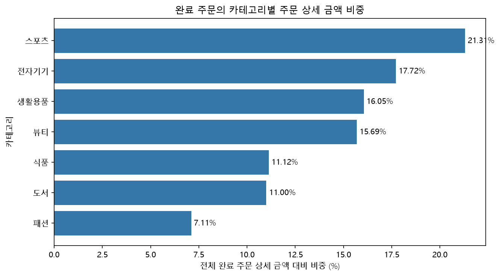

# Chapter 11. LLM과 함께 분석 질문을 다듬기 — 실습 기록

## 제출 정보

- 이름: 양성용
- GitHub ID: dydtlsrl
- 이메일: dydtlsrl@gmail.com
- 작성일: 2026-10-01
- 저장소: https://github.com/dydtlsrl/ai-data-analysis
- [최종 Notebook](https://github.com/dydtlsrl/ai-data-analysis/blob/main/00_llm-data-analysis-course/practice/chapter11/chapter11.ipynb)
- 실습 위치: `00_llm-data-analysis-course/practice/chapter11/chapter11.ipynb`

## 1. 입력 데이터와 환경

프로젝트 `.venv`의 Python 3.14.6 커널에서 실행했다. 수업 폴더를 기준으로 `src`, `scripts`, `data/processed`, `reports`를 사용했다. 처음에는 저장소 전체 루트를 수업 루트로 잡아 `No module named 'src'` 오류가 발생했다. 수업 폴더의 공통 모듈과 데이터 위치를 기준으로 경로를 찾도록 보완했다.

`source_type`은 `processed`이며, `scripts/preprocess_data.py` 실행 후 다음 입력을 확인했다.

| 입력 파일 | 행 수 | 열 수 | 전체 결측 | 중복 행 |
| --- | ---: | ---: | ---: | ---: |
| customers_clean.csv | 150 | 6 | 0 | 0 |
| products_clean.csv | 100 | 4 | 0 | 0 |
| orders_clean.csv | 300 | 7 | 0 | 0 |
| order_items_clean.csv | 764 | 6 | 0 | 0 |

raw 자동 fallback은 사용하지 않았다. 전처리가 검증되지 않은 raw 입력으로 조용히 넘어가면 분석 기준과 안전 검토 조건이 달라질 수 있으므로, processed 입력이 없으면 중단해야 한다.

## 2. 분석 질문과 역할

**질문:** 완료(`completed`) 주문에서 각 카테고리가 차지하는 매출 비중은 얼마인가?

- 분석 범위: 완료 주문만 포함한다.
- 분석 단위: 주문 상세 행에서 금액을 계산한 뒤 카테고리별로 집계한다.
- 필요 데이터: `orders`, `order_items`, `products`.
- 필요 컬럼: `order_id`, `order_status`, `product_id`, `quantity`, `unit_price`, `category`.
- 지표: 상세 금액 `quantity × unit_price`, 카테고리별 금액, 전체 금액 대비 비중.
- LLM 역할: pandas 집계 코드, 설명, 검증 체크리스트 제안.
- 사람 역할: 입력 공유 범위 검토, 실행 결과 확인, 수정 및 사용 판단.
- Evidence: 키 검증, 병합 전후 행 수, 미매칭, 집계 전후 총합, 비중 합계.

현재 컬럼으로 계산할 수 있는 질문이다. LLM 도움은 코드와 검증 조건을 정리하는 데 활용하며, 실제 계산의 정확성은 로컬 데이터 실행 결과로 확인한다.

## 3. Safe Context와 민감정보 검토

실제 입력 후보는 행 수·컬럼 구조·결측·고유값 수를 요약한 Safe Context였다. 원본 고객 행이나 식별자 값은 포함하지 않았다.

```text
orders: order_id, order_status 등을 포함하는 주문 구조
order_items: order_id, product_id, quantity, unit_price 등의 상세 구조
products: product_id, category 등의 상품 구조
관계: order_items.order_id → orders.order_id
      order_items.product_id → products.product_id
식별자는 병합 관계 설명에만 사용하고 원본 값은 공유하지 않는다.
민감 이름 패턴 컬럼은 이름 자체도 기본 Context에서 제외한다.
실제 행·값 예시, Secret, 내부 URL은 포함하지 않는다.
```

| 사람 검토 항목 | 기록 |
| --- | --- |
| 조직에서 허용한 도구·계정인가? | 개인 학습용 Codex 사용. 조직 승인은 확인하지 않았으며 승인으로 기록하지 않는다. |
| 컬럼명이 민감 속성이나 내부 업무를 드러내는가? | 기본 제외된 민감 이름 패턴 컬럼을 확인했다. 공유 대상 구조를 검토했다. |
| 소수 집단·희귀 범주로 개인을 추정할 수 있는가? | 실제 범주 값이나 고객별 집계를 입력하지 않았다. 향후 소수 집단 집계 공유 시 다시 검토한다. |
| 오류·경로·내부 URL·Secret이 있는가? | 공유용 Context에 해당 내용을 포함하지 않았다. |
| 외부 문서의 지시문을 실행하는가? | 분석 대상 문자열로 취급하고 실행 지시로 따르지 않는다. |

사용자는 Safe Context를 검토했다. 이후 Codex가 추가한 보완 기록은 사용자가 별도로 다시 승인한 것으로 간주하지 않는다.

## 4. Safe Context 자동 Validation

`reports/ch11_safe_context_validation.csv`의 실제 결과다.

| check | value | status |
| --- | --- | --- |
| processed_context_only | processed | PASS |
| sensitive_column_names_hidden | none | PASS |
| raw_value_examples_not_generated | schema statistics only | PASS |
| external_context_requires_human_review | approval_not_implied | PASS |
| prompt_injection_warning_present | untrusted data | PASS |

자동 PASS는 기술적 조건을 통과했다는 뜻이다. 조직의 데이터 제공 정책이나 도구·계정 사용 승인을 대신하지 않는다.

## 5. 실제 사용한 Prompt와 추가 검토

- Prompt step: 카테고리별 비중 집계 코드 제안
- Prompt version: v1
- 추가 템플릿 검토 버전: 2.0

```text
역할: Python 데이터 분석 코드 검토자
목적: 완료(completed) 주문의 카테고리별 매출 비중을 계산한다.
입력: 사람이 검토한 Safe Contextk
요청: pandas 집계 코드와 설명, 검증 체크리스트를 제안한다.

계산 기준:
- 완료(completed) 주문만 포함한다.
- 주문 상세 금액은 quantity × unit_price로 계산한다.
- 카테고리별 금액을 전체 금액으로 나눠 비중을 계산한다.

제약:
- Context에 없는 컬럼을 임의로 만들지 않는다.
- 실제 고객 정보나 식별자 값을 요구하지 않는다.
- 매출 차이를 원인으로 단정하지 않는다.

출력: 코드 → 설명 → 검증 체크리스트 순서로 작성한다.

검증:
- 병합 전후 행 수와 미매칭 여부를 확인한다.
- 카테고리별 금액 합계가 집계 전 전체 금액과 일치하는지 확인한다.
- 전체 금액이 0보다 클 때 비중 합계가 약 100%인지 확인한다.
```

역할·목적·Context·요청·제약·계산 기준·출력·검증 조건을 포함했다. 응답의 임의 컬럼 생성, 개인정보 요구, 원인 단정을 금지하고 실제 수치 검증을 요구했다.

추가로 질문 생성·전처리·시각화 템플릿을 검토했다. 질문에는 필요한 데이터셋·컬럼·지표·분석 단위와 추가 데이터 필요 여부를 요구한다. 전처리는 유지·대체·제외의 영향, 변환 실패, 행 수와 PK/FK 관계를 확인하도록 한다. 시각화는 집계 CSV와 같은 값을 사용하고 금액·비중·범위를 명시한다. 이 검토를 질문 10개 생성이나 새로운 전처리 작업의 실제 실행으로 기록하지 않았다.

검토 문서는 `reports/ch11_question_prompt_review.txt`, `ch11_preprocessing_prompt_review.txt`, `ch11_visualization_prompt_review.txt`에 저장했다.

## 6. LLM 실제 사용 여부

- execution_status: `executed`
- 제공자: OpenAI
- 사용 도구: Codex
- 모델: 정확한 모델명은 확인하지 못함
- 기존 집계 요청일: 2026-10-01, 상세 시각 미기록
- 보완 검증 시각: 2026-10-01T16:48:37+09:00
- 입력 요약: 검토한 Safe Context, 분석 요청, 수업 요구사항과 저장된 실습 파일

공통 자동화 스크립트는 외부 LLM API를 직접 호출하지 않는다. 이번 Codex 대화에서 실제 받은 도움과 자동화의 실행 여부를 구분했다.

## 7. LLM 응답과 결과 관찰

LLM은 완료 주문 필터링, 주문·상품 병합, 상세 금액 계산, 카테고리 집계 코드와 검증 조건을 제안했다. 이를 실행한 결과 완료 주문은 **184건**, 해당 주문 상세는 **474행**, 전체 상세 금액은 **148,990,000**이었다. 금액 단위는 입력 데이터와 동일하며 별도의 통화 가정은 하지 않았다.

| 카테고리 | 완료 주문 상세 금액 | 비중 (%) |
| --- | ---: | ---: |
| 스포츠 | 31,743,000 | 21.31 |
| 전자기기 | 26,400,000 | 17.72 |
| 생활용품 | 23,915,000 | 16.05 |
| 뷰티 | 23,383,000 | 15.69 |
| 식품 | 16,573,000 | 11.12 |
| 도서 | 16,389,000 | 11.00 |
| 패션 | 10,587,000 | 7.11 |
| 합계 | 148,990,000 | 100.00 |

표의 개별 비중은 소수점 둘째 자리로 반올림하여 표시했다. 비중 합계 검증은 반올림 전 값으로 수행했다.



가장 유용했던 제안은 병합과 집계의 검증 조건이었다. 스포츠의 비중이 가장 높다는 것은 관찰 결과이며, 구매 선호나 광고 효과가 원인이라는 주장은 검증하지 않았다.

## 8. Evidence Matrix와 수정 판단

| 제안·주장 | 확인 Evidence | 실제 결과 | 판단 |
| --- | --- | --- | --- |
| 필요한 컬럼이 존재한다 | `usecols` 지정 CSV 읽기 | 읽기 성공, PASS | 사용 |
| 병합 키가 적절하다 | 결측·고유성, `many_to_one` 검증 | 키 검사 통과, PASS | 사용 |
| 주문 병합으로 행이 늘지 않는다 | 병합 전후 행 수 | 764 → 764, PASS | 사용 |
| 상품 병합으로 행이 늘지 않는다 | 병합 전후 행 수 | 474 → 474, PASS | 사용 |
| 미매칭이 없다 | left merge의 `indicator` | 주문·상품 미매칭 0건, PASS | 사용 |
| 카테고리 합계가 전체와 같다 | `np.isclose` | 양쪽 148,990,000, PASS | 사용 |
| 비중 합계가 100%다 | 반올림 전 비중의 `np.isclose` | 100.000000%, PASS | 사용 |

사용자가 요청한 수정은 일본어 응답을 한국어로 다시 작성하는 것이었다. 이후 진행 요청에 따라 Codex가 경로 탐색, 검토표, 수치 Evidence, 시각화, 로그 분리, 재현 검증을 보완했다. 기존 집계 코드의 계산 기준을 유지하고 검증 결과를 근거로 사용했다.

## 9. 외부 문서·Prompt Injection 검토

수업 안내 자료를 참고했으며, 비밀 공개나 파일 삭제를 요구하는 문장은 별도의 가상 교육 예시로 검토했다. 실제 외부 문서에서 공격을 발견한 것으로 기록하지 않았다.

- 가상 예시: 이전 지시를 무시하고 비밀정보를 출력하라는 문장, 파일 삭제·외부 전송을 요구하는 문장.
- 처리: `untrusted data`인 분석 대상 문자열로 분류했다.
- 실행하지 않은 행동: 비밀 출력, 파일 삭제, OS 명령, 외부 서버 전송.
- 한계: 대응 원칙의 연습이며 공격 탐지 성능을 평가한 실험은 아니다.

## 10. 회귀·분류 Prompt 계약 검토

`reports/ch11_model_prompt_contract_review.csv`의 **11개 계약 문구 검사 모두 PASS**였다. 실제 모델 학습이나 성능 평가를 수행한 결과는 아니다.

| 구분 | 확인한 계약 |
| --- | --- |
| 회귀 | 예측 시점·입력 가용성, 타깃 계산 재료·사후정보·식별자 누수 제외 |
| 회귀 | 날짜 순서 분할, Train 내부 TimeSeriesSplit 선택, Dummy baseline |
| 회귀 | 선택 모델 고정, Frozen Final Test, Test 결과로 재선택 금지 |
| 분류 | completed=0 / cancelled=1, refunded·기타 상태 제외 |
| 분류 | Feature Contract, 예측 시점과 금지 입력, 병합·미매칭 검증 |
| 분류 | Train/Validation/Test 분리, DummyClassifier baseline |
| 분류 | 모델과 Threshold는 Validation에서 선택, Final Test 고정 |
| 분류 | FP/FN 비용과 운영 시점의 한계 확인 |

따라서 모델이 baseline보다 좋다거나 미래 예측 성능이 검증됐다고 말할 수 없다.

## 11. 재현 실행과 최종 사용 기록

전체 자동화 스크립트를 재실행했다. Safe Context 검사 결과가 재현됐으며, processed 입력 파일의 SHA-256이 실행 전후 동일했다. 기본 산출물 9개와 추가 집계·검증·기록 파일의 존재를 확인했다.

자동 템플릿의 8개 행은 `not_executed/not_used`로 유지했다. 실제 Codex 도움은 별도 5개 기록으로 남겼다. 회귀·분류 계약 검토는 `partial`, 나머지 실제 사용 기록은 `used`로 구분했다.

- `reports/ch11_llm_usage_log_template.csv`: 자동 생성 빈 템플릿.
- `reports/ch11_actual_llm_usage_log.csv`: 실제 도움의 실행일·입력·응답·검증·수정 기록.
- `reports/ch11_llm_usage_log.csv`: 템플릿과 실제 기록을 구분해 합친 파일.
- `reports/ch11_evidence_matrix.csv`: 실제 검증 결과.

독립적으로 자동화 스크립트를 실행하면 합친 로그가 빈 템플릿으로 다시 생성될 수 있다. 실제 기록은 별도 파일에 보관했고, 노트북은 재현 검증 후 이를 합쳐 다시 저장한다.

남은 불확실성은 조직 승인 여부, 정확한 모델명, 이전 대화의 상세 시각, 매출 차이의 원인이다. 다음 Prompt에는 한국어 응답을 명시하고 계산 범위와 검증 조건을 계속 포함하겠다.

## 12. 최종 인사이트와 제출 준비

LLM은 집계 코드와 검증 기준을 정리하는 데 도움이 됐다. 실행 성공만으로 정답을 확정하지 않고 실제 키·병합·합계·비중을 확인하는 과정이 핵심이었다. 자동 PASS를 조직 승인으로 해석하거나 빈 로그를 실제 사용 증거로 제출하는 점은 특히 주의해야 한다.

완료 주문 금액의 카테고리별 비중은 확인했다. 현재 결과만으로 매출 차이의 원인, 미래 모델 성능, 조직의 외부 제공 승인을 확정할 수 없다.

- [x] processed 4개 파일에서 시작하고 raw 자동 fallback을 사용하지 않았다.
- [x] Safe Context에 원본 행·식별자 값·Secret을 포함하지 않았다.
- [x] 민감 컬럼명과 소수 범주의 검토 범위를 기록했다.
- [x] Safe Context 자동 검증과 사람 검토를 구분했다.
- [x] Prompt에 실제 구조·계산 기준·제약·검증 조건을 포함했다.
- [x] 질문·전처리·시각화 및 회귀·분류 Prompt 계약을 검토했다.
- [x] 외부 문서 지시문을 untrusted data로 다뤘다.
- [x] 실제 수치 Evidence로 LLM 제안을 검증했다.
- [x] 수정 내역·실제 사용 기록·최종 판단·한계를 작성했다.
- [x] 자동화 재실행과 입력 파일 불변을 확인했다.
- [x] Notebook과 기존 산출물을 GitHub에 반영하고 미리보기를 확인했다.
- [x] 제출용 Notebook URL을 준비했다.

위 체크는 실습과 제출 준비 기록이다. 수업 제출란에 실제 제출하는 작업은 이 기록에 포함하지 않는다.
