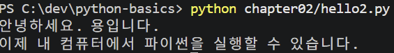

운영체제 : Window 11 
Python 확인 결과 :  python 3.14.6 
VS Code 설치 여부 : 설치 완료 
Python 확장 설치 여부 : 설치 완료 
선택한 인터프리터 :Python 3.14(64-bit) 
작업 폴더 : C:/dev/python-basics 

## 과제 3. 코드 변경까지 완료

## 환경 문제 질문 템플릿
나는 [운영체제]에서 Python을 사용하고 있습니다.  
사용 도구는 [VS Code / PowerShell 등]입니다.  

실행한 명령:  
[명령]  

실제 오류:  
[오류 메시지]  

이미 확인한 것:  

[확인 내용]  
완성 코드를 새로 만들지 말고,  
원인을 확인할 수 있도록 다음 점검 단계부터 알려 주세요.  